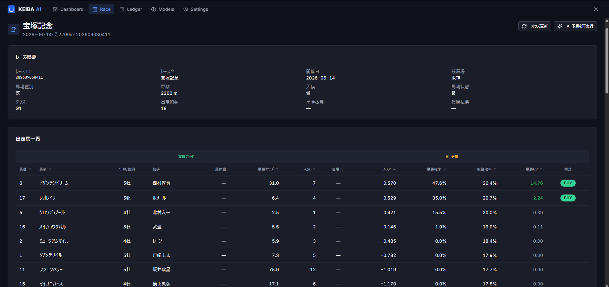

# KEIBA AI

JRA 中央競馬のレースデータを自前パイプラインで収集し、**Set Transformer ベースの NN ランキングモデル**で各馬の勝率・複勝率・連系馬券の的中確率を推定して買目を提案する、個人研究用の競馬予想ツールです。FastAPI バックエンド + React 管理画面で構成され、`scripts/dev.sh` 一発でローカル起動します。

単なる着順予測ではなく、**回収率 (ROI) を直接最適化する decision-focused な損失設計**、**Plackett-Luce による連系馬券の解析的確率導出**、**リーク防止を厳密に管理した特徴量パイプライン**が技術的な中心です。10 回に及ぶモデル改善実験の帰結として「公営競技市場の効率性の壁」を定量的に確認するところまでを含めて、`docs/ai-model.md` に記録しています。

> 📘 作品説明資料 (概要・スクリーンショット・技術ハイライト・AI 活用): **[docs/PORTFOLIO.md](docs/PORTFOLIO.md)**

## スクリーンショット

| 週末レース一覧 | レース詳細 (AI 予測 + 推奨買目) |
|---|---|
|  |  |

その他の画面は [docs/PORTFOLIO.md](docs/PORTFOLIO.md) を参照。

## 概要

| 項目 | 内容 |
|---|---|
| カテゴリ | Tool / AI（競馬予想支援・個人研究用） |
| バックエンド | FastAPI (Python) + PyTorch (Set Transformer + 履歴 GRU) |
| フロントエンド | React + Vite + TypeScript + shadcn/ui + Tailwind |
| データソース | netkeiba スクレイピング（個人研究範囲・レート制御徹底） |
| DB | SQLite（SQLAlchemy + Alembic） |
| 動作形態 | ローカル dev サーバ + ブラウザアクセス |

## ディレクトリ構造

```text
.
├── backend/        # FastAPI + AI + スクレイパー (Python, uv 管理)
├── frontend/       # React 管理画面 (Vite + TypeScript)
├── scripts/        # dev.sh (uvicorn + Vite 一発起動)
├── data/           # SQLite DB / モデル / ログ (gitignored・リポジトリには含まれない)
└── docs/           # 仕様・設計・運用ドキュメント + 作品説明資料
```

## クイックスタート

前提: [uv](https://docs.astral.sh/uv/) / Node.js 20+ / pnpm がインストール済みであること。

```bash
# 開発サーバ起動 (FastAPI on :8765 + Vite on :5173)
bash scripts/dev.sh
# → http://localhost:5173 をブラウザで開く
```

依存同期・DB migration は `dev.sh` が毎回自動で行います。**スクレイピング済みデータと学習済みモデルはリポジトリに含まれない**ため、初回起動時は空の状態から始まります (画面の取込ボタンまたは `uv run keiba-ingest --date YYYY-MM-DD` でデータ取得)。セットアップの詳細は [docs/operations.md](docs/operations.md) を参照。

## ドキュメント

| ファイル | 内容 |
|---|---|
| [docs/PORTFOLIO.md](docs/PORTFOLIO.md) | **作品説明資料**（概要・スクショ・技術ハイライト・成果と学び・AI 活用） |
| [docs/README.md](docs/README.md) | ドキュメント管理ハブ |
| [docs/spec.md](docs/spec.md) | 技術仕様（スタック・DB・API・開発ビルド手順） |
| [docs/design.md](docs/design.md) | 設計方針（アーキテクチャ・AI モジュール・UI 構成） |
| [docs/data-pipeline.md](docs/data-pipeline.md) | スクレイピング・取り込み仕様 |
| [docs/ai-model.md](docs/ai-model.md) | モデル設計（Set Transformer・損失・確率変換・評価・実験知見） |
| [docs/operations.md](docs/operations.md) | 運用（セットアップ・再学習サイクル・バックアップ・障害対応） |

## データソースと権利について

- **個人研究限定**: 取得データ・学習済みモデルは第三者へ提供・公開しません。本リポジトリに含まれるのはソースコードとドキュメントのみです
- **サイト負荷への配慮**: リクエストは直列のみ・最低 3 秒 + ジッター（深夜帯はさらに長く）のレート制御を徹底し、robots.txt を遵守します（取得失敗時は fail-closed = 全リクエスト拒否）。User-Agent は連絡先付きの研究用ボットとして自己申告します
- **即時停止スイッチ**: Settings 画面の停止スイッチ、`/api/scraper/stop` エンドポイント、環境変数 `KEIBA_SCRAPER_STOP=1` の 3 経路で任意のタイミングでスクレイピングを停止できます
- テストフィクスチャはすべて合成 HTML であり、実ページの capture は含まれません

## ライセンス

ポートフォリオとしての閲覧・評価目的でのみ公開しています。再配布・商用利用不可。詳細は [LICENSE](LICENSE) を参照してください。
