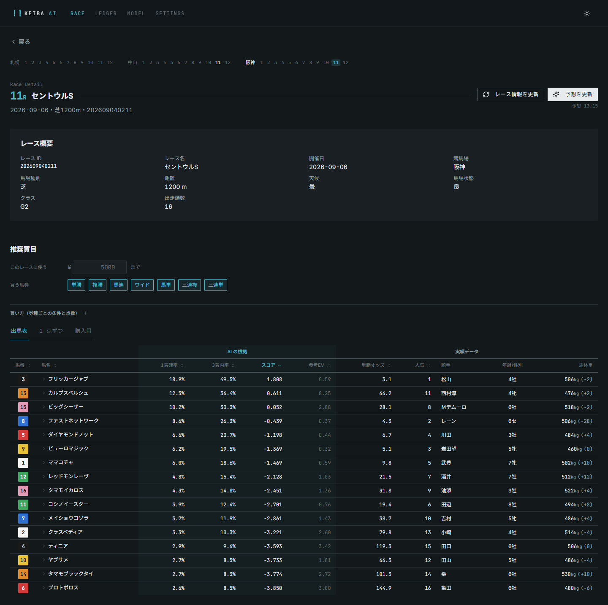
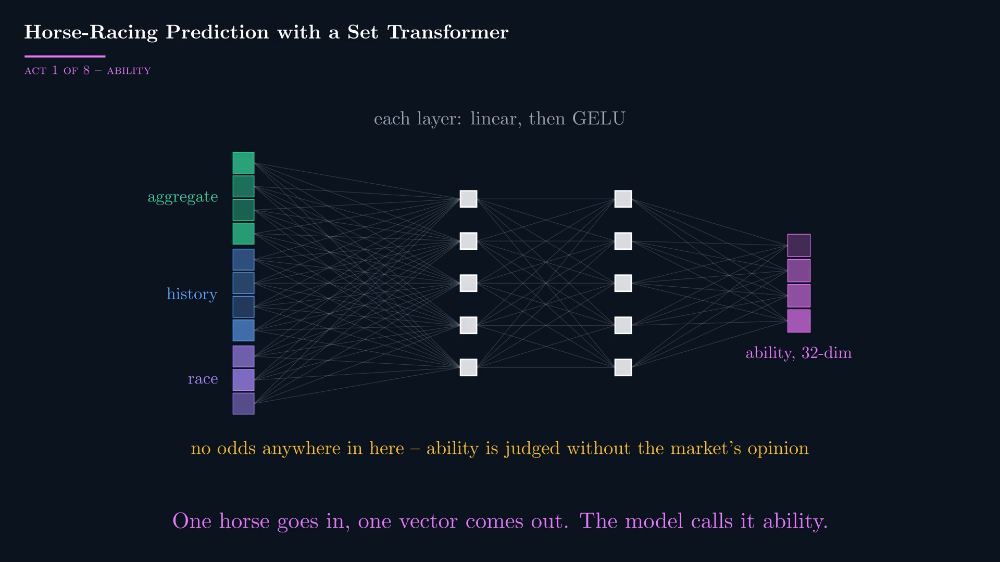
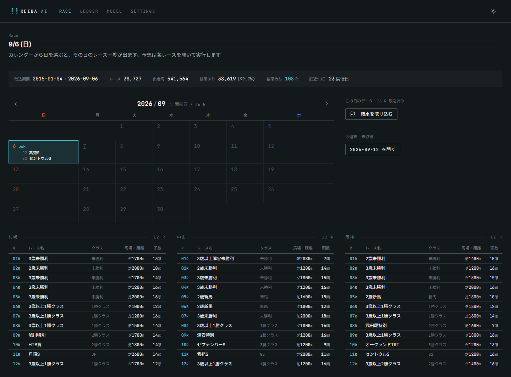
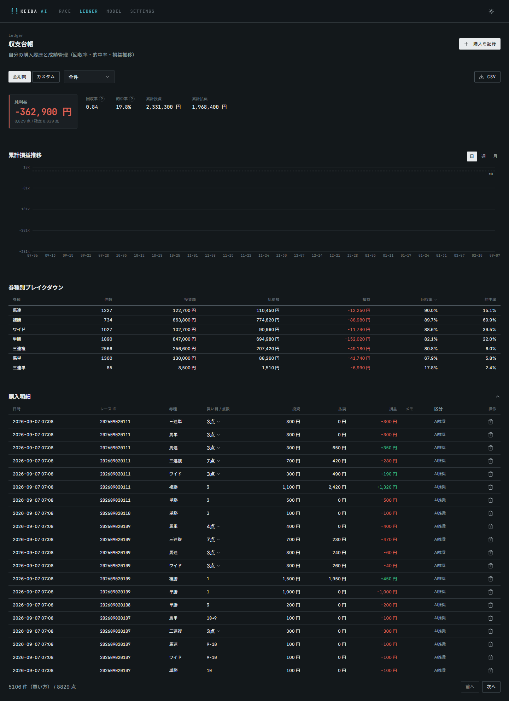
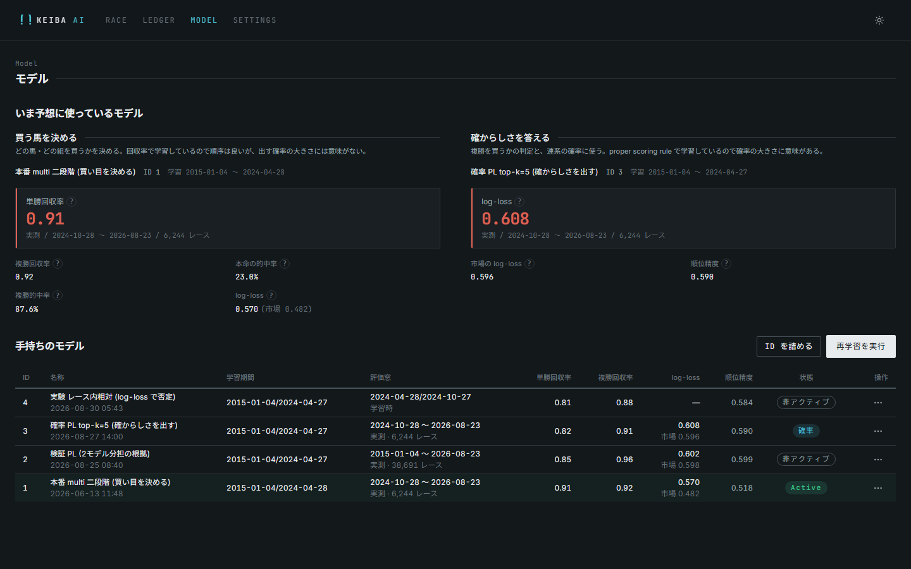
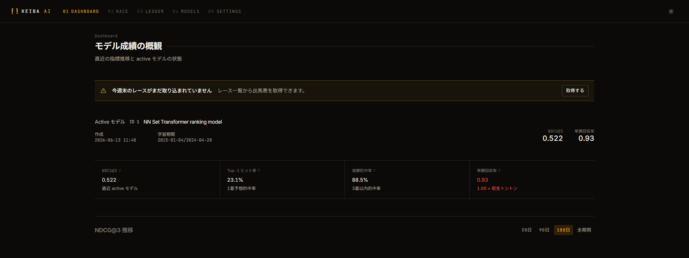

<!-- portfolio:begin -->
<!-- ここから portfolio:end までは自動生成です。直接編集しても次の生成で消えます。
     原本 : portfolio-site/src/data/projects.ts （slug: keiba-ai）
     生成 : cd portfolio-site && npm run docs:emit
     点検 : cd portfolio-site && npm run check
     マーカーの外（ライセンス・クレジットなど）は手書きのまま残ります -->

# KEIBA AI

> データ収集から確率推定・買い目提案・収支検証までを自分で作った個人研究

**[作品ページ（動画つき）](https://kosei-matsuzaki.github.io/portfolio/works/keiba-ai/)** ・ **[開発者向けドキュメント](docs/README.md)**

| 項目 | 内容 |
| --- | --- |
| 期間 | 2026年3月〜 |
| 体制 | 個人開発（企画・設計・実装・実験・評価すべて） |
| 使用技術 | Python / FastAPI / PyTorch Lightning / React / TypeScript / Tailwind CSS / SQLite / SQLAlchemy / uv |
| 単勝 / 複勝回収率（out-of-sample・5,390 レース） | 0.931 / 0.886 |
| 自動テスト（backend + frontend） | 1,300+ |
| リーク防止を強制した特徴量 | 46 |

「機械学習で競馬の回収率 100% を超えられるか」を確かめるためのプロジェクトです。着順ではなく回収率そのものを最適化する損失を設計しましたが、特徴量も損失もどう足してもエッジは上積みできず、multi-seed A/B で「市場効率の壁」を定量化する結果になりました。4.5 年の前進検証を通ったのは賭け方の側（複勝を確信度で厚くする配分）だけで、それでも黒字ラインには届きません。

*レース詳細 — 予想と推奨買い目、買い方の条件設定、レース後の答え合わせ*

*モデルの計算過程（能力推定 → self-attention → 確率導出 → 買い目提案）を manim で可視化した解説動画（サムネイルをクリックで再生・ダウンロード）*

**見どころ**

- レースを「可変長の馬集合」として扱う Set Transformer + 履歴 GRU
- 実オッズでの資金成長率を直接最適化する decision-focused loss
- 回収率を動かしたのはモデル改良ではなく「評価と本番のズレ」の発見だった

## 回収率で評価できる環境をつくる

公営競技の予想が当たったかどうかと、賭けて増えたかどうかは別です。機械学習の教科書的な指標（精度・AUC）が測るのは前者だけなので、収集から収支検証までを自分で作り、回収率という 1 つの指標でモデルを選べる環境を用意しました。

### データ

netkeiba から出馬表・レース結果・全馬券種の実オッズを自動収集し SQLite に蓄積

### 推定

各馬の勝率・複勝率に加え、馬連・三連複など連系馬券の的中確率を解析的に導出

### 意思決定

単勝・複勝は AI の本命（予想 1 位）を、連系は的中確率が下限を超えた買い目を、確信度で決まる点数で提示し、購入記録と実オッズで収支を検証

## レースを「集合」として扱うモデル

出走馬の強さは絶対値ではなく同じレース内の相対比較で決まります。そこで馬単位の回帰ではなく、レース = 可変長の馬集合を入力とする Set Transformer を採用し、self-attention でレース内の全馬を相互参照させました。各馬の過去走系列は GRU でエンコードして結合しています。

損失は着順の順位学習だけでなく、実オッズでの log-growth（賭けた場合の資金成長率）を直接最適化します。モデル選択も検証期間の回収率で行うので、選ばれるのは「精度が高いモデル」ではなく「賭けて増えるモデル」です。

### 確率の一貫性

全馬券種を単一のスコアベクトルから導く。温度は勝ち馬の NLL で較正し、単勝 softmax と複勝 Plackett-Luce で同じ値を使うので、馬券種間で矛盾した予測が起きない

### リーク防止

特徴量は「レース当日より厳密に過去」の情報だけを SQL の条件レベルで強制する。馬 ID・騎手 ID などの識別子は、暗記を防ぐため特徴量に入れない

### 実験基盤

同一データ分割・複数シードで対照比較する paired A/B ハーネスを整備した。モデルは重み・前処理器・温度スケーラ一式を artifact として保存し、任意の時点で再評価できる

## 回収率を動かしたのはモデルではなかった

回収率を実際に動かしたのは、モデルの改良ではなく「学習時に評価したものと、本番で動いているものが違う」というズレの発見でした。いずれも着順の精度はほとんど変わらないのに、回収率だけが動きます。

### 推論時に履歴を渡していなかった

能力エンコーダは過去走系列を GRU で読むのに、その系列を組み立てていたのは連系馬券の経路だけで、単複の予測もバックテストも API も履歴ゼロで動いていた。渡しただけで単勝回収率 0.823 → 0.912。top-1 的中率はほぼ不変で、崩れていたのは順位ではなく確率の校正だった

### 温度スケーラが回収率を見て校正していた

温度を払戻グリッド探索で選んでいたため下限に張り付き、1 位の単勝確率が 100.0% と表示される状態になっていた。NLL 最小化での較正に切り替え、買い方も「モデル 1 位 + オッズ下限」と明示して単勝回収率 0.931（1 番人気ベタ買いは 0.792）

### 期待値フィルタの向きが逆だった

複勝を EV 帯別に並べると「買わない帯」（EV 0.0〜0.9）が 0.832 で最良、EV 2.0 以上が 0.573 で最悪という単調減少で、シグナルが逆を向いていた。単調変換では直せないので期待値フィルタを捨て、単複とも「モデルの本命を買う」に変更。複勝回収率 0.654 → 0.887（1 番人気ベタ買いは 0.850）

### 予算の割り当てが期待値の順のままだった

1 レースの予算を期待値の高い順に埋めていたため、回収率の推定がいちばん確かな単複から切り捨てられていた（実測 2,034 レースで単勝 3 点・複勝 1 点しか買われていない）。並び順と 1 点あたりの金額を券種ごとに決め直しただけで総合回収率 0.776 → 0.868（2025 年 11 月〜2026 年 5 月の実測）。モデルには一切触れていない

## 厚みは確信度で決める

期待値で買う / 買わないを決める方式は全券種で捨てました。残った問いは「同じ買い方の中で、どのレースに厚く張るか」だけで、判断は確信度（確率モデルがその買い目に付けた的中確率）に一本化しています。

### 効くのは複勝だけだった

確信度で 5 分位に切ると、複勝の回収率は 0.749 → 0.911 と単調に上がる。一方の単勝は的中率が 6% → 37% と動くのに回収率は動かない（相関 −0.005）。賭け金を確信度で動かしてよいのは複勝だけ、という非対称を測ってから配分を決めた

### 段階ではなく連続で配分する

倍率を段階で切るのではなく、点数 = 基準 × (確信度 / 0.50)^2 を 1〜15 点に丸める連続配分。前進検証 14,619 レースで複勝回収率は定額 5 点の 0.875 に対し 0.891、しかも 1 レースあたりの点数は 5.42 と段階配分の 8.87 より少ない

## 画面は「読み物」ではなく「端末」

確率と金額を横断で読む道具なので、余白の広い読み物的な UI から、暗所で数字と枠色が立つオッズ端末寄りの画面に作り替えました。箱を積むのをやめて罫線で区切り、数値は等幅＋tabular-nums で桁を揃えています。「今週末のレース」「過去レース」「データ取込」も、結局どれも日付を選ぶ操作だったのでカレンダー 1 画面に統合しました。

新馬戦のように出走馬全員が初出走のレースでは、履歴系の特徴が丸ごと欠けます。出走馬の過去走ゼロ率でレース単位の情報量を測り、レース詳細に「判断材料が少ない」と明示しました。除外しても回収率は動きませんが、買う前に分かること自体に意味があると考えています。

## 節度あるスクレイパー設計

取得先サイトへの負荷を避けることを設計要件として最初に置きました。直列リクエストのみ・最低 3 秒＋ジッター（深夜はさらに延長）・robots.txt 遵守（取得失敗時は fail-closed で全停止）・連絡先を明示した研究用 User-Agent。UI / API / 環境変数の 3 経路から即時停止でき、中断してもレコード単位で再開できます。

## 結果と、いちばん重要な学び

確定実オッズ・19 ヶ月 5,390 レースの out-of-sample 検証で、アプリと同じ賭け方をした場合の回収率は単勝 0.931・複勝 0.886。一律購入のベースライン（控除率のため約 0.75〜0.80）も 1 番人気ベタ買いも上回りましたが、黒字ライン 1.0 には届きません。

特徴量の追加、損失の設計、オッズを入力しないモデルで市場の過小評価を突く戦略まで multi-seed A/B で検証しましたが、本番の回収率はひとつも改善しませんでした。4.5 年の前進検証を通ったのは賭け方の側（複勝を確信度で厚くする配分で 0.875 → 0.891）だけで、モデルの側からは何も出ていません。オッズが既に持つ情報量が支配的で、公開情報から残るエッジは控除率を覆すには足りない — この市場効率を、自前の実験基盤で再現可能な形で確認できたことが到達点だと考えています。次は公開オッズに織り込まれていない情報（ペース・区間タイム・馬場差・オッズの時系列）を入れる方向を試します。

## 画面

*レース — カレンダーで日を選び、その日の取り込みと予想を 1 画面で行う*

*収支台帳 — 買い方単位の損益管理と実オッズでの検証*

*モデル管理 — 学習・切替・バックテストを画面から実行*

*ダッシュボード — モデル成績の概観*

## 生成 AI の活用について

- リポジトリ直下の CLAUDE.md に依存方向・リーク防止規約・DB 運用ルールなど「コード全体を読まないと掴めない制約」を明文化し、どのセッションでも同じ規約下で作業させる
- docs/ の仕様・設計文書を人間と AI の共通の正とし、実装との乖離を定期的に監査
- 全変更にテストを伴わせ、実験は multi-seed A/B で統計的に判定することで提案を鵜呑みにしない
- 課題設定・実験計画・採否判断・アーキテクチャの意思決定は自分が行い、実装・テスト作成・リファクタリングを協働

---

動かし方・設計資料・開発メモは **[docs/README.md](docs/README.md)** にまとめています。  
動画つきの詳しい版: https://kosei-matsuzaki.github.io/portfolio/works/keiba-ai/

<!-- portfolio:end -->

## データソースと権利について

- **個人研究限定**: 取得データ・学習済みモデルは第三者へ提供・公開しません。本リポジトリに含まれるのはソースコードとドキュメントのみです
- **サイト負荷への配慮**: リクエストは直列のみ・最低 3 秒 + ジッター（深夜帯はさらに長く）のレート制御を徹底し、robots.txt を遵守します（取得失敗時は fail-closed = 全リクエスト拒否）。User-Agent は連絡先付きの研究用ボットとして自己申告します
- **即時停止スイッチ**: Race 画面の取込パネル（`DayIngestPanel`）、`/api/scraper/stop` エンドポイント、環境変数 `KEIBA_SCRAPER_STOP=1` の 3 経路で任意のタイミングでスクレイピングを停止できます
- テストフィクスチャはすべて合成 HTML であり、実ページの capture は含まれません

## ライセンス

ポートフォリオとしての閲覧・評価目的でのみ公開しています。再配布・商用利用不可。詳細は [LICENSE](LICENSE) を参照してください。
