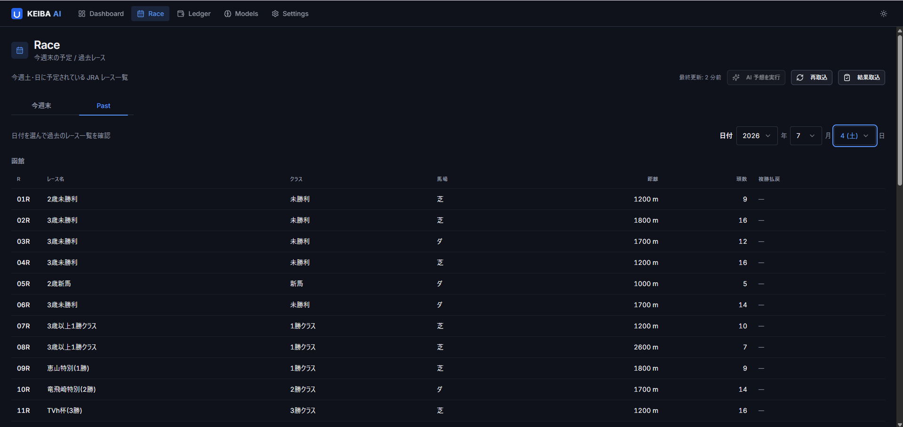
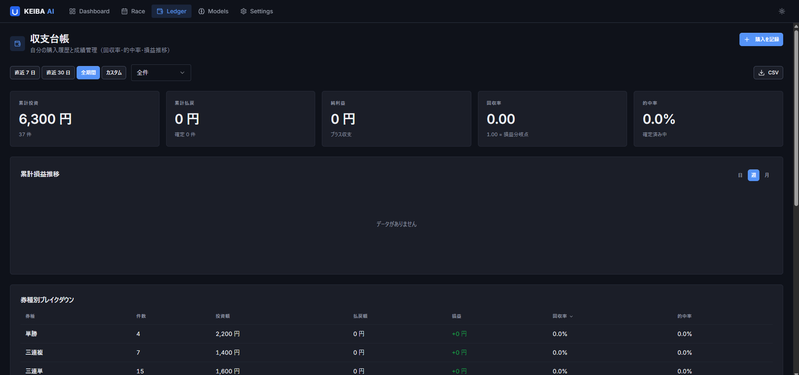
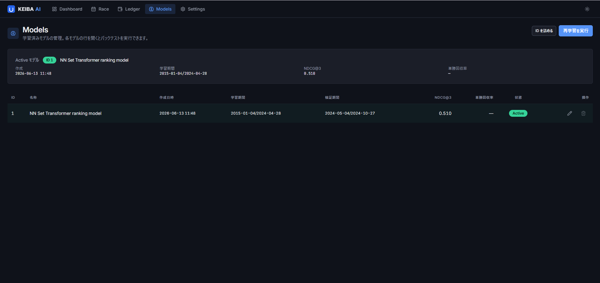
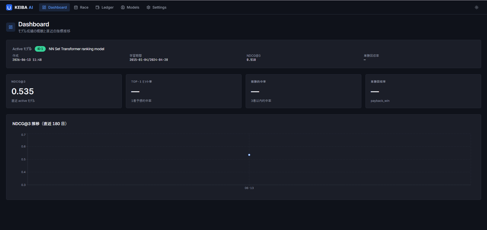

# KEIBA AI — 作品説明資料

競馬レースデータの収集からニューラルネットによる確率推定・買目提案・収支管理までを一気通貫で行う、フルスタックの個人開発プロジェクトです。

| | |
|---|---|
| 開発期間 | 2026年3月〜（継続開発中） |
| 規模 | 426 コミット / backend テスト 1,000+ 件 / frontend テスト 190+ 件 |
| 形態 | ローカル起動の Web アプリ（FastAPI + React） |
| リポジトリ | このリポジトリ（ソースコードとドキュメントのみ。取得データ・学習済みモデルは含まない） |

---

## 1. 何を作ったか

**課題設定**: 「機械学習で競馬の回収率 100% を超えられるか」を、データ収集・特徴量設計・モデル学習・確率校正・賭け戦略・収支検証の全工程を自作して検証する。

**できること**:

- netkeiba から出馬表・レース結果・オッズ（全馬券種の実オッズを含む）を自動収集し SQLite に蓄積
- Set Transformer + 履歴 GRU による各馬の勝率・複勝率推定と、Plackett-Luce モデルによる馬連・三連複など連系馬券の的中確率の解析的導出
- 期待値 (EV) と fractional Kelly 基準に基づく推奨買目の提示
- 実際の購入記録の管理と、実オッズを使ったバックテスト・収支シミュレーション
- モデルの学習・評価・切替を管理画面から実行

## 2. スクリーンショット

| レース詳細（AI 予測・単勝EV・BUY 推奨） | 過去レース一覧 |
|---|---|
|  |  |

| 収支台帳（買い方単位の損益管理） | モデル管理（学習・切替・バックテスト） |
|---|---|
|  |  |

| ダッシュボード（モデル成績の概観） | |
|---|---|
|  | |

<!-- TODO: 週末レース一覧 (upcoming-races.png) は netkeiba のレース情報提供の復旧後に撮影して追加 -->

## 3. アーキテクチャ

```text
ブラウザ (http://localhost:5173)
    │
    ▼  React 管理画面 (Vite + TypeScript + shadcn/ui)
    │      HTTP → http://127.0.0.1:8765/api/*
    ▼
FastAPI (uvicorn)
    ├─ scraper/   netkeiba クライアント（レート制御・robots.txt fail-closed・停止スイッチ）
    ├─ jobs/      取込ジョブ（非同期バックグラウンド実行・202 即時返却・resume 対応）
    ├─ features/  特徴量パイプライン（46 特徴量・リーク防止を SQL レベルで強制）
    ├─ ai/        学習 (PyTorch Lightning) / 推論 / 賭け戦略 / シミュレーション / 評価
    └─ db/        SQLite ×2（レースデータ + 実オッズ）, SQLAlchemy + Alembic
```

**依存方向を `api → jobs → ai/features/scraper → db` に厳守**し、循環依存を禁止。`ai/` 内部も依存 DAG に沿って `core → model → training/inference/betting/simulation/evaluation` にサブパッケージ化しています。

## 4. 技術ハイライト

### レースを「集合」として扱う Set Transformer

出走馬の強さは絶対値ではなく同レース内の相対比較で決まるため、馬単位の回帰ではなく**レース = 可変長の馬集合**を入力とする Set Transformer（self-attention でレース内の全馬を相互参照）を採用。さらに各馬の過去走系列を GRU でエンコードして結合します。「能力の推定」と「オッズ（市場情報）の利用」をネットワーク内で分離し、市場情報への過度な依存を制御できる構成にしています。

### 回収率を直接最適化する decision-focused loss

着順の順位学習 (Plackett-Luce) だけでなく、**実オッズでの fractional-Kelly log-growth（賭けた場合の資金成長率）を損失関数として直接最適化**する `log_growth` 損失、連系馬券確率の NLL を加えて外部校正器を不要にした本番用の複合損失 `multi` を実装。「精度が高いモデル」ではなく「賭けて儲かるモデル」を選ぶため、モデル選択も検証期間の回収率で行います。最良構成は順位損失での事前学習 → 複合損失への fine-tune の二段階学習です。

### 確率の一貫した導出と校正

NN のスコアから、単勝確率は温度スケーリング付き softmax、複勝・連系確率は Plackett-Luce モデルのモンテカルロ / 解析解で導出。すべての馬券種の確率が単一のスコアベクトルから一貫して得られるため、馬券種間で矛盾した予測が起きません。

### リーク防止の徹底

- 特徴量は「レース当日より**厳密に過去**」の情報のみを SQL の条件レベルで強制
- 馬 ID・騎手 ID などの識別子は特徴量に入れない（暗記の防止）
- 学習/検証/テストは時系列で分割し、評価は常に out-of-sample
- 予測時点で未確定のオッズを除外して検証できるスイッチも用意

### 節度あるスクレイパー設計

直列リクエストのみ・最低 3 秒 + ジッター（深夜はさらに延長）・robots.txt 遵守（取得失敗時は fail-closed で全停止）・連絡先を明示した研究用 User-Agent・UI / API / 環境変数の 3 経路の即時停止スイッチ。中断してもレコード単位で再開できる resume 機構を全 backfill ジョブに実装しています。

### 実験基盤と再現性

特徴量やモデル構成の変更を同一データ分割・複数シードで対照比較する paired A/B ハーネスを整備。モデルはタイムスタンプ付きディレクトリに artifact 一式（重み・前処理器・温度スケーラ・メタデータ）として保存され、任意の時点のモデルで再評価できます。

## 5. 成果と学び

**定量的な結果** (out-of-sample、確定実オッズでの検証):

- 単勝回収率 **0.89** / 複勝回収率 **0.94** — ベースライン（一律購入 ≈ 0.75〜0.80、控除率 20〜25%）と市場の 1 番人気追従を有意に上回るが、**1.0 (黒字) には届かない**
- 着順予測精度 (NDCG@3) では市場オッズ由来の予測を上回る構成も達成

**最も重要な学び — 「市場効率の壁」の定量確認**:

特徴量追加（欠損フラグ・log 変換・タイム指数・ペース適性）、損失設計（デプロイ整合 Kelly 損失）、データ増量など **10 方向のモデル改善を multi-seed A/B で検証し、本番設定の回収率を改善したものはゼロ**でした。オッズ（市場の集合知）が既に持つ情報量が支配的で、公開情報からの残余のエッジは控除率を覆すには足りない — という公営競技市場の効率性を、自前の実験基盤で再現可能な形で確認したことがこのプロジェクトの技術的な到達点です。ネガティブリザルトを含む全実験の記録は [ai-model.md](ai-model.md) にあります。

**工学面の学び**: 時系列データのリーク防止設計、確率的予測の校正 (proper scoring rule)、非同期ジョブ管理、SQLite の実運用（WAL/TRUNCATE、破損対策、世代バックアップ）、単独開発でのドキュメント駆動の仕様管理。

## 6. 動かし方

前提: [uv](https://docs.astral.sh/uv/) / Node.js 20+ / pnpm

```bash
bash scripts/dev.sh          # 依存同期 + DB migration + uvicorn(:8765) + Vite(:5173)
# → http://localhost:5173
```

データとモデルは同梱されないため初回は空の状態です。画面の取込ボタン（またはCLI `uv run keiba-ingest --date 2024-12-28`）でデータを取得し、モデル管理画面（または `uv run python -m ai.training.train_nn ...`）で学習すると全機能が動きます。

```bash
# テスト
cd backend && uv run pytest      # 1,000+ 件
cd frontend && pnpm test         # 190+ 件
```

## 7. AI (Claude Code) の活用について

本プロジェクトは **Claude Code (Anthropic の CLI 型コーディングエージェント) を全面的に活用**して開発しました。「AI に書かせて終わり」ではなく、AI を安全に使うための仕組みづくり自体を開発プロセスに組み込んでいます:

- **制約の明文化**: リポジトリ直下の `CLAUDE.md` に、依存方向・リーク防止規約・DB 破損を防ぐ運用ルールなど「コード全体を読まないと掴めない制約」を明文化し、AI がどのセッションでも同じ規約下で作業するようにした
- **ドキュメント駆動**: `docs/` の仕様・設計文書を人間と AI の共通の正とし、実装との乖離を定期的に監査・修正
- **検証の自動化**: 全変更にテストを伴わせ (backend 1,000+ / frontend 190+ 件)、実験は multi-seed A/B ハーネスで統計的に判定することで、AI の提案を鵜呑みにしない体制を維持
- **役割分担**: 課題設定・実験計画・採否判断・アーキテクチャ上の意思決定は人間が行い、実装・テスト作成・リファクタリング・ドキュメント整備を AI と協働

## 8. 今後の展望

- 予測の説明性（どの特徴が効いたか）の再導入
- 地方競馬・海外レースへの対応によるデータ拡張
- 「儲ける」から「市場の歪みを検出する」への目的の再設定（期待値の高い歪みが発生する条件の研究）
