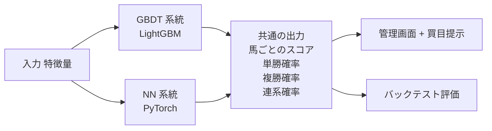
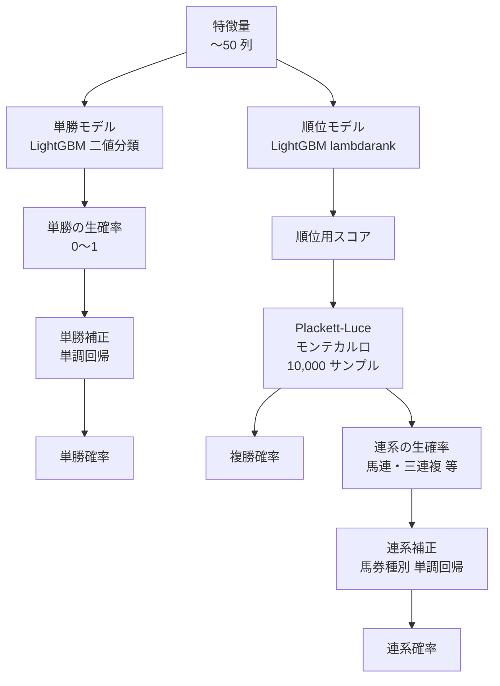
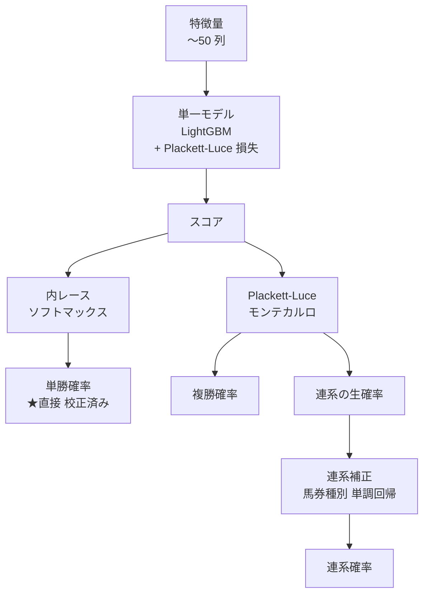
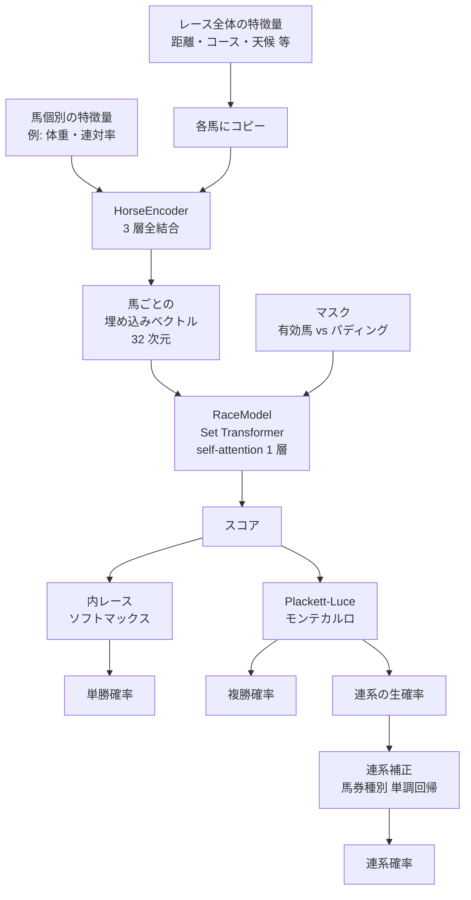

# KEIBA AI — モデル設計書

関連ドキュメント: [spec.md](spec.md) / [design.md](design.md) / [data-pipeline.md](data-pipeline.md)

---

## 問題定義

競馬の単勝・複勝・連系（馬連 / ワイド / 馬単 / 三連複 / 三連単）予想を「各馬にスコアを付け、レース内の着順を推定する」課題として定式化する。

このスコアから派生して以下の値を計算する。

- **単勝の出る確率**（1 着になる確率）
- **複勝の出る確率**（3 着以内に入る確率）
- **連系の出る確率**（指定の組み合わせで決まる確率）

予想モデルは以下の二系統を併存させており、同じ入力（馬の特徴量）に対して同じ出力スキーマ（馬ごとのスコアと各種確率）を返す。

| 系統 | 実装 | 用途 |
|---|---|---|
| GBDT（勾配ブースティング決定木） | LightGBM | 主流。CPU 単体で速く、本番運用が容易 |
| NN（ニューラルネットワーク） | PyTorch + Lightning + Set Transformer | 実験用。馬同士の相互作用を構造的に表現できるかを検証中 |

両系統とも `predict_race_bundle` という共通インターフェースで呼び出せるため、推論経路を切り替えるだけで同じ管理画面・同じ評価コードから扱える。

---

## モデルアーキテクチャ概要



GBDT には **2 つの動作モード**があり、`--loss` フラグで切り替える。

| モード | 起動方法 | 概要 |
|---|---|---|
| 順位学習モード（既定） | `--loss lambdarank` | 順位を直接学習する LightGBM のランキング目的関数を使う。単勝確率は別の二値モデル + 単調補正で出す |
| Plackett-Luce モード | `--loss plackett_luce` | 「順位の起こりやすさを直接モデル化する」損失で学習。スコアをそのまま単勝確率に変換できるため二値モデルが不要 |

NN モードは現状 1 種類のみ。馬個別の処理と馬同士の相互作用処理を分けたアーキテクチャになっている。

---

## GBDT — 順位学習モード（既定動作）

### 流れ



### 各ブロックの役割

| ブロック | 入力 | 出力 | 役割 |
|---|---|---|---|
| 順位モデル | 馬の特徴量 | スコア | 各馬の「強さの順位」を直接学習する。`relevance` ラベル（1 着=4、2 着=3、3 着=2、4-5 着=1、それ以下=0）に対する LightGBM の lambdarank 損失で最適化 |
| 単勝モデル | 馬の特徴量 | 0〜1 の生値 | 「1 着になる / ならない」の二値分類で、単勝の生確率を出す（順位モデルとは別個に学習） |
| 単勝補正 | 単勝モデルの生値 | 校正済み単勝確率 | 検証データでの実際の勝率と生値のズレを単調関数で矯正する |
| Plackett-Luce モンテカルロ | 順位モデルのスコア | 複勝確率・連系生確率 | スコアからレース結果（着順）を 10,000 回ランダム生成し、各馬が 3 着以内に入る回数や連系の組み合わせの出現回数を数えて確率に変換 |
| 連系補正 | 連系の生確率 | 校正済み連系確率 | モンテカルロで出した連系確率は長配（穴狙い）側で過大に出る系統的バイアスがあるため、馬券種別（馬連 / ワイド / 馬単 / 三連複 / 三連単）に単調回帰で矯正する |

### このモードの構造的な弱点

順位モデルと単勝モデルは **同じ訓練データを別々の目的関数で最適化** している。両者の出力は厳密には一致せず、たとえば順位モデルでは 1 番手のスコアでも単勝モデルでは 2 番目に高い確率になる、ということが起きうる。これを後付けの単調回帰で矯正している。

「順位モデル」と「単勝モデル」と「単調回帰」の三段構成は、それぞれが独立に学習されるため整合性が保証されない。これを 1 本の損失で統合する案が次節の Plackett-Luce モード。

### 追加オプション

| フラグ | 由来 issue | 効果 |
|---|---|---|
| `--recency-lambda 0.5` | #205 | 古いレースほどサンプル重みを下げる（重み = `exp(-λ × 経過年数)`）。コース改修やルール変更による「環境の変化」に対応する |
| `--conditional-calibration` | #208 | 単勝補正と連系補正を「コース種別 × 出走頭数」のバケット別に学習する。`(芝, 16 頭以上)` と `(ダート, 8 頭以下)` ではバイアスの傾向が違うはずという仮説に基づく |
| `--cv-folds 2` | #206 | 単一の学習・検証・テスト分割ではなく、時系列を後ろから前進検証で N 分割して指標の平均と分散を出す。性能差が偶然か実力かを判定しやすくなる |

---

## GBDT — Plackett-Luce モード

### 流れ



### Plackett-Luce 損失とは

「レースの結果（1 着 → 2 着 → 3 着 → ... の並び）が起こる確率」を、各馬のスコアから直接計算する確率モデル。スコアの指数を内レースで正規化したものが「次の 1 着になる確率」になり、それを順番に掛け合わせると「観察された並び順そのもの」の確率が出る。これが大きくなるようにスコアを学習すれば、自動的に **スコアの指数 ≒ 単勝確率** になる。

### このモードの利点

- **単勝モデルが不要**: スコアをレース内でソフトマックス（指数を取って合計が 1 になるように割る）するだけで単勝確率になる
- **単勝補正が不要**: ソフトマックスの結果がそのまま校正済みの確率として使える（仕組みが「順位の起こりやすさ」を直接学習しているため）
- **役割の重複が消える**: 順位を出すモデルと単勝確率を出すモデルが同一になり、両者の不整合という問題自体が消える

### このモードの注意点

- 連系確率は引き続きモンテカルロ + 馬券種別の単調回帰で出す（複勝以下の確率は厳密にはモデル化されていないため）
- LightGBM は標準では Plackett-Luce 損失を持っていないため、勾配とヘシアンを Python で実装した `pl_loss.py` を「カスタム目的関数」として登録している
- カスタム目的関数のため学習時間は順位学習モードより 1.5〜2 倍程度長い

### コード上の制御

`train.py` では以下のように分岐している（要点のみ）:

```python
use_pl = loss == "plackett_luce"
if use_pl:
    binary_model = None
    calibrator = None
    log.info("PL mode: skipping binary classifier and calibrator.")
else:
    binary_model, calibrator, _ = _train_binary_classifier_and_calibrator(...)
```

---

## NN モード

### 流れ



### 構成

| ブロック | 種類 | 役割 |
|---|---|---|
| HorseEncoder | 全結合 3 層 | 各馬を独立に処理し、特徴量を 32 次元の埋め込みベクトルに変換する。レース全体の特徴量（距離・コース・天候など）は全馬にコピーしてから入力に連結 |
| RaceModel | Set Transformer 1 層 + 出力ヘッド | 同じレースに出走している馬同士の相互作用を self-attention で表現する。「16 頭立てで突出した強い馬がいるレース」と「8 頭立ての横一線レース」では各馬のスコア解釈が変わる、という効果を構造的に取り込む |
| マスク | bool 行列 | 異なる頭数のレースを 1 つのバッチにまとめるために、最大頭数までゼロ埋めしたパディング部分を attention から除外する |

### 学習

PyTorch Lightning の `Trainer` で動かす。損失関数は 3 種類用意してあり `--loss` で切り替える。

| 損失 | 概要 |
|---|---|
| `plackett_luce`（既定） | GBDT の PL モードと同じ確率モデル。NN 版ではこちらを既定にする |
| `listmle` | リストワイズの順位学習損失。PL とほぼ同等だが計算経路がわずかに違う |
| `time_margin` | 着差秒数を重みにしたペアワイズ損失。「2 馬身差」と「ハナ差」の両方を 1 着 → 2 着の同じシグナルとして扱う既存ランキング損失の弱点を補う |

### 単勝確率・複勝確率・連系確率の出し方

- スコアからの **単勝確率**: GBDT の PL モードと同じくソフトマックス（補正不要）
- **複勝確率・連系確率**: GBDT と同じ Plackett-Luce モンテカルロ + 連系補正

つまり推論経路の出力は GBDT と完全に同じ形になる。違いはスコアを出すまでの計算経路だけ。

### 現状の位置付け

skeleton（土台）の動作確認まで済んでおり、データ参照 → 学習 → 保存 → 推論の経路が全部つながっている。性能調整（隠れ層サイズ・学習率・損失関数の選択・データ拡充）は本番データの蓄積後に行う。

---

## 3 モードの役割比較

| 役割 | 順位学習モード | Plackett-Luce モード | NN モード |
|---|---|---|---|
| 主モデル | LightGBM lambdarank | LightGBM + PL 損失 | Set Transformer + PL 損失 |
| 単勝モデル（独立） | LightGBM 二値分類 | 不要 | 不要 |
| 単勝補正 | 必要（単調回帰） | 不要 | 不要 |
| 複勝確率 | Plackett-Luce モンテカルロ | 同左 | 同左 |
| 連系の生確率 | Plackett-Luce モンテカルロ | 同左 | 同左 |
| 連系補正 | 馬券種別 単調回帰 | 同左 | 同左 |
| 学習時間（相対） | 1.0x | 1.5〜2.0x | 5.0x 以上（CPU） |
| 重複構造 | あり（順位 vs 単勝が独立） | 無し | 無し |
| 実運用 | 既定・本番投入 | 比較検証中 | 実験中 |

---

## ラベル設計（順位学習モードでの relevance）

| 着順 | relevance ラベル |
|---|---|
| 1 着 | 4 |
| 2 着 | 3 |
| 3 着 | 2 |
| 4〜5 着 | 1 |
| 6 着以下 / 競走中止 | 0 |

`group`（クエリ）は `race_id` ごとに設定する。実装は `ai/labels.py` の `assign_relevance` 関数。Plackett-Luce モードと NN モードでは relevance ではなく **生の着順 (1, 2, 3, ...)** を直接ラベルとして使う。

---

## ハイパーパラメータ（GBDT 既定）

```python
DEFAULT_PARAMS = {
    "objective":                  "lambdarank",
    "metric":                     "ndcg",
    "ndcg_eval_at":               [1, 3],
    "lambdarank_truncation_level": 3,
    "num_leaves":                 63,
    "learning_rate":              0.05,
    "min_data_in_leaf":           5,
    "feature_fraction":           0.9,
    "bagging_fraction":           0.8,
    "bagging_freq":               5,
    "verbose":                    -1,
}
```

> `min_data_in_leaf=5` は小規模 / synthetic データでも動かすための値。本番 DB（数万レース以上）では 50 以上に引き上げることを推奨する（`--params-json` で上書き可能）。
> Plackett-Luce モードでは `objective` がカスタム関数に置き換わるため、`metric` / `ndcg_eval_at` / `lambdarank_truncation_level` は内部で除外される。

### パラメータファイルの使い分け

| ファイル | 用途 |
|---|---|
| `backend/configs/production_lgb.json` | 本番 DB（大規模・実データ）向け。`num_leaves=127`, `learning_rate=0.03`, `min_data_in_leaf=50`, `num_boost_round=2000` 等 |
| `backend/configs/synthetic_lgb.json` | 小規模 / synthetic データ / テスト向け。DEFAULT_PARAMS をそのまま記録したもの |

---

## 特徴量カタログ

実装は `features/` 配下の各モジュールと `features/builder.py` の `FEATURE_COLUMNS` / `CATEGORICAL_FEATURES` に集約されている。GBDT・NN とも同じ列を使うが、NN ではレース全体に共通する列（`distance`, `surface`, `course`, `weather`, `track_condition`, `race_class`, `n_runners`）を「レース特徴量」として馬個別の列と分離して使う。

合計 50 列前後（PR ごとに微増）。**欠損値の扱い**: LightGBM の native missing value 処理に委譲する。imputation は行わない。NN では数値列はそのまま、カテゴリ列はラベル符号化してから tensor 化する。

### レース・馬番

| カラム名 | モジュール | 内容 |
|---|---|---|
| `distance` | `features/course.py` | 距離 (m) |
| `n_runners` | `features/course.py` | 出走頭数 |
| `post_position` | `features/course.py` | 馬番 |
| `post_position_ratio` | `features/course.py` | 馬番 / 出走頭数 |
| `age` | `features/course.py` | 馬齢 |
| `horse_weight` | `features/course.py` | 馬体重 (kg) |
| `horse_weight_diff` | `features/course.py` | 馬体重増減 |

### オッズ・市場

| カラム名 | モジュール | 内容 |
|---|---|---|
| `odds_win` | `features/odds.py` | 単勝オッズ |
| `popularity` | `features/odds.py` | 人気順位 |
| `log_odds_win` | `features/odds.py` | log(単勝オッズ) |

### 馬の過去成績

| カラム名 | モジュール | 内容 |
|---|---|---|
| `recent_avg_finish` | `features/horse_history.py` | 直近 5 走の平均着順 |
| `recent_n_starts` | `features/horse_history.py` | 総出走回数 |
| `starts_same_distance` | `features/horse_history.py` | 同距離での出走回数 |
| `starts_same_course` | `features/horse_history.py` | 同競馬場での出走回数 |
| `recent_avg_agari_3f` | `features/horse_history.py` | 直近 5 走の上がり 3F 平均 |
| `days_since_last_race` | `features/horse_history.py` | 前走からの経過日数 |
| `wins_same_course` | `features/horse_history.py` | 同競馬場での勝利数 |
| `recent_finish_1` / `_2` / `_3` | `features/horse_history.py` | 1〜3 走前の着順 |
| `recent_avg_class_weight` | `features/horse_history.py` | クラス重み付き直近成績 |
| `high_class_starts` | `features/horse_history.py` | 上位クラスでの出走回数 |
| `high_class_places` | `features/horse_history.py` | 上位クラスでの 3 着以内回数 |
| `recent_avg_margin` | `features/horse_history.py` | 直近 5 走の着差（秒）の平均 |
| `recent_avg_finish_time_norm` | `features/horse_history.py` | 直近 5 走の走破タイム / 距離 の平均 |
| `recent_best_margin_in_top3` | `features/horse_history.py` | 直近 3 着以内に入ったときの最良着差 |
| `recent_avg_position_change` | `features/horse_history.py` | 通過順 → 着順の差の平均（末脚指標） |
| `recent_passing_volatility` | `features/horse_history.py` | 通過順位の標準偏差 |

### 騎手・調教師

| カラム名 | モジュール | 内容 |
|---|---|---|
| `jockey_recent_win_rate` | `features/jockey.py` | 直近 30 日の騎手勝率 |
| `jockey_recent_place_rate` | `features/jockey.py` | 直近 30 日の騎手複勝率 |
| `jockey_course_place_rate` | `features/jockey.py` | 同競馬場での騎手複勝率 |
| `trainer_course_place_rate` | `features/trainer.py` | 同競馬場での調教師複勝率 |

### カテゴリ特徴量

| カラム名 | モジュール | 内容 |
|---|---|---|
| `surface` | `features/course.py` | 馬場種別（芝 / ダ） |
| `course` | `features/course.py` | 競馬場名 |
| `weather` | `features/course.py` | 天候 |
| `track_condition` | `features/course.py` | 馬場状態 |
| `race_class` | `features/course.py` | レースクラス |
| `sex` | `features/course.py` | 性別 |

### 同レース内 相対特徴量

レース内の他馬との相対値を計算した列。

| カラム名 | 内容 |
|---|---|
| `horse_weight_pct` | 馬体重の percentile |
| `odds_win_rank` | 単勝オッズ順位（1 = 最低オッズ = 1 番人気） |
| `weight_carried_pct` | 斤量の percentile |
| `jockey_recent_win_rate_vs_field` | 騎手勝率 − レース平均 |
| `course_place_rate_vs_field` | 同コース複勝率 − レース平均 |
| `odds_win_diff_from_favorite` | 当馬オッズ − レース内最低オッズ |

### 血統

| カラム名 | モジュール | 内容 |
|---|---|---|
| `sire_progeny_win_rate` | `features/pedigree.py` | 父の産駒勝率 |
| `dam_progeny_win_rate` | `features/pedigree.py` | 母の産駒勝率 |

> 父系・母系の **ID** 自体（`sire_id` / `dam_sire_id`）は高基数で過学習源になりやすいため学習特徴量には含めない方針（`HIGH_CARDINALITY_ID_FEATURES` 定数で防御。詳細は #204）。代わりに集約値（産駒勝率）を使う。

### リーク防止の実装保証

全ての特徴量関数は `before_date` を必須引数として受け取り、SQL の where 句で `Race.date < before_date.isoformat()` による行レベルフィルタを適用する。時系列 shift による事後計算は行わず、DB クエリ段階で保証する。

---

## 学習・評価フロー

### 時系列分割（リーク防止）

実装は `ai/splits.py` の `time_split`。

```text
基準日（train_end 引数 or データ最終日）
├── テスト開始: 基準日 - test_months（既定 6 ヶ月）
├── 検証開始:   テスト開始 - valid_months（既定 12 ヶ月）
│
├── 学習データ: [min_date, 検証開始)
├── 検証データ: [検証開始, テスト開始)  ← 早期停止・指標評価
└── テストデータ: [テスト開始, 基準日]  ← ホールドアウト、最終評価のみ
```

### 前進検証 N 分割（`--cv-folds`）

`--cv-folds 2` 以上を指定すると、上記の単一分割の代わりに **時系列を後ろから前進検証で N 分割** する。

```text
fold 1: 学習 [..., D-2T] | 検証 [D-2T, D-T] | テスト [D-T, D]
fold 2: 学習 [..., D-3T] | 検証 [D-3T, D-2T] | テスト [D-2T, D-T]
...
```

各 fold の指標を平均と分散で集計し、`metrics_json["cv_metrics"]` に保存する。最終的にディスクに残るモデルは fold 1（最新期間で学習したもの）。

### 評価指標

| 指標 | 内容 |
|---|---|
| NDCG@1 | 1 着予想の精度 |
| NDCG@3 | 上位 3 着予想の精度（メイン指標） |
| Top-1 ヒット率 | モデル 1 位予想が実際に 1 着になった割合 |
| 複勝的中率 | モデル上位 3 頭のうち 1 頭以上が実際に 3 着以内に入った割合 |
| 単勝 回収率（`payback_win`） | 単勝 EV > 1.1 の馬に賭けた場合の `払戻金合計 / 賭け金合計`。**1.00 が損益分岐点** |
| 複勝 回収率（`payback_place`） | 複勝 EV > 1.05 の馬に賭けた場合の回収率 |

> **回収率の定義**: 日本競馬の慣習に合わせて「総払戻 / 総投資」で表現する。1.00 が損益分岐、1.10 = 10% プラス、0.80 = 20% マイナス。

### ベースライン比較（`--baseline favorite`）

各レースで `odds_win` が最低の馬（1 番人気）に単勝・複勝を常時ベットする dumb 戦略と比較する。`delta = model − baseline` が正であればモデルがベースラインを上回っている。

---

## 学習 CLI

### GBDT

```bash
# 既定（順位学習モード）
uv run python -m keiba_ai.ai.train

# Plackett-Luce モード
uv run python -m keiba_ai.ai.train --loss plackett_luce

# 古いレースの重みを下げて学習する
uv run python -m keiba_ai.ai.train --recency-lambda 0.5

# 単勝補正と連系補正をコース × 頭数別に分ける
uv run python -m keiba_ai.ai.train --conditional-calibration

# 時系列 3 分割の前進検証
uv run python -m keiba_ai.ai.train --cv-folds 3

# カスタムパラメータ
uv run python -m keiba_ai.ai.train --params-json backend/configs/production_lgb.json

# 学習期間の指定
uv run python -m keiba_ai.ai.train --train-end 2025-12-31 --valid-months 6 --test-months 3
```

### NN

```bash
# 既定（Plackett-Luce 損失、CPU、3 層 32 次元）
uv run python -m keiba_ai.ai.nn.train_nn

# 損失関数の切り替え
uv run python -m keiba_ai.ai.nn.train_nn --loss listmle
uv run python -m keiba_ai.ai.nn.train_nn --loss time_margin

# 隠れ層・埋め込み次元・ヘッド数の調整
uv run python -m keiba_ai.ai.nn.train_nn \
    --hidden-dim 128 --embed-dim 64 --n-heads 8

# 学習エポック・バッチサイズ・学習率
uv run python -m keiba_ai.ai.nn.train_nn \
    --max-epochs 50 --batch-size 64 --learning-rate 5e-4

# GPU
uv run python -m keiba_ai.ai.nn.train_nn --device cuda
```

### 評価

評価 CLI は GBDT と NN で共通。

```bash
# 学習済みモデルをバックテスト評価する
uv run python -m keiba_ai.ai.evaluate --model data/models/20260101-120000

# 1 番人気常時投票ベースラインと比較する
uv run python -m keiba_ai.ai.evaluate --model data/models/... --baseline favorite

# 評価結果を model_runs.metrics_json にマージ保存する
uv run python -m keiba_ai.ai.evaluate --model data/models/... --persist
```

学習完了後、モデルは `data/models/<YYYYMMDD-HHMMSS>/`（GBDT）または `data/models/<YYYYMMDDTHHMMSS>-nn/`（NN）に自動保存され、`model_runs` テーブルに `is_active=0` で登録される。`model_type` カラム（alembic migration 0008）で GBDT / NN を区別する。

---

## 推奨ベットルール

バックテスト評価および実運用想定のための初期ルール設定。Settings 画面で変更可能。

| 券種 | 買い条件 |
|---|---|
| 単勝 | `単勝確率 × odds_win > 1.1` |
| 複勝 | `複勝確率 × 複勝オッズ最低値 > 1.05` |

> バックテスト上の最適閾値は本番 DB でのデータ蓄積後に見直す。

**フロントエンド BUY バッジとの同期**: Race Detail 画面の `PredictionTable` も同じ条件で BUY バッジを表示する。Settings で閾値を変更した場合はバックテスト側（`WIN_EV_THRESHOLD`）とフロント側（Settings 経由で `PUT /api/settings`）の両方を更新すること。

---

## SHAP 特徴量寄与（GBDT のみ）

`ai/predict.py` の `predict_race_with_shap()` が SHAP TreeExplainer で各馬の上位 3 特徴量列名を返す。`GET /api/predictions/{race_id}` の `top_features` フィールドに格納される。NN モデルでは未対応。

---

## Future Work

- **GBDT 順位学習モード vs Plackett-Luce モード**: 同期間で学習して回収率と NDCG を比較し、PL モードが同等以上なら本番経路を切り替える
- **NN の性能調整**: 隠れ層サイズ・損失関数・学習率を grid 探索。データ蓄積後に GBDT との比較学習を実施
- **アンサンブル**: GBDT + NN の予測を加重平均する（両者の弱点が独立している前提）
- **Optuna による GBDT ハイパーパラメータ探索**: 探索目的を `valid_ndcg1` ではなく `payback_place` にして、回収率を直接最適化する
- **オッズ時系列特徴量**: 出馬表公開時 vs 締め切り時のオッズ変化を特徴量化（市場の momentum シグナル）
