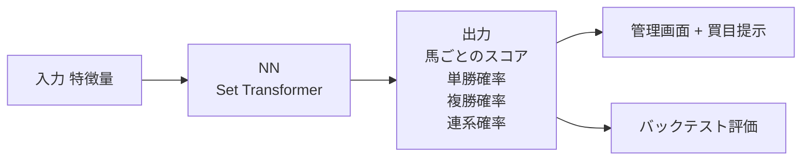
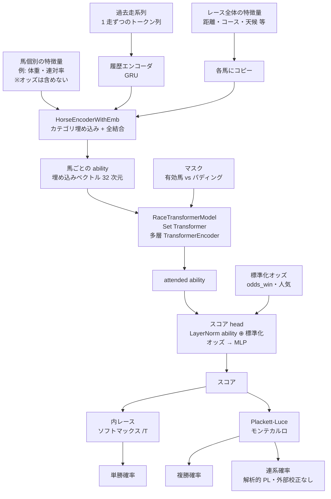

# KEIBA AI — モデル設計書

関連ドキュメント: [spec.md](spec.md) / [design.md](design.md) / [data-pipeline.md](data-pipeline.md)

---

## 問題定義

競馬の単勝・複勝・連系（馬連 / ワイド / 馬単 / 三連複 / 三連単）予想を「各馬にスコアを付け、レース内の着順を推定する」課題として定式化する。

このスコアから派生して以下の値を計算する。

- **単勝の出る確率**（1 着になる確率）
- **複勝の出る確率**（3 着以内に入る確率）
- **連系の出る確率**（指定の組み合わせで決まる確率）

予想モデルは **NN（PyTorch + Lightning + Set Transformer）単独構成**。`registry.load_model_full` が返す `ModelBundle` を `predict_race` / `predict_race_with_combinations` に渡して推論し、管理画面・評価コードも同じ経路を使う。

---

## モデルアーキテクチャ概要



モデルは **ability（馬の実力）** と **value（市場のオッズ）** を分離したアーキテクチャ。馬個別の処理（`HorseEncoderWithEmb`、オッズを含まない）→ 馬同士の相互作用（Set Transformer）で ability を出し、最後のスコア head でオッズを合成する。学習目的（損失）は `--loss` で切り替える（下記）。

---

## NN モード

### 流れ



### 構成

| ブロック | 種類 | 役割 |
|---|---|---|
| 履歴エンコーダ | GRU | 各馬の過去走を「1 走ずつのトークン列」として時系列に要約する。集約スカラー（連対率など）が潰してしまう「その日のレース内容ごとの情報」を保つ。過去走 0 件の馬は zero ベクトル。leak-safe（レース日より厳密に過去のみ） |
| HorseEncoderWithEmb | カテゴリ埋め込み + 全結合 | 各馬を独立に **実力（ability）** として処理し 32 次元埋め込みに変換する。カテゴリ特徴は `nn.Embedding`、レース全体特徴は全馬にコピーして連結、履歴 GRU 出力も連結。**オッズ（市場予想）はここには入れない** |
| RaceTransformerModel | 多層 TransformerEncoder + スコア head | 馬同士の相互作用を self-attention（GELU・pre-norm・FFN）で表現。「16 頭立てで突出した強い馬がいるレース」と「8 頭立ての横一線レース」でスコア解釈が変わる効果を取り込む。スコア head は ability を LayerNorm したものに **標準化済みオッズを連結** して MLP に通す（ability→value 分離） |
| マスク | bool 行列 | 異なる頭数のレースを 1 つのバッチにまとめるために、最大頭数までゼロ埋めしたパディング部分を attention から除外する |

> **オッズの扱い**: `odds_win` / `popularity` は ability エンコーダではなくスコア head で使う（馬の実力評価に市場予想を混ぜない）。`KEIBA_EXCLUDE_ODDS_FEATURES=1` のときはオッズ次元 0 で head が ability のみを入力に取る（オッズ未確定時の検証用）。`history_feat_dim` / `odds_feat_dim` は *次元* で 0 ならその入力なし。旧 v1/v2 アーキと gated フラグ（`use_history` / `use_odds_head` / `arch_version`）は 2026-06 に全廃し、この構成が唯一の正規アーキ。

### 学習（既定は ROI 志向 = decision-focused）

PyTorch Lightning の `Trainer` で動かす。**既定の損失は `multi`（単複の賭けリターン `log_growth` + 連系校正 `combo_nll` の加重和）= 全馬券を 1 モデルで扱う本番目的**で、モデル選択（early-stopping）も検証 ROI（`valid_tansho_roi`）で行う。これは「ランキング精度を上げても +EV の馬券に直結しない」ギャップを埋めるためで、OOS バックテストで順位損失と市場の人気1番をいずれも上回る（後述）。

`--loss` で切り替える。

| 損失 | 種別 | 概要 |
|---|---|---|
| `multi`（**既定・本番**） | 全馬券 | `log_growth`（単複の賭け）+ `combo_weight`·`combo_nll`（連系の校正）の加重和。**全馬券を 1 モデルで**扱う。`combo_nll` が ~10× 大きいため `--combo-weight` 既定 0.01、`--combo-bet-type` 既定 馬連（CUDA上 `all` は三連の解析計算で遅い） |
| `log_growth` | ROI志向（単勝） | 各レースを単勝ポートフォリオとみなし、`W = 1 + kelly·(p_winner·odds_winner − 1)` の `−mean(log W)` を最小化する fractional-Kelly log-growth 損失。**実オッズ**で「賭けて殖えるか」を直接学習。cash項で odds が勾配に残る。kelly_fraction は 0.25 固定 |
| `combo_nll` | 校正（連系） | 当たり combo 確率の **NLL**（proper scoring rule）`−log P_PL(当たりcombo)`。連系の combo 確率を **NN 内部で校正**（解析的 PL・微分可・払戻不要）。`--combo-bet-type all` で全連系を合算 |
| `plackett_luce` | 順位（事前学習用） | 着順の起こりやすさを直接モデル化する PL 尤度損失。**二段階学習の事前学習**に使う（下記） |

**`--monitor`（モデル選択指標、すべて最大化）**

| 指標 | 概要 |
|---|---|
| `valid_tansho_roi`（**既定**） | 検証セットでの実オッズ top-1 単勝 ROI。賭けリターン損失と整合 |
| `valid_fukusho_roi` | 同・複勝 ROI |
| `valid_ndcg3` | 旧来のランキング指標（legacy） |

実オッズ `odds_win` は特徴量として標準化される一方、`log_growth` 損失・ROI 計測には **標準化前の生値**が要るため、`odds_win_raw` を非特徴列として dataset/collate に通している。`combo_nll`（連系校正）は払戻不要で、当たり combo の着順だけから NLL を計算する。

#### 推奨レシピ：二段階学習（PL 事前学習 → log_growth fine-tune）

**本番モデルは二段階**：まず `plackett_luce` で表現を学習し、その重みを `--init-from <model_dir>` で読み込んで `multi` に fine-tune する。ランキング能力を保ったまま単複の賭けリターンを最大化しつつ連系を校正できる。

```bash
# 1) PL 事前学習
uv run python -m ai.training.train_nn --loss plackett_luce --monitor valid_ndcg3 ...
# 2) multi で fine-tune（全馬券対応の本番モデル）
uv run python -m ai.training.train_nn --loss multi --combo-weight 0.01 --monitor valid_tansho_roi \
    --init-from data/models/<PLモデル> --learning-rate 1e-4 --max-epochs 30 ...
```

#### 性能（OOS test 19ヶ月・5,176レース・top-1 平場買い・実オッズ）

| モデル | 単勝ROI | 複勝ROI |
|---|---|---|
| 人気1番（市場） | 0.789 | 0.850 |
| 順位損失（PL） | 0.799 | 0.861 |
| log_growth 単勝（二段階） | **0.856** | 0.894 |
| 複勝特化 fine-tune（実験） | 0.843 | **0.912**（CI [0.885, 0.939]、人気1番と非重複＝有意） |

ROI 志向損失は順位損失・市場の人気1番をいずれも**有意かつ seed 堅牢に**上回る。ただし **回収率は依然 1.0 未満**（控除率20%の壁の内側で最適化されただけで黒字ではない）。オッズ特徴を外すと優位は消える＝現特徴量に市場独立の alpha は無く、1.0 超えには新特徴量（pace/sectional/condition）が必要、という切り分けが済んでいる。

> 補足：`log_growth` 系の導入に伴い、温度スケーラが**標準化済みオッズ**で payback グリッドサーチしていたバグ（生オッズを使うべき箇所）も修正済み。

#### 連系（combo）の校正を NN 内部へ（`combo_calibrators` 撤廃）

従来の連系確率は **NN の外** で、(1) スコア→PL モンテカルロ（非微分）で combo 確率を推定、(2) `combo_calibrators.pkl`（馬券種別 sklearn IsotonicRegression、学習後に valid で後付け fit）で穴側の過大評価を矯正、という2段の後処理だった。**当たり combo の確率は解析的 PL で微分可能**（`ai/model/loss.py` の `_pl_exacta` / `_pl_trifecta` / `_winning_combo_prob`）なので、これを損失に組めば校正を学習に内在させられる。

馬連の校正診断（予測 prob / 実 hit、外部 isotonic なし、OOS test）:

| モデル | 低 prob 帯の比 | 高 prob 帯（賭け対象）|
|---|---|---|
| `plackett_luce`（順位） | 3.8〜5.1×（**過大評価**） | 0.8〜0.9 |
| 賭けリターン版（実験・不採用） | 0.02〜0.5（**過補正**で過小） | 1.34 |
| **`combo_nll`（校正）** | 0.49〜0.76 | **0.96 / 1.00 / 1.04** |

- PL の combo 確率は低 prob 帯で 3〜5 倍の過大評価 → **これが `combo_calibrators` の存在理由**。
- 連系の「賭けリターン」最適化（実験）は -EV のため確率を潰す方向に過補正し、校正の道具にならなかった。
- **`combo_nll`（proper scoring rule）は実際に賭ける高 prob 帯で比 ≈1.00 ＝ NN 内部で校正できており、外部 isotonic を置換可能**。

本番で全馬券を 1 モデルで扱うには **`multi`**（`log_growth` + `combo_weight`·`combo_nll("all")`）を二段階で fine-tune する。連系確率と単複確率は同一スコア由来のため、連系校正を入れると単複 ROI と**トレードオフ**になる（`combo_weight` で調整、実測して決める）。**注意：校正 ≠ 黒字**。連系は控除率 25% で依然 -EV であり、`combo_nll` の価値は「確率を正直にする（isotonic 撤廃）」であって連系で勝てるようになる訳ではない。

### 単勝確率・複勝確率・連系確率の出し方

- **単勝確率**: スコアを内レースでソフトマックス（温度スケーラ `T_win` 適用）
- **複勝確率**: スコアの Plackett-Luce モンテカルロ
- **連系確率**: スコアの Plackett-Luce（解析 / モンテカルロ）。`multi`/`combo_nll` で校正済みなので外部 isotonic は不要

### 現状の位置付け

本番運用中。アクティブモデルは二段階 PL→`multi`（全馬券対応・連系自己校正）。

### 実験ノブと A/B 知見（2026-06〜07）

「事前データ処理・特徴量・損失関数で本番 ROI を改善できるか」を検証した一連の
A/B。すべて **env-gated / `--loss` オプションで default-off・inert**（本番アクティブ
モデルに無影響）で実装済み。harness は `scripts/model_side_ab.py`
（`python -m scripts.model_side_ab --knob <name>`、同一 seed で baseline↔treatment を
paired 比較、`persist=False` で models/・keiba.db 非書込）。

| ノブ | 有効化 | 内容 | 実装 |
|---|---|---|---|
| A1 欠損インジケータ | `KEIBA_MISSING_INDICATORS=1` | 新馬/新騎手/血統不明等の欠損源に `*_is_missing` フラグ | `features/builder.py` |
| A2 log 変換 | `KEIBA_LOG_FEATURES=1`（`KEIBA_LOG_FEATURE_COLS` で列上書き） | `odds_win`/`days_since_last_race`/`recent_n_starts` を log1p→標準化 | `ai/model/preprocess.py` |
| B1 タイム指数 | `KEIBA_SPEED_FIGURE=1` | par-time + track-variant 補正済み speed_fig を履歴トークンに追加（17次元）。par は train-fit・`speed_figure.pkl` として永続化 | `features/speed_figure.py` / `features/history_sequence.py` |
| B2 ペース想定 | `KEIBA_PACE_FEATURES=1` | `projected_pace`（先行馬比率）+ `pace_fit`（脚質×ペース交互作用） | `features/extractors/relative_features.py` |
| L1 デプロイ整合損失 | `--loss kelly_deploy` | 実ベット決定（EV>0のみ・棄権・edge比例 Kelly）を微分可能化した単勝 log-growth | `ai/model/loss.py::kelly_deploy_loss` |

**結論（全ノブ multi-seed）: 本番（with-odds）の tansho ROI はどれも改善しない。**

- **A1+A2**: no-odds（ability）は ndcg3 +0.014 とクリーンに改善するが、with-odds は全面悪化（再表現でしかない）。
- **B1（新情報）**: single-seed では有望（no-odds ROI +0.098）に見えたが **multi-seed で霧散**（本番 tansho ROI 平均 −0.03、的中率改善もノイズ）。
- **B2**: 3ノブ中最も明確な負け（本番 全シード・全指標で負、tansho ROI 平均 −0.072）。既存 `recent_early_position_ratio` の派生で新情報がほぼ無い。
- **L1**: 本番 tansho ROI −0.063（全シード負）だが **ndcg3 +0.085 と着順精度は激増**。「精度↑=本命追従（効率価格）=ROI↓」を損失側で最も鮮明に示した。ROI でなく着順精度が欲しい用途では `kelly_deploy` が優秀なランカー。

いずれも「odds を入力する本番モデルは市場が既に持つ信号を汲み尽くしており、特徴/損失を
変えても予測が odds 最適から離れて ROI が下がる」という市場効率の壁を再確認した。ROI を
狙う未検証の唯一の道は、odds を入力しない ability-only モデル（A1+A2/B1 で実際に改善）の
予測が odds と乖離する overlay（市場過小評価馬）を突く **戦略**側の approach。

---

## ラベル設計（NDCG 評価用 relevance）

| 着順 | relevance ラベル |
|---|---|
| 1 着 | 4 |
| 2 着 | 3 |
| 3 着 | 2 |
| 4〜5 着 | 1 |
| 6 着以下 / 競走中止 | 0 |

実装は `ai/core/labels.py` の `assign_relevance`。**学習損失は生の着順 (1, 2, 3, ...) を直接使い**、この relevance は NDCG 評価指標の計算にのみ使う。

---

## 特徴量カタログ

実装は `features/` 配下の各モジュールと `features/builder.py` の `FEATURE_COLUMNS` / `CATEGORICAL_FEATURES` に集約されている。NN ではレース全体に共通する列（`distance`, `surface`, `course`, `weather`, `track_condition`, `race_class`, `n_runners`）を「レース特徴量」として馬個別の列と分離して使う。

合計 46 列。2026-06 の特徴量監査で、他列と相関 r≥0.94 の冗長列（`post_position_ratio` / `log_odds_win` / `odds_win_rank` / `odds_win_diff_from_favorite` / `jockey_recent_win_rate_vs_field`）は削除済み。**欠損値の扱い**: imputation は行わず、NN では数値列はそのまま（NaN→標準化後 0）、カテゴリ列はラベル符号化してから tensor 化する。

### レース・馬番

| カラム名 | モジュール | 内容 |
|---|---|---|
| `distance` | `features/extractors/course.py` | 距離 (m) |
| `n_runners` | `features/extractors/course.py` | 出走頭数 |
| `post_position` | `features/extractors/course.py` | 馬番 |
| `age` | `features/extractors/course.py` | 馬齢 |
| `horse_weight` | `features/extractors/course.py` | 馬体重 (kg) |
| `horse_weight_diff` | `features/extractors/course.py` | 馬体重増減 |

### オッズ・市場

| カラム名 | モジュール | 内容 |
|---|---|---|
| `odds_win` | `features/extractors/odds.py` | 単勝オッズ |
| `popularity` | `features/extractors/odds.py` | 人気順位 |

### 馬の過去成績

| カラム名 | モジュール | 内容 |
|---|---|---|
| `recent_avg_finish` | `features/extractors/horse_history.py` | 直近 5 走の平均着順 |
| `recent_n_starts` | `features/extractors/horse_history.py` | 総出走回数 |
| `starts_same_distance` | `features/extractors/horse_history.py` | 同距離での出走回数 |
| `starts_same_course` | `features/extractors/horse_history.py` | 同競馬場での出走回数 |
| `recent_avg_agari_3f` | `features/extractors/horse_history.py` | 直近 5 走の上がり 3F 平均 |
| `days_since_last_race` | `features/extractors/horse_history.py` | 前走からの経過日数 |
| `wins_same_course` | `features/extractors/horse_history.py` | 同競馬場での勝利数 |
| `recent_finish_1` / `_2` / `_3` | `features/extractors/horse_history.py` | 1〜3 走前の着順 |
| `recent_avg_class_weight` | `features/extractors/horse_history.py` | クラス重み付き直近成績 |
| `high_class_starts` | `features/extractors/horse_history.py` | 上位クラスでの出走回数 |
| `high_class_places` | `features/extractors/horse_history.py` | 上位クラスでの 3 着以内回数 |
| `recent_avg_margin` | `features/extractors/horse_history.py` | 直近 5 走の着差（秒）の平均 |
| `recent_avg_finish_time_norm` | `features/extractors/horse_history.py` | 直近 5 走の走破タイム / 距離 の平均 |
| `recent_best_margin_in_top3` | `features/extractors/horse_history.py` | 直近 3 着以内に入ったときの最良着差 |
| `recent_avg_position_change` | `features/extractors/horse_history.py` | 通過順 → 着順の差の平均（末脚指標） |
| `recent_passing_volatility` | `features/extractors/horse_history.py` | 通過順位の標準偏差 |
| `recent_early_position_ratio` | `features/extractors/horse_history.py` | 平均（第 1 コーナー位置 / 頭数）。低 = 逃げ・先行、高 = 追い込み（脚質指標） |
| `recent_late_position_ratio` | `features/extractors/horse_history.py` | 平均（最終コーナー位置 / 頭数）。勝負所での位置取り |
| `recent_best_agari_3f` | `features/extractors/horse_history.py` | 直近の最速上がり 3F（瞬発力のピーク） |
| `class_change` | `features/builder.py`（horse_history の raw 値から算出） | 今走 class weight − 前走（昇級 + / 降級 −） |
| `weight_carried_diff` | `features/builder.py`（horse_history の raw 値から算出） | 今走 斤量 − 前走 斤量 |

### 騎手・調教師

| カラム名 | モジュール | 内容 |
|---|---|---|
| `jockey_recent_win_rate` | `features/extractors/jockey.py` | 直近 30 日の騎手勝率 |
| `jockey_recent_place_rate` | `features/extractors/jockey.py` | 直近 30 日の騎手複勝率 |
| `jockey_course_place_rate` | `features/extractors/jockey.py` | 同競馬場での騎手複勝率 |
| `trainer_course_place_rate` | `features/extractors/trainer.py` | 同競馬場での調教師複勝率 |

### カテゴリ特徴量

| カラム名 | モジュール | 内容 |
|---|---|---|
| `surface` | `features/extractors/course.py` | 馬場種別（芝 / ダ） |
| `course` | `features/extractors/course.py` | 競馬場名 |
| `weather` | `features/extractors/course.py` | 天候 |
| `track_condition` | `features/extractors/course.py` | 馬場状態 |
| `race_class` | `features/extractors/course.py` | レースクラス |
| `sex` | `features/extractors/course.py` | 性別 |

### 同レース内 相対特徴量

レース内の他馬との相対値を計算した列（`features/extractors/relative_features.py`）。

| カラム名 | 内容 |
|---|---|
| `horse_weight_pct` | 馬体重の percentile |
| `weight_carried_pct` | 斤量の percentile |
| `course_place_rate_vs_field` | 同コース複勝率 − レース平均 |

### 血統

| カラム名 | モジュール | 内容 |
|---|---|---|
| `sire_progeny_win_rate` | `features/extractors/pedigree.py` | 父の産駒勝率 |
| `dam_progeny_win_rate` | `features/extractors/pedigree.py` | 母の産駒勝率 |

> 父系・母系の **ID** 自体（`sire_id` / `dam_sire_id`）は、ユニーク値が数万に及ぶ高基数カテゴリで過学習源になりやすいため学習特徴量には含めない方針（`HIGH_CARDINALITY_ID_FEATURES` 定数 + リグレッションテストで防御）。代わりに集約値（産駒勝率）を使う。

### リーク防止の実装保証

全ての特徴量関数は `before_date` を必須引数として受け取り、SQL の where 句で `Race.date < before_date.isoformat()` による行レベルフィルタを適用する。時系列 shift による事後計算は行わず、DB クエリ段階で保証する。

---

## 学習・評価フロー

### 時系列分割（リーク防止）

実装は `ai/core/splits.py` の `time_split`。

```text
基準日（train_end 引数 or データ最終日）
├── テスト開始: 基準日 - test_months（既定 6 ヶ月）
├── 検証開始:   テスト開始 - valid_months（既定 12 ヶ月）
│
├── 学習データ: [min_date, 検証開始)
├── 検証データ: [検証開始, テスト開始)  ← 早期停止・指標評価
└── テストデータ: [テスト開始, 基準日]  ← ホールドアウト、最終評価のみ
```

### 前進検証 N 分割（`--cv-folds`）

`--cv-folds 2` 以上を指定すると、上記の単一分割の代わりに **時系列を後ろから前進検証で N 分割** する。

```text
fold 1: 学習 [..., D-2T] | 検証 [D-2T, D-T] | テスト [D-T, D]
fold 2: 学習 [..., D-3T] | 検証 [D-3T, D-2T] | テスト [D-2T, D-T]
...
```

各 fold の指標を平均と分散で集計し、`metrics_json["cv_metrics"]` に保存する。最終的にディスクに残るモデルは fold 1（最新期間で学習したもの）。

### 評価指標

| 指標 | 内容 |
|---|---|
| NDCG@1 | 1 着予想の精度 |
| NDCG@3 | 上位 3 着予想の精度（メイン指標） |
| Top-1 ヒット率 | モデル 1 位予想が実際に 1 着になった割合 |
| 複勝的中率 | モデル上位 3 頭のうち 1 頭以上が実際に 3 着以内に入った割合 |
| 単勝 回収率（`payback_win`） | 単勝 EV > 1.1 の馬に賭けた場合の `払戻金合計 / 賭け金合計`。**1.00 が損益分岐点** |
| 複勝 回収率（`payback_place`） | 複勝 EV > 1.05 の馬に賭けた場合の回収率 |

> **回収率の定義**: 日本競馬の慣習に合わせて「総払戻 / 総投資」で表現する。1.00 が損益分岐、1.10 = 10% プラス、0.80 = 20% マイナス。

### ベースライン比較（`--baseline favorite`）

各レースで `odds_win` が最低の馬（1 番人気）に単勝・複勝を常時ベットする dumb 戦略と比較する。`delta = model − baseline` が正であればモデルがベースラインを上回っている。

---

## 学習 CLI

### NN

```bash
# 既定（ROI志向: log_growth 損失 + valid_tansho_roi 監視、CPU）
uv run python -m ai.training.train_nn

# 推奨：二段階（PL 事前学習 → log_growth fine-tune）
uv run python -m ai.training.train_nn --loss plackett_luce --monitor valid_ndcg3   # 1)
uv run python -m ai.training.train_nn --loss log_growth --monitor valid_tansho_roi \
    --init-from data/models/<上で保存されたPLモデル> --learning-rate 1e-4 --max-epochs 30  # 2)

# 連系の校正（外部 combo_calibrators を撤廃）: combo_nll で全連系を NN 内部校正
uv run python -m ai.training.train_nn --loss combo_nll --combo-bet-type all

# 全馬券対応の本番モデル: multi（単複betting + 連系校正）を二段階 fine-tune
uv run python -m ai.training.train_nn --loss multi --combo-weight 0.01 --monitor valid_tansho_roi \
    --init-from data/models/<PLモデル> --learning-rate 1e-4 --max-epochs 30

# legacy 順位損失
uv run python -m ai.training.train_nn --loss plackett_luce --monitor valid_ndcg3  # 事前学習用

# 隠れ層・埋め込み次元・ヘッド数の調整
uv run python -m ai.training.train_nn \
    --hidden-dim 128 --embed-dim 64 --n-heads 8

# 学習エポック・バッチサイズ・学習率
uv run python -m ai.training.train_nn \
    --max-epochs 50 --batch-size 64 --learning-rate 5e-4

# GPU
uv run python -m ai.training.train_nn --device cuda
```

### 評価

評価 CLI。

```bash
# 学習済みモデルをバックテスト評価する
uv run python -m ai.evaluation.backtest --model data/models/20260101T120000-nn

# 1 番人気常時投票ベースラインと比較する
uv run python -m ai.evaluation.backtest --model data/models/... --baseline favorite

# 評価結果を model_runs.metrics_json にマージ保存する
uv run python -m ai.evaluation.backtest --model data/models/... --persist
```

学習完了後、モデルは `data/models/<YYYYMMDDTHHMMSS>-nn/` に自動保存され、`model_runs` テーブルに `is_active=0` で登録される（アクティブ化は `registry.set_active_by_id` / 管理画面）。

---

## 推奨ベットルール

バックテスト評価および実運用想定のための初期ルール設定。Settings 画面で変更可能。

| 券種 | 買い条件 |
|---|---|
| 単勝 | `単勝確率 × odds_win > 1.1` |
| 複勝 | `複勝確率 × 複勝オッズ最低値 > 1.05` |

> バックテスト上の最適閾値は本番 DB でのデータ蓄積後に見直す。

**フロントエンド BUY バッジとの同期**: Race Detail 画面の `PredictionTable` も同じ条件で BUY バッジを表示する。Settings で閾値を変更した場合はバックテスト側（`WIN_EV_THRESHOLD`）とフロント側（Settings 経由で `PUT /api/settings`）の両方を更新すること。

---

## Future Work

- **新特徴量で >1.0 を狙う**: pace / sectional / track condition 等、市場（オッズ）に含まれない情報を追加（現状は市場効率の壁で回収率 <1.0）
- **combo_nll のベクトル化**: 三連の解析 combo 確率の per-race Python ループを撤去して `--combo-bet-type all` を実用速度に
- **multi の combo_weight チューニング**: 単複 ROI と連系校正のトレードオフを再探索
- **オッズ時系列特徴量**: 出馬表公開時 vs 締め切り時のオッズ変化を特徴量化（市場の momentum シグナル）
