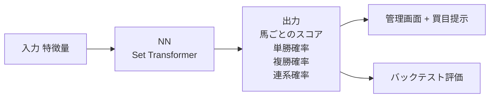
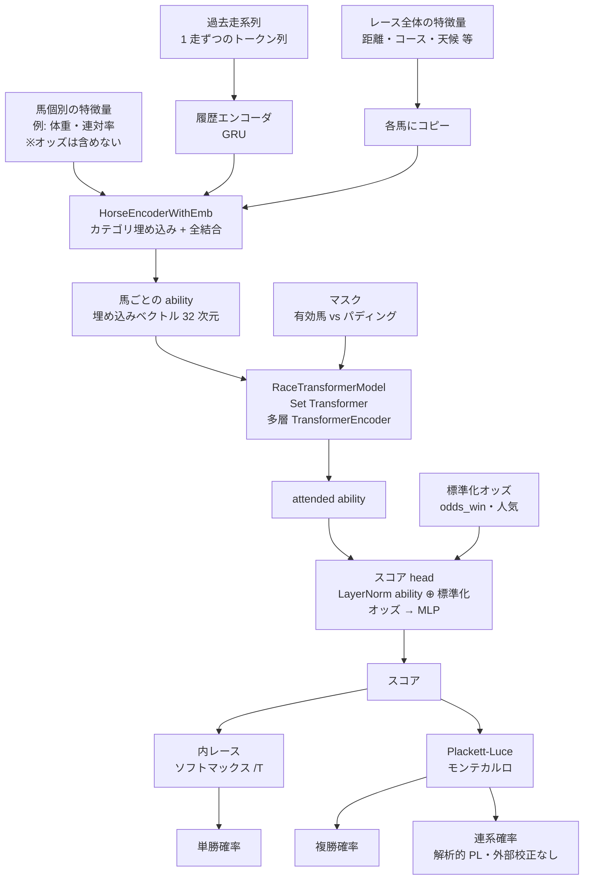

# KEIBA AI — モデル設計書

関連ドキュメント: [spec.md](spec.md) / [design.md](design.md) / [data-pipeline.md](data-pipeline.md)

---

## いまの姿（要約・2026-08-28）

この文書は実験の記録を含むので長い。**現在どうなっているか**だけ知りたい場合はここを読めば足りる。

### 運用しているモデルは 2 つ

役割が分かれている。**どの馬・どの組を買うかを決めるのは常に active** で、確率モデルは
「その選択をどれくらい信じてよいか」だけを答える。確率モデルに馬を選ばせてはいけない
（的中率は上がるが人気馬に寄るので回収率が落ちる: 単勝 0.824 / 複勝 0.881）。

| 役割 | 設定 | 損失 | 何に使うか |
|---|---|---|---|
| **買い目を決める** | `model_runs.is_active` | 二段階（`plackett_luce` → `multi`） | どの馬・どの組を買うか |
| **確からしさを出す** | `settings.probability_model_path` | `plackett_luce`（`--pl-top-k 5`） | 複勝を買うかの判定 / 連系の確率 |

確率モデルが要るのは、**active の確率が確率として機能していない**ため。本命の `win_prob` と
実際の勝敗の相関は **0.073**（市場の実装確率は 0.354）。ROI 志向の損失は順序しか最適化せず、
大きさに意味を持たせる圧力がかからない（→ [確率が壊れていた件](#確率が壊れていた件と2-モデルの役割分担2026-08-25)）。
未設定でも動く（複勝は全レースで買い、連系の確率は active 由来になる）。

### 買い方

| | 現在の仕様 |
|---|---|
| モデル | Set Transformer（ability エンコーダ + 履歴 GRU）→ head で odds を concat。active は `20260613T114817-nn` |
| 確率 | `softmax(score / T)` と PL に**同じ T**。T は**勝ち馬の NLL 最小化**で較正 |
| 単勝 | **モデル 1 位**を `odds_win > win_min_odds`（1.1）で買う |
| 複勝 | **モデル 1 位**を買う。確率モデルがあれば 3 着内率が `place_min_hit_prob`（既定 0.60）未満のレースは見送る。買うときの点数も確信度に比例 |
| 連系 | 上位 3 頭から組み、**的中確率が券種ごとの下限以上**の買い目を確率の高い順に買う（点数上限は持たない。レースごとに変わる） |
| 賭け金 | **1 点 = 100 円 × 点数**。点数は確信度が決める（単複 `base 5 × (確信度/基準)^2`、連系は下限を超えた数）。単勝→複勝→連系の順 |
| 予測しない券種 | **枠連**（オッズ・払戻は取得するが買い目は生成しない） |
| レースの選別 | AI 予想は**全レース**で出す（複勝の確信度フィルタを除く） |

> **EV（期待値）はどの券種でも買う/買わないの判定に使わない**（2026-08-28 に全廃）。
> 単勝・複勝は先に廃止済みで、最後まで残っていた連系の閾値 1.1 にも根拠が無く、
> 入力の確率が壊れているため実質「推定オッズの高い順」に退化していた。
> `min_ev` / `win_ev_threshold` は設定に存在しない。backtest に残る
> `LEGACY_WIN_EV_THRESHOLD` / `LEGACY_PLACE_EV_THRESHOLD` は旧ルール
> (`--win-bet-rule ev` / `--place-bet-rule ev`) 専用で、既定では参照しない。

### OOS 実測

active・test 22ヶ月（2024-10-28〜2026-08-23）・6,244 レース・実オッズ・本命 1 点。
95% 区間はレース単位ブートストラップ 2,000 回（2026-09-04 に測り直した）:

| 券種 | active | 95% 区間 | 1番人気ベタ買い |
|---|---|---|---|
| 単勝 | **0.907** | 0.844–0.972 | 0.792 |
| 複勝 | **0.919** | 0.892–0.947 | 0.850 |

**区間が 1.0 をまたがない**（単勝の上端 0.972）。1.0 未満は誤差ではなく確定している。
古い窓（19ヶ月・5,390 レース）の数字は [archive/2026.md](archive/2026.md)。

> **どれくらいの窓なら差を読めるか。** 回収率が 0.05 違うことを 95% で言うのに要る期間は
> 複勝 1.6 年 / 単勝 5.6 年 / 馬連 8.9 年 / 三連単 19 年（`backend/scripts/roi_measurement_power.py`、
> 1 年 = 3,300 レース）。**これより短い窓で出した差は読んではいけない。**
> 単一 holdout の「効いた」が前進検証で消えた 3 件は、どれも必要期間の 1/3 以下だった。
> 連系の A/B が事実上できないのもこれが理由で、連系は回収率ではなく確率の質（NLL）で判断する。
> 内訳は [archive/2026.md](archive/2026.md)。

**いずれも 1.0 未満**（控除率の壁の内側で最適化されただけで黒字ではない）。
**前進検証を通ったのは複勝の確信度フィルタだけ**（4.5 年で再現し、市場価格を固定しても効く）。
連系の +0.028 は再現せず、9 fold では +0.007（CI 重なり）と**差が無い**。
EV を戻さないのは回収率ではなく設計上の理由（根拠の無い閾値・壊れた入力確率・単複との一貫性）。

> **この文書の読み方**: ここに書くのは**いまの姿**で、そうなった経緯は
> [archive/2026.md](archive/2026.md) にある。数字を引用するときは、それが *学習時* の指標か
> *バックテスト* の実測かを必ず確認すること（同じ名前で定義の違う指標がある）。

---

## 問題定義

競馬の単勝・複勝・連系（馬連 / ワイド / 馬単 / 三連複 / 三連単）予想を「各馬にスコアを付け、レース内の着順を推定する」課題として定式化する。

このスコアから派生して以下の値を計算する。

- **単勝の出る確率**（1 着になる確率）
- **複勝の出る確率**（3 着以内に入る確率）
- **連系の出る確率**（指定の組み合わせで決まる確率）

予想モデルは **NN（PyTorch + Lightning + Set Transformer）単独構成**。`registry.load_model_full` が返す `ModelBundle` を `predict_race` / `predict_race_with_combinations` に渡して推論し、管理画面・評価コードも同じ経路を使う。

---

## モデルアーキテクチャ概要


```mermaid
flowchart LR
    F[入力 特徴量] --> NN[NN<br/>Set Transformer]
    NN --> O[出力<br/>馬ごとのスコア<br/>単勝確率<br/>複勝確率<br/>連系確率]
    O --> UI[管理画面 + 買目提示]
    O --> EV[バックテスト評価]
```

モデルは **ability（馬の実力）** と **value（市場のオッズ）** を分離したアーキテクチャ。馬個別の処理（`HorseEncoderWithEmb`、オッズを含まない）→ 馬同士の相互作用（Set Transformer）で ability を出し、最後のスコア head でオッズを合成する。学習目的（損失）は `--loss` で切り替える（下記）。

---

## NN モード

### 流れ


```mermaid
flowchart TD
    HF[馬個別の特徴量<br/>例: 体重・連対率<br/>※オッズは含めない] --> HE
    HIST[過去走系列<br/>1 走ずつのトークン列] --> GRU[履歴エンコーダ<br/>GRU]
    GRU --> HE
    RF[レース全体の特徴量<br/>距離・コース・天候 等] --> BC[各馬にコピー]
    BC --> HE[HorseEncoderWithEmb<br/>カテゴリ埋め込み + 全結合]
    HE --> EMB[馬ごとの ability<br/>埋め込みベクトル 32 次元]
    EMB --> RM[RaceTransformerModel<br/>Set Transformer<br/>多層 TransformerEncoder]
    MASK[マスク<br/>有効馬 vs パディング] --> RM
    RM --> AB[attended ability]
    AB --> HEAD[スコア head<br/>LayerNorm ability ⊕ 標準化オッズ → MLP]
    ODDS[標準化オッズ<br/>odds_win・人気] --> HEAD
    HEAD --> S[スコア]
    S --> SM[内レース<br/>ソフトマックス /T] --> WP[単勝確率]
    S --> PLM[Plackett-Luce<br/>モンテカルロ]
    PLM --> PP[複勝確率]
    PLM --> CR[連系確率<br/>解析的 PL・外部校正なし]
```

### 構成

| ブロック | 種類 | 役割 |
|---|---|---|
| 履歴エンコーダ | GRU | 各馬の過去走を「1 走ずつのトークン列」として時系列に要約する。集約スカラー（連対率など）が潰してしまう「その日のレース内容ごとの情報」を保つ。過去走 0 件の馬は zero ベクトル。leak-safe（レース日より厳密に過去のみ） |
| HorseEncoderWithEmb | カテゴリ埋め込み + 全結合 | 各馬を独立に **実力（ability）** として処理し 32 次元埋め込みに変換する。カテゴリ特徴は `nn.Embedding`、レース全体特徴は全馬にコピーして連結、履歴 GRU 出力も連結。**オッズ（市場予想）はここには入れない** |
| RaceTransformerModel | 多層 TransformerEncoder + スコア head | 馬同士の相互作用を self-attention（GELU・pre-norm・FFN）で表現。「16 頭立てで突出した強い馬がいるレース」と「8 頭立ての横一線レース」でスコア解釈が変わる効果を取り込む。スコア head は ability を LayerNorm したものに **標準化済みオッズを連結** して MLP に通す（ability→value 分離） |
| マスク | bool 行列 | 異なる頭数のレースを 1 つのバッチにまとめるために、最大頭数までゼロ埋めしたパディング部分を attention から除外する |

> **オッズの扱い**: `odds_win` / `popularity` は ability エンコーダではなくスコア head で使う（馬の実力評価に市場予想を混ぜない）。`KEIBA_EXCLUDE_ODDS_FEATURES=1` のときはオッズ次元 0 で head が ability のみを入力に取る（オッズ未確定時の検証用）。`history_feat_dim` / `odds_feat_dim` は *次元* で 0 ならその入力なし。旧 v1/v2 アーキと gated フラグ（`use_history` / `use_odds_head` / `arch_version`）は 2026-06 に全廃し、この構成が唯一の正規アーキ。

### 学習（既定は ROI 志向 = decision-focused）

PyTorch Lightning の `Trainer` で動かす。**既定の損失は `multi`（単複の賭けリターン `log_growth` + 連系校正 `combo_nll` の加重和）= 全馬券を 1 モデルで扱う本番目的**で、モデル選択（early-stopping）も検証 ROI（`valid_tansho_roi`）で行う。これは「ランキング精度を上げても +EV の馬券に直結しない」ギャップを埋めるためで、OOS バックテストで順位損失と市場の人気1番をいずれも上回る（後述）。

`--loss` で切り替える。

| 損失 | 種別 | 概要 |
|---|---|---|
| `multi`（**既定・本番**） | 全馬券 | `log_growth`（単複の賭け）+ `combo_weight`·`combo_nll`（連系の校正）の加重和。**全馬券を 1 モデルで**扱う。`combo_nll` が ~10× 大きいため `--combo-weight` 既定 0.01、`--combo-bet-type` 既定 馬連（CUDA上 `all` は三連の解析計算で遅い） |
| `log_growth` | ROI志向（単勝） | 各レースを単勝ポートフォリオとみなし、`W = 1 + cash_fraction·(p_winner·odds_winner − 1)` の `−mean(log W)` を最小化する log-growth 損失。**実オッズ**で「賭けて殖えるか」を直接学習。`cash_fraction`（0.25 固定）は**賭け金の Kelly ではなく odds を勾配に残すための cash 項**で、1.0 にすると勾配が勝ち馬クロスエントロピーと完全一致し ROI 志向でなくなる（下記）|
| `combo_nll` | 校正（連系） | 当たり combo 確率の **NLL**（proper scoring rule）`−log P_PL(当たりcombo)`。連系の combo 確率を **NN 内部で校正**（解析的 PL・微分可・払戻不要）。`--combo-bet-type all` で全連系を合算 |
| `flat_ev` | ROI志向（単勝・**デプロイ整合**） | **当時の**賭け方（EV 閾値超えに 1 点定額）を微分可能化。**その賭け方は既に廃止済み**なので、この損失は現在のデプロイとは整合しない。`gate_i = sigmoid((p_i·o_i − τ)/T)` を「買う/買わない」の連続化とみなし、1 レースの損益 `gate_winner·o_winner − Σ gate_i` の期待値を最大化する。定額配分には複利が無いので **log-growth ではなく期待損益**が目的関数。`--flat-ev-threshold`（既定 1.1）/ `--flat-ev-temp`（既定 0.05）/ `--flat-ev-max-bets`（0=無制限）で調整。**買わない = 損失 0 が床**なので単体だと順位学習が崩れる → `plackett_luce` 事前学習からの fine-tune 前提 |
| `plackett_luce` | 順位（事前学習用） | 着順の起こりやすさを直接モデル化する PL 尤度損失。**二段階学習の事前学習**に使う（下記） |

実験用に `kelly_deploy`（デプロイ整合 Kelly）もあるが、A/B で本番 tansho ROI は log_growth 未満（−0.06）と判明済みで本番非採用（着順精度は高い。後述「実験ノブ」）。

> **Kelly は賭け金の決定からも評価からも廃止**（2026-08-23。`backtest.py` は 1 点定額のみで、
> `kelly_bet_size` / `--bet-sizing` / `--bankroll` は存在しない）。ただし **`log_growth` の内部定数
> `cash_fraction`（旧 `kelly_fraction`）は Kelly ではない** — `W = 1 + c·(p·o − 1)` の `c` で、
> `c=1` にすると勾配が勝ち馬クロスエントロピーと一致し、ROI 志向でなくなる。`kelly_deploy` の
> `kelly_fraction` だけが本物の Kelly 係数（実験用・本番非採用）。撤去の経緯と回帰テスト名は
> [archive/2026.md](archive/2026.md)。

**`--monitor`（モデル選択指標、すべて最大化）**

| 指標 | 概要 |
|---|---|
| `valid_tansho_roi`（**既定**） | 検証セットでの実オッズ top-1 単勝 ROI。賭けリターン損失と整合 |
| `valid_fukusho_roi` | 同・複勝 ROI |
| `valid_ndcg3` | 旧来のランキング指標（legacy） |

実オッズ `odds_win` は特徴量として標準化される一方、`log_growth` 損失・ROI 計測には **標準化前の生値**が要るため、`odds_win_raw` を非特徴列として dataset/collate に通している。`combo_nll`（連系校正）は払戻不要で、当たり combo の着順だけから NLL を計算する。

#### 推奨レシピ：二段階学習（PL 事前学習 → multi fine-tune）

**本番モデルは二段階**：まず `plackett_luce` で表現を学習し、その重みを `--init-from <model_dir>` で読み込んで `multi` に fine-tune する。ランキング能力を保ったまま単複の賭けリターンを最大化しつつ連系を校正できる。

コマンドは下記「学習 CLI」が正本（ここに写すと引数の既定を変えたとき片方だけ古くなる）。

> **学習時とバックテストで定義の違う指標がある。**複勝的中率は 0.503（予想 1 位が 3 着以内）と
> 0.885（上位 3 頭のうち 1 頭以上）で別物。数字を出すときは必ず出所を書く。世代ごとの実測と
> 「9 モデルは test 窓がバラバラで横比較できない」件は
> [archive/2026.md](archive/2026.md)。

> **推論時は `predict_race(..., session=...)` を必ず渡す。**履歴 GRU は `session=None` で
> 系列が zero に落ち、着順精度はほぼ変わらないのに単勝回収率が 0.912 → 0.823 になる
> （壊れるのは順位ではなく確率の校正）。経緯は [archive/2026.md](archive/2026.md)。

> **ability-overlay に edge は無い**（最良 0.880 < 本番 0.912、CI [0.58, 1.20]）。odds を抜くと
> スコアがほぼ平坦になり、偽 EV を量産するだけだった。実測は [archive/2026.md](archive/2026.md)。

#### 未使用ホールドアウト（2026-06-01 以降）

DB は 2026-08-23 までスクレイプ済みで、**active の test 窓（〜2026-05-31）より後**に
`2026-06-01/2026-08-23` の 477 レース（うち着順・払戻あり 300）がある。この期間は
学習にもモデル選択にも一度も使われていないので、**戦略・閾値をいじった結果の最終確認**に
使える唯一のクリーンな窓。逆に言えば、ここで閾値探索をやったらもう clean ではなくなるので、
探索は test 窓で行い、確定した 1 案だけをここに当てること。

#### 連系（combo）の校正を NN 内部へ（`combo_calibrators` 撤廃）

従来の連系確率は **NN の外** で、(1) スコア→PL モンテカルロ（非微分）で combo 確率を推定、(2) `combo_calibrators.pkl`（馬券種別 sklearn IsotonicRegression、学習後に valid で後付け fit）で穴側の過大評価を矯正、という2段の後処理だった。**当たり combo の確率は解析的 PL で微分可能**（`ai/model/loss.py` の `_pl_exacta` / `_pl_trifecta` / `_winning_combo_prob`）なので、これを損失に組めば校正を学習に内在させられる。

馬連の校正診断（予測 prob / 実 hit、外部 isotonic なし、OOS test）:

| モデル | 低 prob 帯の比 | 高 prob 帯（賭け対象）|
|---|---|---|
| `plackett_luce`（順位） | 3.8〜5.1×（**過大評価**） | 0.8〜0.9 |
| 賭けリターン版（実験・不採用） | 0.02〜0.5（**過補正**で過小） | 1.34 |
| **`combo_nll`（校正）** | 0.49〜0.76 | **0.96 / 1.00 / 1.04** |

- PL の combo 確率は低 prob 帯で 3〜5 倍の過大評価 → **これが `combo_calibrators` の存在理由**。
- 連系の「賭けリターン」最適化（実験）は -EV のため確率を潰す方向に過補正し、校正の道具にならなかった。
- **`combo_nll`（proper scoring rule）は実際に賭ける高 prob 帯で比 ≈1.00 ＝ NN 内部で校正できており、外部 isotonic を置換可能**。

本番で全馬券を 1 モデルで扱うには **`multi`**（`log_growth` + `combo_weight`·`combo_nll("all")`）を二段階で fine-tune する。連系確率と単複確率は同一スコア由来のため、連系校正を入れると単複 ROI と**トレードオフ**になる（`combo_weight` で調整、実測して決める）。**注意：校正 ≠ 黒字**。連系は控除率 25% で依然 -EV であり、`combo_nll` の価値は「確率を正直にする（isotonic 撤廃）」であって連系で勝てるようになる訳ではない。

### 単勝確率・複勝確率・連系確率の出し方

- **単勝確率**: スコアを内レースでソフトマックス（`softmax(score / T)`）
- **複勝確率**: スコアの Plackett-Luce モンテカルロ（同じ `T` を使う）
- **連系確率**: スコアの Plackett-Luce（解析 / モンテカルロ）。`multi`/`combo_nll` で校正済みなので外部 isotonic は不要

> **PL をやめて組合せ単位で直接学習すると当たり組合せの NLL は良くなる**（馬連 −0.10 / 馬単 −0.11 / ワイド −0.06 / 三連複 −0.03、拡大窓の交差適合・6,000 レース）。ただし**市場には負けたまま**で、NN を学習し直すたびに交差適合をやり直す運用が要るため未採用。実験は `backend/scripts/combo_direct_vs_pl_production.py`、数字は [archive/2026.md](archive/2026.md)。

`T` は **勝ち馬の NLL 最小化**で決める（`TemperatureScaler.fit_calibration`）。単勝の softmax と
複勝の PL に**同じ T** を使うので、「単勝は 100% と言うのに複勝はほぼ一様」という矛盾が
構造的に起きない。旧実装は payback のグリッド探索で T を選んでおり、`T_win=0.133` とグリッド端に張り付いて
本命に 0.999999 が乗っていた（経緯は [archive/2026.md](archive/2026.md)）。

### 現状の位置付け

本番運用中。アクティブモデルは二段階 PL→`multi`（全馬券対応・連系自己校正）で、
**重みは 2026-06-13 の学習のまま**。2026-08-24 に温度スケーラを NLL 較正版へ差し替え、
賭けルールを本命買いに変更したが、いずれも**学習済みの重みには手を入れていない**
（推論・後処理・デプロイ側の変更）。

### 実験ノブ

特徴量・損失を足して本番 ROI を動かせるかを試した一連の A/B。**すべて default-off・inert** で、
**本番（with-odds）の tansho ROI はどれも改善しない**。harness は `backend/scripts/model_side_ab.py`。

| ノブ | 有効化 | 実装 |
|---|---|---|
| 欠損インジケータ | `KEIBA_MISSING_INDICATORS=1` | `features/builder.py` |
| log 変換 | `KEIBA_LOG_FEATURES=1` | `ai/model/preprocess.py` |
| タイム指数 | `KEIBA_SPEED_FIGURE=1` | `features/speed_figure.py` |
| ペース想定 | `KEIBA_PACE_FEATURES=1` | `features/extractors/relative_features.py` |
| レース内相対 | `KEIBA_RELATIVE_FORM=1` | `features/extractors/horse_history.py` |
| デプロイ整合損失 | `--loss kelly_deploy` / `--loss flat_ev` | `ai/model/loss.py` |

**odds の入れ方**（2026-09-02）。「odds が出力に近いところから強く効きすぎているのでは」を
4 通りに介入して測った。**どれも改善しない。**

| ノブ | 変えるもの | 単勝 ROI 差 | ndcg@3 差 |
|---|---|---|---|
| `--odds-dropout 0.3` | 学習中だけレース単位で odds を潰す | −0.051（負 2/2） | −0.014 |
| `--head-norm joint` | concat 後にまとめて LayerNorm | −0.056（負 1/2） | −0.005 |
| `--odds-route encoder` | odds を transformer に通す | −0.024（**負 4/4**） | −0.008 |
| `--head-mode residual` | `score = 市場項 + ability 補正` | −0.009（負 2/4） | **−0.013（負 4/4）** |

4 つとも odds の効きを弱めるか切り離す方向で、結果は「弱めると損」で一貫している。
**現行の concat は局所最適**で、ability と odds が隠れ層で混ざること自体に価値がある
（residual に分けると順位精度が 4/4 で落ちる）。

**測定の限界**: この規模で解像できるのは ROI 0.05 / ndcg@3 0.01 程度。ROI は seed 間で
0.11 動くのに ndcg@3 は 0.01 しか動かないので、**順位精度を先に見て ROI は後から見る**。

seed ごとの数値と各ノブの落ち方は [archive/2026.md](archive/2026.md)。
**A/B のときは `KEIBA_DISABLE_FRAME_CACHE=1` を併用する** — frame cache のキーは特徴量フラグを
含まず、`train_nn` は frame に無い列を黙って落とすので、付け忘れるとベースラインのまま完走する。

## ラベル設計（NDCG 評価用 relevance）

| 着順 | relevance ラベル |
|---|---|
| 1 着 | 4 |
| 2 着 | 3 |
| 3 着 | 2 |
| 4〜5 着 | 1 |
| 6 着以下 / 競走中止 | 0 |

実装は `ai/core/labels.py` の `assign_relevance`。**学習損失は生の着順 (1, 2, 3, ...) を直接使い**、この relevance は NDCG 評価指標の計算にのみ使う。

---

## 特徴量カタログ

実装は `features/` 配下の各モジュールと `features/builder.py` の `FEATURE_COLUMNS` / `CATEGORICAL_FEATURES` に集約されている。NN ではレース全体に共通する列（`distance`, `surface`, `course`, `weather`, `track_condition`, `race_class`, `n_runners`）を「レース特徴量」として馬個別の列と分離して使う。

合計 46 列。2026-06 の特徴量監査で、他列と相関 r≥0.94 の冗長列（`post_position_ratio` / `log_odds_win` / `odds_win_rank` / `odds_win_diff_from_favorite` / `jockey_recent_win_rate_vs_field`）は削除済み。**欠損値の扱い**: imputation は行わず、NN では数値列はそのまま（NaN→標準化後 0）、カテゴリ列はラベル符号化してから tensor 化する。

### レース・馬番

| カラム名 | モジュール | 内容 |
|---|---|---|
| `distance` | `features/extractors/course.py` | 距離 (m) |
| `n_runners` | `features/extractors/course.py` | 出走頭数 |
| `post_position` | `features/extractors/course.py` | 馬番 |
| `age` | `features/extractors/course.py` | 馬齢 |
| `horse_weight` | `features/extractors/course.py` | 馬体重 (kg) |
| `horse_weight_diff` | `features/extractors/course.py` | 馬体重増減 |

### オッズ・市場

| カラム名 | モジュール | 内容 |
|---|---|---|
| `odds_win` | `features/extractors/odds.py` | 単勝オッズ |
| `popularity` | `features/extractors/odds.py` | 人気順位 |

### 馬の過去成績

| カラム名 | モジュール | 内容 |
|---|---|---|
| `recent_avg_finish` | `features/extractors/horse_history.py` | 直近 5 走の平均着順 |
| `recent_n_starts` | `features/extractors/horse_history.py` | 総出走回数 |
| `starts_same_distance` | `features/extractors/horse_history.py` | 同距離での出走回数 |
| `starts_same_course` | `features/extractors/horse_history.py` | 同競馬場での出走回数 |
| `recent_avg_agari_3f` | `features/extractors/horse_history.py` | 直近 5 走の上がり 3F 平均 |
| `days_since_last_race` | `features/extractors/horse_history.py` | 前走からの経過日数 |
| `wins_same_course` | `features/extractors/horse_history.py` | 同競馬場での勝利数 |
| `recent_finish_1` / `_2` / `_3` | `features/extractors/horse_history.py` | 1〜3 走前の着順 |
| `recent_avg_class_weight` | `features/extractors/horse_history.py` | クラス重み付き直近成績 |
| `high_class_starts` | `features/extractors/horse_history.py` | 上位クラスでの出走回数 |
| `high_class_places` | `features/extractors/horse_history.py` | 上位クラスでの 3 着以内回数 |
| `recent_avg_margin` | `features/extractors/horse_history.py` | 直近 5 走の着差（秒）の平均 |
| `recent_avg_finish_time_norm` | `features/extractors/horse_history.py` | 直近 5 走の走破タイム / 距離 の平均 |
| `recent_best_margin_in_top3` | `features/extractors/horse_history.py` | 直近 3 着以内に入ったときの最良着差 |
| `recent_avg_position_change` | `features/extractors/horse_history.py` | 通過順 → 着順の差の平均（末脚指標） |
| `recent_passing_volatility` | `features/extractors/horse_history.py` | 通過順位の標準偏差 |
| `recent_early_position_ratio` | `features/extractors/horse_history.py` | 平均（第 1 コーナー位置 / 頭数）。低 = 逃げ・先行、高 = 追い込み（脚質指標） |
| `recent_late_position_ratio` | `features/extractors/horse_history.py` | 平均（最終コーナー位置 / 頭数）。勝負所での位置取り |
| `recent_best_agari_3f` | `features/extractors/horse_history.py` | 直近の最速上がり 3F（瞬発力のピーク） |
| `class_change` | `features/builder.py`（horse_history の raw 値から算出） | 今走 class weight − 前走（昇級 + / 降級 −） |
| `weight_carried_diff` | `features/builder.py`（horse_history の raw 値から算出） | 今走 斤量 − 前走 斤量 |

### 騎手・調教師

| カラム名 | モジュール | 内容 |
|---|---|---|
| `jockey_recent_win_rate` | `features/extractors/jockey.py` | 直近 30 日の騎手勝率 |
| `jockey_recent_place_rate` | `features/extractors/jockey.py` | 直近 30 日の騎手複勝率 |
| `jockey_course_place_rate` | `features/extractors/jockey.py` | 同競馬場での騎手複勝率 |
| `trainer_course_place_rate` | `features/extractors/trainer.py` | 同競馬場での調教師複勝率 |

### カテゴリ特徴量

| カラム名 | モジュール | 内容 |
|---|---|---|
| `surface` | `features/extractors/course.py` | 馬場種別（芝 / ダ） |
| `course` | `features/extractors/course.py` | 競馬場名 |
| `weather` | `features/extractors/course.py` | 天候 |
| `track_condition` | `features/extractors/course.py` | 馬場状態 |
| `race_class` | `features/extractors/course.py` | レースクラス |
| `sex` | `features/extractors/course.py` | 性別 |

### 同レース内 相対特徴量

レース内の他馬との相対値を計算した列（`features/extractors/relative_features.py`）。

| カラム名 | 内容 |
|---|---|
| `horse_weight_pct` | 馬体重の percentile |
| `weight_carried_pct` | 斤量の percentile |
| `course_place_rate_vs_field` | 同コース複勝率 − レース平均 |

### 血統

| カラム名 | モジュール | 内容 |
|---|---|---|
| `sire_progeny_win_rate` | `features/extractors/pedigree.py` | 父の産駒勝率 |
| `dam_progeny_win_rate` | `features/extractors/pedigree.py` | 母の産駒勝率 |

> 父系・母系の **ID** 自体（`sire_id` / `dam_sire_id`）は、ユニーク値が数万に及ぶ高基数カテゴリで過学習源になりやすいため学習特徴量には含めない方針（`HIGH_CARDINALITY_ID_FEATURES` 定数 + リグレッションテストで防御）。代わりに集約値（産駒勝率）を使う。

### リーク防止の実装保証

全ての特徴量関数は `before_date` を必須引数として受け取り、SQL の where 句で `Race.date < before_date.isoformat()` による行レベルフィルタを適用する。時系列 shift による事後計算は行わず、DB クエリ段階で保証する。

---

## 学習・評価フロー

### 時系列分割（リーク防止）

実装は `ai/core/splits.py` の `time_split`。

```text
基準日（train_end 引数 or データ最終日）
├── テスト開始: 基準日 - test_months（既定 6 ヶ月）
├── 検証開始:   テスト開始 - valid_months（既定 12 ヶ月）
│
├── 学習データ: [min_date, 検証開始)
├── 検証データ: [検証開始, テスト開始)  ← 早期停止・指標評価
└── テストデータ: [テスト開始, **フレームの最後**]  ← ホールドアウト、最終評価のみ
```

> **`--train-end` は「学習の終了日」ではない。** 基準日であり、実際に学習が終わるのは
> **`基準日 - test_months - valid_months`**。`--train-end 2024-04-28 --valid-months 6
> --test-months 19` と渡すと学習は **2022-03-27** で打ち切られる（2 年分を失う）。
> 学習を D まで行いたいなら `--train-end` には **D + valid_months + test_months** を渡す。
> 例: active（学習 〜2024-04-28 / valid 6ヶ月 / test 6ヶ月）は `--train-end 2025-04-30`。
>
> **テストデータに上限は無い。** `test = frame[date >= テスト開始]` なので、フレームに
> 含まれる限り何年分でもテストに入る。異なる `--train-end` で学習したモデルの
> `test_*` 指標は**測っている期間が違うので直接比較できない**。比較するときは
> 同じ窓で測り直すこと（`backend/scripts/strategy_signal_dump.py --model <dir>`）。

### 前進検証（未実装）

過去に `--cv-folds` で時系列を N 分割する前進検証があったが、**現在のコードには存在しない**
（`cv_folds` / `cv_metrics` はリポジトリ内に 1 件も無い）。分割は単一のみ。

前進検証が要るのは、**二段目のモデル**（一段目の出力を入力に取るモデル）を学習するとき。
一段目の学習期間での出力は「答えを部分的に覚えた後の出力」なので、そこで二段目を学習すると
実運用では成立しない関係を覚える（stacking の典型的な失敗）。fold ごとに cutoff を進めて
「まだ見ていない区間」だけを予測し、それを積む必要がある。`train_nn(prebuilt_frame=...)` が
あるので特徴量構築（約 60 分）は 1 回で済み、fold あたりの追加コストは学習のみ（実測 29 分）。

### 評価指標

| 指標 | 内容 |
|---|---|
| NDCG@1 | 1 着予想の精度 |
| NDCG@3 | 上位 3 着予想の精度（メイン指標） |
| Top-1 ヒット率 | モデル 1 位予想が実際に 1 着になった割合 |
| 複勝的中率 | モデル上位 3 頭のうち 1 頭以上が実際に 3 着以内に入った割合 |
| 単勝 回収率（`payback_win`） | **モデル 1 位**に 1 点定額（`--win-bet-rule top1` が既定、オッズ下限 `win_min_odds`）での `払戻金合計 / 賭け金合計`。**1.00 が損益分岐点** |
| 複勝 回収率（`payback_place`） | **モデル上位 `--place-top-k` 頭**（既定 1）に 1 点定額での回収率 |

> **回収率の定義**: 日本競馬の慣習に合わせて「総払戻 / 総投資」で表現する。1.00 が損益分岐、1.10 = 10% プラス、0.80 = 20% マイナス。

### ベースライン比較（`--baseline favorite`）

各レースで `odds_win` が最低の馬（1 番人気）に単勝・複勝を常時ベットする dumb 戦略と比較する。`delta = model − baseline` が正であればモデルがベースラインを上回っている。

---

## 学習 CLI

### NN

```bash
# 既定（ROI志向: multi 損失 + valid_tansho_roi 監視、CPU）
uv run python -m ai.training.train_nn

# 推奨：二段階（PL 事前学習 → multi fine-tune）
uv run python -m ai.training.train_nn --loss plackett_luce --monitor valid_ndcg3   # 1)
uv run python -m ai.training.train_nn --loss multi --combo-weight 0.01 --monitor valid_tansho_roi \
    --init-from data/models/<上で保存されたPLモデル> --learning-rate 1e-4 --max-epochs 30  # 2)

# 連系の校正（外部 combo_calibrators を撤廃）: combo_nll で全連系を NN 内部校正
uv run python -m ai.training.train_nn --loss combo_nll --combo-bet-type all

# 隠れ層・埋め込み次元・ヘッド数の調整
uv run python -m ai.training.train_nn \
    --hidden-dim 128 --embed-dim 64 --n-heads 8

# 学習エポック・バッチサイズ・学習率
uv run python -m ai.training.train_nn \
    --max-epochs 50 --batch-size 64 --learning-rate 5e-4

# GPU
uv run python -m ai.training.train_nn --device cuda
```

### 評価 CLI

```bash
# 学習済みモデルをバックテスト評価する
uv run python -m ai.evaluation.backtest --model data/models/20260101T120000-nn

# 1 番人気常時投票ベースラインと比較する
uv run python -m ai.evaluation.backtest --model data/models/... --baseline favorite

# 評価結果を model_runs.metrics_json にマージ保存する
uv run python -m ai.evaluation.backtest --model data/models/... --persist
```

既定の単勝ルール（`--win-bet-rule top1`）が使う `--win-min-odds`（未指定なら settings.json の `win_min_odds`・既定 1.1）は
**オッズの下限**で、EV 閾値ではない。metrics にも `win_min_odds` として記録される。

backtest は回収率と併せて **`log_loss` / `market_log_loss`**（本命についての二値 NLL と、
同じレース集合での市場 1/オッズ の同じ量）と **評価窓 `eval_start` / `eval_end`** を記録する。
確率の質はここで見る。実測では active（`multi`）が 0.574 に対し市場 0.483 で、
**回収率で勝っていても確率としては市場に負けている**。確率が要る用途に別モデルを
立てているのはこのため。

学習完了後、モデルは `data/models/<YYYYMMDDTHHMMSS>-nn/` に自動保存され、`model_runs` テーブルに `is_active=0` で登録される（アクティブ化は `registry.set_active_by_id` / 管理画面）。

---

## 推奨ベットルール

**どの券種でも EV（期待値）は買う/買わないの判定に使わない。** 買い目は
「オッズが取れるものを、券種の優先度（単勝→複勝→連系）→ 的中確率の順に、
予算の限り」選ぶ（`ai/betting/strategy.py::assign_flat_stakes`）。

| 券種 | 買い条件 |
|---|---|
| **単勝** | **モデル 1 位の馬**を `odds_win > win_min_odds`（既定 1.1）のとき買う |
| **複勝** | **モデル 1 位の馬**を買う。確率モデルがあれば 3 着内率が `place_min_hit_prob`（既定 0.60）未満のレースは見送る |
| **連系** | 上位 3 頭から組み、**的中確率が `combo_min_hit_prob`（券種ごと）以上の買い目だけ**を確率の高い順に買う。点数の上限は持たない（点数はレースごとに変わる／予算は上限であって使い切らない） |

### なぜ EV をやめたか

3 券種とも同じ理由で、順に廃止した。

券種ごとの効果（**test 19ヶ月・5,390 レース**の窓。いまの単複の実測は上の「OOS 実測」）:

| 券種 | 廃止 | 効果 |
|---|---|---|
| 単勝 | 2026-08-24 | 0.698 → **0.931** |
| 複勝 | 2026-08-24 | 0.654 → **0.887** |
| 連系 | 2026-08-28 | 単一窓 0.849 → 0.877 だが、**前進検証では差なし**（0.832 vs 0.839） |

**EV = `p̂ × オッズ` の `p̂` がノイズだから。** active の本命の確率と実際の勝敗の相関は
0.073（市場は 0.354）で、ノイズ × オッズは実質「推定オッズの高い順」に退化する。
較正済みの確率で EV 条件にしても直らない（単勝 0.698 / 複勝 0.654）。複勝に至っては
**EV の順序が逆**で、EV 0.0-0.9 帯が 0.832 で最良、2.0 以上が 0.573 で最悪という
単調減少だった。温度や冪のような単調変換では直せない。

連系の閾値 1.1 には最後まで根拠が無く（docs にも「暫定」と書いていた）、
`place_ev_threshold`（複勝）と同様に**死に設定**になっていた。現在
`min_ev` / `win_ev_threshold` は設定に存在しない。backtest の
`LEGACY_WIN_EV_THRESHOLD` / `LEGACY_PLACE_EV_THRESHOLD` だけが、
旧ルール（`--win-bet-rule ev`）と比べる分析用途に残っている。

### それでも EV を戻さない理由

回収率では正当化できないので、設計側の理由で維持する。

- **悪化していない**（+0.007、CI は重なる）。戻す実利が無い
- 閾値 1.1 に**根拠が無い**。docs にも「暫定」と書いていた
- 入力の確率が壊れている以上（本命の確率と勝敗の相関 0.073）、EV は
  「推定オッズの高い順」に退化しており、**意味のある基準として説明できない**
- 単勝・複勝と原理が揃い、`min_ev` というパラメータを 1 つ減らせる

つまり「効くから残す」ではなく「**根拠のないノブを外しても悪化しないので、
外したままにする**」という判断である。

### 枠連は予測対象外（UI からも外した・2026-08-24）

`COMBINATION_BET_TYPES` に枠連は含まれない。オッズ (`ingest_odds`) と払戻 (`payouts` に
36,450 行) は取得しているが、**買い目候補は 1 件も生成されない**。にもかかわらずフロントの
`ALL_BET_TYPES` には入っており、Settings とレース詳細で「選べるのに何も起きない」死んだ
選択肢になっていた（`place_ev_threshold` と同じ型の不具合）。

UI から外し、あわせて `core.bet_types.supported_bet_types()` を追加して、**保存済み設定に
枠連が残っていても読み込み時に落とす**ようにした（推奨 API・シミュレーション・設定 API の
3 経路すべてで適用）。全部落ちて 1 点も買えなくなる設定にはならないよう、空になったら
`DEFAULT_ENABLED_BET_TYPES` に戻す。

実装しなかった理由: 枠連は馬連のペア確率を枠で集約すれば導出でき（枠番は馬番と頭数から
決まる）技術的には可能だが、控除率 22.5% と馬連より粗く、
実測でも連系は 5 券種すべて 0.80〜0.88 と単複に劣るため、券種を 1 つ足す価値が薄い。

### 履歴の無いレース（新馬戦など）の扱い（2026-08-24）

モデルは per-race 履歴 GRU と直近着順・上がり・脚質を主要な入力にしているので、出走馬
全員が初出走だとそれが全滅し、枠順・馬体重・騎手・血統・オッズだけの予想になる。同じ
モデルでも入力の質が別物なので、判定して明示する（`features/race_info.py`）。

**クラス名（`race_class == "新馬"`）では判定しない。** 未勝利戦にも初出走馬が混ざるうえ、
分類に現れないケースもあるため、実際に手元にある過去走の本数で測る。実測（test 19ヶ月）:

| クラス | 過去走ゼロ率 | 平均出走数 | レース数 |
|---|---|---|---|
| **新馬** | **0.997** | **0.003** | 422 |
| 未勝利 | 0.052 | 3.85 | 1,958 |
| 1勝クラス | 0.004 | 9.56 | 1,440 |
| OP | 0.010 | 18.41 | 167 |

新馬とそれ以外の間が大きく空いているので、閾値（初出走が 5 割以上）の細かい調整で判定は
揺れない。データ駆動の判定は 432 レースを拾い、クラス名（422）より 10 レース多い。

**除外しても回収率は上がらない**（`backend/scripts/low_information_races.py`、本命買いでの実測）:

| 群 | レース | 平均出走数 | 単勝的中 | 単勝回収 | 複勝的中 | 複勝回収 |
|---|---|---|---|---|---|---|
| 全レース | 5,390 | 8.51 | 0.232 | 0.933 | 0.507 | 0.889 |
| 情報が少ない | 432 | 0.03 | **0.292** | 0.866 | **0.637** | **0.932** |
| 情報あり（除外後）| 4,958 | 9.24 | 0.227 | **0.938** | 0.496 | 0.886 |

単勝は +0.006 とほぼ変わらず、**複勝はむしろ悪化する**（情報の無いレースは複勝回収率
0.932 で全群中最良）。的中率は単勝 29.2% / 複勝 63.7% と高いのに回収率が伸びないのは、
履歴が無いぶんモデルがオッズに寄り、人気馬＝低オッズを本命にするため。「当たりやすいが
儲かりにくい」レース群である。

したがって **シミュレーションの除外オプションは既定 off**。UI 側は除外ではなく
「判断材料が少ない」旨の注記を出す（`LowInformationNotice`）。

### 連系の点数は確率の下限で決める（2026-09-01）

**予算は上限であって、使い切る目標ではない。** 買い目は的中確率の高い順に並び、
その順序は本物（OOF 14,697 レース: rank 1 の的中率 0.097 → rank 10 で 0.005）。
深く買うほど当たりにくい買い目に金を足すことになる。

以前は「上位 N 点」と**点数を固定**していた。これをやめ、**的中確率が券種ごとの
下限（`combo_min_hit_prob`）を超えた買い目だけ**を買う。結果として買う点数が
レースごとに変わる（確信度の高いレースほど深く、低いレースでは 0 点）。

前進検証 9 fold（2019-10〜2024-10・連系のみ・1 点 100 円・確率モデル由来の連系確率）:

| 買い方 | 連系 ROI | 点数 / レース | 使う金 | fold の幅 |
|---|---|---|---|---|
| 固定 2 点（旧既定） | 0.828 | 7.42 | 100% | 0.638〜1.036 |
| 固定 1 点 | 0.834 | 3.84 | 52% | 0.648〜1.180 |
| 下限 + 上限 2 点（**現行ではない**）| 0.892 | 3.90 | 52% | 0.783〜0.985 |

**同じ点数どうしで +0.058**、使う金は固定 2 点の 52%。fold ごとの最悪値も
0.648 → 0.783 と上がる。なおこの行は上限を併用したときの値で、**いまの実装は上限を
持たない**（下限のみ 1.25x で 0.867。次項）。効いているのは「確信度の低いレースで連系を買わないこと」で、
**27.5% のレースは連系を 1 点も買わない**（点数の分布は 0〜10 点・中央 4 点）。

券種別（**この測定で使った下限**・上限 2 点 / 括弧内は固定 2 点）。下の「下限」列は
この A/B で振った値であって**いまの既定ではない** — 実装の既定は
`core/bet_types.py` の `DEFAULT_COMBO_MIN_HIT_PROB`（馬連 0.075 / ワイド 0.260 /
馬単 0.025 / 三連複 0.024 / 三連単 0.019、[spec.md](spec.md) の設定表と同じ）:

| 券種 | この測定の下限 | ROI | 点数 / レース |
|---|---|---|---|
| 馬連 | 0.045 | 0.846 (0.800) | 0.99 (1.97) |
| ワイド | 0.155 | 0.869 (0.885) | 1.06 (1.99) |
| 馬単 | 0.015 | 0.896 (0.844) | 0.79 (1.46) |
| 三連複 | 0.014 | 0.949 (0.766) | 1.00 (1.91) |
| 三連単 | 0.012 | 1.106 (1.247) | 0.05 (0.09) |

三連複の改善が最も大きい（0.766 → 0.949）。三連単は点数が少なすぎて（0.05 点/レース）
数字を信用してはいけない。

**下限の値そのものには敏感でない。** 券種内の的中確率の中央値の 0.5〜1.25 倍の
どこに置いても 0.87〜0.89 で、いずれも固定点数より良い。効くのは「下限を持つこと」
であって値の微調整ではない。

#### 券種ごとの点数上限は持たない（2026-09-01）

以前は「券種ごと最大 2 点」という上限を併用していた。**回収率はそちらが高い**
（上限 2 点 0.887 / 3.19 点・レース）が、上限は捨てた。ワイドが効くレース・
三連単が効くレースは実際にあり、一律の点数でそれを潰してしまうため。

上限なしで下限だけにしたときの実測（前進検証 9 fold・上限なし）:

| 下限（中央値比） | 連系 ROI | 点数 / レース | fold の幅 |
|---|---|---|---|
| 0.75x | 0.872 | 7.29 | 0.772〜0.942 |
| 1.0x | 0.864 | 5.47 | 0.784〜0.961 |
| **1.25x（既定）** | **0.867** | **4.23** | **0.798〜0.979** |
| 1.5x | 0.841 | 3.35 | 0.748〜0.923 |
| 2.0x | 0.853 | 2.24 | 0.730〜0.966 |
| 3.0x | 0.862 | 1.16 | 0.768〜0.997 |

**どこに置いても 0.84〜0.87 で頭打ち**なので、1.25 倍を選んだのは回収率ではなく
「同じ成績を最も少ない点数で得られる」から。上限を外した代償は **−0.02**
（0.887 → 0.867）で、これは「券種ごとの上限」という一律ルールを持たない対価である。

いずれも 1.0 未満で、**連系は依然として控除率の内側**である。なお下限の値は評価に
使ったのと同じ OOF から採っている（中央値という分布の目印であって ROI を最適化した
わけではないが、完全な out-of-sample ではない）。

生成: scratchpad の使い捨てスクリプト（リポジトリには残していない）。OOF のスコア CSV から本番と
同じ経路（確率モデルの連系候補 → `recommend_for_race`）で買い目を組み直し、payouts と
突き合わせる。NN は再実行しないので 30 分程度で回る。

### 確信度は券種をまたいで 1 つ（2026-09-01）

**確信度 = 確率モデルがその買い目に付けた的中確率**。単勝なら 1 着になる確率、
複勝なら 3 着以内に入る確率、連系なら組合せの的中確率（連系はもともと確率モデル由来）。

以前は複勝の判定にも **1 着確率**を使っていた。前進検証で効くことは確かめてあったが、
「複勝を買うかを 1 着確率で決める」は意味が通らず、画面に出しても解釈できない。
3 着内率に替えても成績は同等（OOF 14,619 レース・買う割合 25% で 0.904 → 0.907、
10% で 0.925 → 0.930）なので、意味の通る定義を採った。

**しきい値の目盛りが変わるので設定キーも変えた**（`place_min_confidence` →
`place_min_hit_prob`、既定 0.30 → 0.60）。3 着内率で 0.30 はほぼ全レースが通るため、
キー名を据え置くと**設定を引き継いだ環境で黙ってフィルタが消える**。

確信度と回収率の関係は券種で違う（OOF・5 分位）:

| 券種 | 最低 | 低 | 中 | 高 | 最高 | 相関 |
|---|---|---|---|---|---|---|
| 単勝 | 0.875 | 0.923 | 0.851 | 0.843 | 0.859 | −0.005 |
| 複勝 | 0.749 | 0.843 | 0.870 | 0.875 | 0.911 | +0.041 |

**単勝は的中率が 6% → 37% と動くのに回収率が動かない** = 市場が正しく値付けしている。
**効果があるのは複勝だけ**（連系も無相関: 0.877 → 0.879）。ただし実装は単複とも
`points_for_confidence` を通す — 単勝で害が無く、券種ごとに賭け金の決め方を変える
理由も無いため（fold ごとのばらつきはむしろ狭まる）。連系だけは式が違い、
1 組合せ 1 点で点数は下限を超えた数が決める。

### 複勝は確信度で厚みを変える（2026-09-01）

**予算はもともと毎レース使い切っている**（実測: 3,395 レースで投資 16,975,000 円 =
ちょうど 5,000 円/レース）。動かせるのは「余りを使うか」ではなく**レース間の配分**。

前進検証 OOF（14,619 レース・2020-05〜2024-10）で配分を変えて測った:

| 配分 | 複勝 ROI | 単勝 ROI |
|---|---|---|
| 定額（全レース） | 0.850 | **0.870** |
| 確信度 0.30 以上だけ定額 | 0.875 | 0.863 |
| **段階 x1/x2/x3（0.30/0.40/0.55）** | **0.882** | — |
| 確信度の 2 乗に比例 | 0.888 | 0.854 |

**複勝では効き、単勝では逆効果、連系は無相関**（0.877 → 0.879）。確信度で絞ると
単勝が落ちるのは docs の既知の非対称性と同じ向き。採用したのは**連続**の点数配分 `点数 = 基準 × (確信度 / 0.50)^2`（1〜15 点に丸め）。
段階（x1/x2/x3）より**回収率が高く、使う点数も少ない**:

| 配分 | 複勝 ROI | 点数/レース |
|---|---|---|
| 定額 5 点 | 0.875 | 3.80 |
| 段階 x1/x2/x3 | 0.882 | 8.87 |
| **連続 (p/0.5)²** | **0.891** | 5.42 |

**5 年すべてでプラス**（+0.037 / +0.007 / +0.019 / +0.008 / +0.016）。

**レース予算ごとスケールしてはいけない。** 投資配分は単勝 50% / ワイド 34% /
複勝 10% なので、全体をスケールすると単勝の −0.016 が複勝の +0.038 を上回る。
複勝の 1 点額だけを変える（`ai/inference/confidence.py::place_stake_multiplier`）。

なお、より大きいレバーは券種構成のほうにある。同じシミュレーションで
複勝 0.947 / 単勝 0.910 に対しワイドは 0.834 で、そこに 34% を使っている。

### 賭け金の配分（2026-08-24）

**EV の高い順に並べるのをやめた。** 確率を正直に較正すると単勝の EV は 0.6 前後になり、
連系（EV 5〜9）の後ろに回る。その状態で 1 レースの予算が足りないと、**回収率の推定が
最も確かな単複が真っ先に切り捨てられ、測定不能な連系だけが残る**。実測（2,034 レース）で **単勝 3 点・複勝 1 点**しか買われていなかった。

券種ごとの回収率と推定の確からしさ（**旧い窓：test 19ヶ月・5,390 レース**。券種どうしの比較に使う。いまの単複の値は上の「OOS 実測」）:

| 券種 | 点数 | 回収率 | 95% CI | 的中率 |
|---|---|---|---|---|
| 単勝（本命買い）| 5,376 | **0.931** | [0.86, 1.00] | 22.8% |
| 複勝（本命買い）| 5,402 | **0.885** | [0.85, 0.92] | 50.9% |
| ワイド | 21,570 | 0.880 | [0.83, 0.93] | 11.0% |
| 馬単 | 11,740 | 0.872 | [0.74, 1.00] | 3.9% |
| 馬連 | 12,717 | 0.845 | [0.76, 0.94] | 5.7% |
| 三連複 | 13,826 | 0.824 | [0.72, 0.95] | 3.8% |
| 三連単 | 4,551 | 0.797 | [0.59, 1.03] | 2.2% |

> 連系を薄く配分する理由は「測れないから」ではなく**「測ったら単複より低いから」**
> （旧記録の「測定不能」は複利設定の産物で 2026-08-25 に訂正。経緯は [archive/2026.md](archive/2026.md)）。

単複は市場ベースライン（0.792 / 0.850）を上回るが、連系は 5 券種すべて 0.80〜0.88 で、
控除率（三連単 27.5% / 三連複 25% / 馬連・馬単・ワイド 22.5%）の壁の内側にある。
総合回収率は券種別回収率の**賭け金加重平均**なので、回収率の高い方に厚く張るのが合理的
（モデルは一切変えずに効く）。

そこで:

- **並び順**: 単勝 → 複勝 → 連系。同じ券種内は**的中確率**の高い順（EV 順ではない）
- **1 点あたり**: 100 円で固定。厚みは点数で表す（単複は確信度から、連系は下限を超えた数）

> **連系の EV 閾値も 2026-08-28 に廃止した。** 根拠が無かった（三連複 0.959 [0.01, 2.63]
> のように閾値を動かす判断材料が無い）。**連系も 2026-08-28 に順位ベースへ寄せた**
> （EV を捨てて的中確率順に変更。単一窓では 0.849 → 0.877 だが前進検証では差なし）。

**この節は履歴。** 当時は `place_ev_threshold` が推奨ロジックに一切渡っておらず
（Settings 画面に入力欄があるのに効かない死に設定）、複勝も `win_ev_threshold` で
判定されていた。backtest は券種ごとに使い分けていたため評価と本番がずれていた。
`min_ev_by_bet_type` を足して一度は解消したが、最終的に **EV 条件そのものを全券種で
廃止**したため、これらのパラメータは現在いずれも存在しない。BUY バッジも
「モデル 1 位 + オッズ下限」の表示に変わっている。

---

## レース選別

**単勝に選別可能な信号は見つかっていない。**「本命のオッズ 10〜25 倍のレースだけ買えば 1.41」は
前進検証（4.5 年・9 fold）で消えた period-specific なノイズで、二段目の信用度モデルも
目的変数をシャッフルした対照に負けた。生き残ったのは複勝の確信度フィルタだけ（後述）。

> **dev/holdout で再現しても period-specific な効果は否定できない。** 同じ期間を前半・後半に
> 割っただけでは、その期間に固有の効果は両方に現れる。否定できるのは別の期間で測ることだけ。
> 経緯と fold ごとの数字は [archive/2026.md](archive/2026.md)。

## 2 モデルの役割分担

**active の確率は勝敗とほぼ無相関**（本命の `win_prob` と勝敗の相関 0.073 / 市場は 0.354）。
`log_growth` / `multi` は回収率を直接最適化する目的関数で、順序は最適化するが
**スコアの大きさに確率としての意味を持たせる圧力がかからない**。温度スケーラは全体の鋭さを
1 つの `T` で合わせるだけなので、レースごとの大小関係の誤りは直せない。EV が無意味だったのも同じ根。
だから確からしさは `plackett_luce`（proper scoring rule）で学習した別モデルに答えさせる。
オッズ帯別の診断と 2 モデルの対比表は [archive/2026.md](archive/2026.md)。

### 使い方: active が馬を選び、PL がその馬をどれくらい信じるか答える

**PL に馬を選ばせるのは失敗する**（複勝 0.870 で active の 0.893 に負ける）。有効なのは
active の本命に対して PL の確率を**信用度**として使うこと。閾値は dev で決め holdout で測定:

| PL の確信度 | dev 複勝 | holdout 複勝 | holdout 95%CI | 複勝的中率 |
|---|---|---|---|---|
| 全レース | 0.896 | 0.889 | [0.847, 0.933] | 0.516 |
| 上位 50% | 0.915 | 0.912 | [0.875, 0.947] | 0.676 |
| **上位 25%** | **0.945** | **0.945** | [0.903, 0.987] | 0.768 |
| 上位 9% | 0.950 | 0.928 | [0.874, 0.981] | 0.805 |

dev / holdout の両方で単調に上がる。黒字には届かないが、**再現する確信度の指標**である。

**単勝には効かない。** 確信度で単勝を絞ると回収率はむしろ下がる（0.900 → 0.835〜0.868）。
単勝は「値段が間違っている馬」が報われる馬券で、確信度は逆を向いているため。

なお、この節の閾値（dev で決め holdout で測定）は同じ 19 ヶ月の前半・後半なので、
**period-specific な効果を否定できていない**。それを確かめたのが次節で、
複勝の確信度は前進検証の 4.5 年でも再現した（オッズ帯は消えた）。

### 採用したもの: 複勝の確信度フィルタ（2026-08-27）

**active が馬を選び、確率専用モデルがその馬をどれくらい信じるかを答える。** 実装は
`ai/inference/confidence.py`、設定は `probability_model_path` と `place_min_hit_prob`。
確率モデル未設定なら何も起きない（既定は無効）。

前進検証で作った **4.5 年・15,073 点**の out-of-sample 出力での実測。**しきい値は旧キー
`place_min_confidence`（1 着確率）の目盛り**で、いまの `place_min_hit_prob`（3 着内率・
**既定 0.60**）とは値が対応しない。3 着内率で 0.30 はほぼ全レースが通るので、
**この表の数字をそのまま設定に入れるとフィルタが黙って消える**（下記「1 着確率から
3 着内率へ」）。同じ選別度は 3 着内率の 0.655 前後。

| しきい値（旧・1 着確率） | 買う割合 | 複勝回収率 | 95% CI | 複勝的中率 |
|---|---|---|---|---|
| （なし） | 100% | 0.866 | [0.848, 0.884] | 0.501 |
| 0.30 | 22% | **0.907** | [0.887, 0.927] | 0.744 |
| 0.40 | 11% | 0.931 | [0.909, 0.955] | 0.798 |

9 fold すべてで基準を上回る（最低 0.861 / 最高 0.969）。別窓（test 19ヶ月）でも
上位 25% で 0.945 と再現する。**オッズ帯と違い、期間を変えても消えない。**

**決定的な検証 — 市場価格を固定しても効く**: 本命が 1.0〜3.0 倍のレース（4,386 件）
だけに絞って確信度で上下に割ると **0.933 vs 0.845（差 +0.088）**。「人気馬かどうか」の
代理ではなく、市場に無い情報を持っている。人気順ベタ選別に対しても各水準で
+0.012〜+0.017 上回る。

**単勝には使わない。** 確信度で単勝を絞ると回収率は下がる（0.900 → 0.835〜0.868）。
単勝は「値段が間違っている馬」が報われる馬券で、確信度は逆を向いているため。

**確率モデルに馬を選ばせてはいけない。** 的中率は高い（0.305 vs 0.232）が人気馬に
寄るので配当が小さく、複勝回収率は 0.881 と active の 0.893 に負ける。**選ぶのは
active、信じるかを決めるのが確率モデル**、という分担が要点。

### 採用しなかったもの: 学習した二段目

一段目の out-of-sample 出力から「信用度」を学習する二段目（`backend/scripts/second_stage_trust.py`）
は、複勝で単純ルールを **+0.02** 上回った（上位 10% で 0.952 vs 0.931、対照は 0.854 なので
効果自体は本物）。ただし常用系に入れるには「確率モデル + GBM 二段目 + 一段目を再学習する
たびに前進検証をやり直す」機構が要る。**+0.02 かつ 1.0 未満のために払うコストとして
見合わない**と判断した。スクリプトと知見は残す。

---

## 券種ごとの専用目的と top-k 打ち切り

「1 本のスコアから全券種を PL で導出している」構造への手当てを 2 つ試した。
**どちらも機構としては正しく働いたが、回収率には届かなかった。**

- **複勝専用の回収率損失**（`--loss place_growth`）: 狙いどおりモデルは堅い馬寄りになる
  （選ぶ馬の 2/3 が変わり、平均オッズ 7.74 → 6.09）が、増えた的中が小さくなった配当で相殺される。
  差 +0.009、CI [−0.031, +0.048]、dev と holdout で符号が反転。**default-off**
- **PL の top-k 打ち切り**（`--pl-top-k`）: log-loss 0.5125 → 0.5080 / valid NDCG@3 0.5831 → 0.6030 と
  確率と順位は改善するが、回収率への効果は CI の幅に対して小さく検出できない。
  **確率モデルの選定は log-loss で行う**方針なので、確率モデルには top-k=5 を採用している

数値と `--place-temp` が逆効果だった件は [archive/2026.md](archive/2026.md)。

## Future Work

回収率を動かせる可能性のある順に。**モデル側の 4 方向は実測で否定済み** —
特徴量ノブ・損失・ability-overlay に加え、2026-08 に試した**レース選別**（オッズ帯・
多ファクターの確証度・二段目の信用度モデル）と**券種ごとの専用目的**（`place_growth`・
PL の top-k 打ち切り）も届かなかった。残るのは市場に無い情報を足すことと、
測定できていない領域を測れるようにすること。

- **新特徴量で >1.0 を狙う**: pace / sectional / 調教 / パドック等、市場（オッズ）に含まれない
  情報を追加。**唯一まだ上限を上げられる可能性のある施策**。2026-09-03 の測定で、
  いま持っている特徴量は odds を外すと市場に大差で負ける（field NLL +0.186、全スライス）
  ことが確定した — 足りないのはモデルではなく情報
- **オッズ時系列特徴量**: 出馬表公開時 vs 締切時のオッズ変化（市場の momentum シグナル）。
  ただし `odds.db` の `race_odds` は `(race_id, bet_type)` 主キーの**確定オッズ 1 点のみ**で
  時系列は無い。`ingest_odds` を発走前に複数回走らせる設計変更が先に要り、
  データが貯まるまで検証できない
- **確率モデルを LightGBM にする**: 本命確率と勝敗の相関は GBDT 0.241 / 市場 0.238 に対し
  active は 0.073。3 着内率の NLL も 0.4083 対 0.4153。学習 40 分 → 45 秒。買い目を決める側では
  なく `settings.probability_model_path` の枠の話
- **複勝の EV 選別は「損を減らす」施策**: 3 着内率では GBDT が市場を上回る（NLL 0.4011 対 0.4061）。
  EV>1.00 で買うと 0.722 → 0.956 と控除率の大半を取り返すが、**前進検証 12 fold で 1.0 に届かない**
  （単一 holdout の 1.199 は消えた。3 度目）。詳細は [archive/2026.md](archive/2026.md)
- **連系の確率を PL から導かない**: 勝率は市場と互角なのに PL で作った三連単は 0.129 負ける。
  損は変換のほう（組合せを直接学習するとワイドで 0.1335→0.1095）。ただし控除率は超えない
- **データを増やして再学習**: 学習は 2024-04-28 までで、以降 7,440 レース（約 24%）が未使用。
  ただし CPU 環境では全期間 1 エポック約 14 分で非現実的（GPU が要る）。また現在の test 窓を
  学習に取り込むと**比較の土台**（上の「OOS 実測」の窓）を失うので、分割を切り直す前提で行うこと
- **combo_nll のベクトル化**: per-race Python ループを撤去し `--combo-bet-type all` を実用速度に
