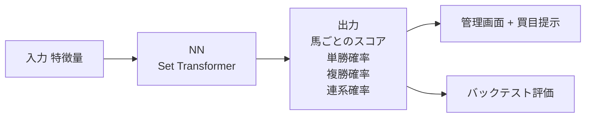
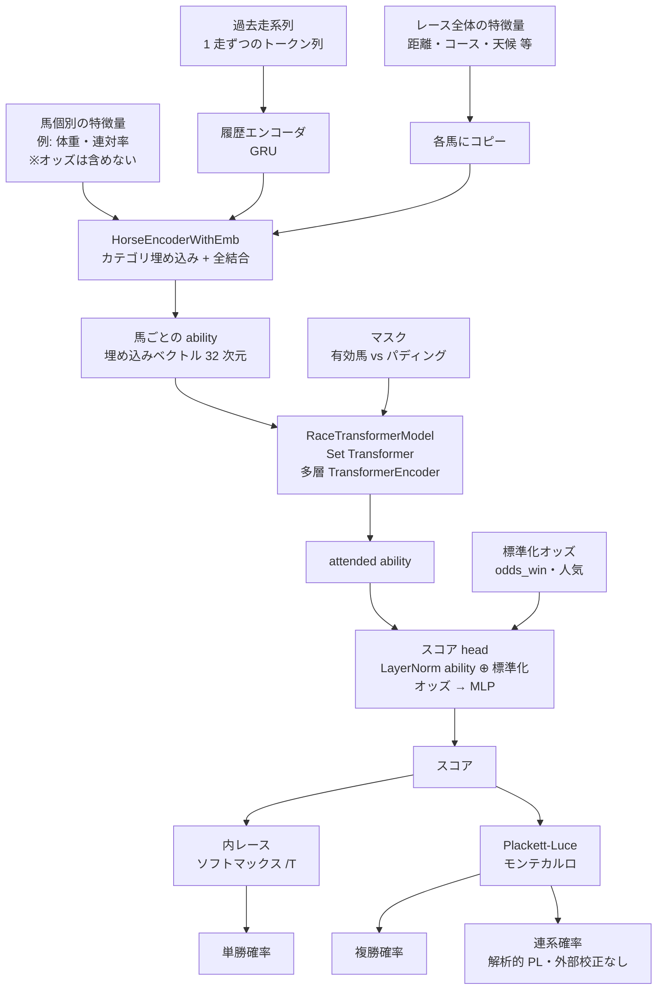

# KEIBA AI — モデル設計書

関連ドキュメント: [spec.md](spec.md) / [design.md](design.md) / [data-pipeline.md](data-pipeline.md)

---

## いまの姿（要約・2026-08-24）

この文書は実験の記録を含むので長い。**現在どうなっているか**だけ知りたい場合はここを読めば足りる。

| | 現在の仕様 |
|---|---|
| モデル | Set Transformer（ability エンコーダ + 履歴 GRU）→ head で odds を concat。active は `20260613T114817-nn`、重みは 2026-06-13 のまま |
| 損失 | 二段階（`plackett_luce` 事前学習 → `multi` fine-tune）。`multi` = `log_growth` + 0.01·`combo_nll` |
| 確率 | `softmax(score / T)` と PL に**同じ T**。T は**勝ち馬の NLL 最小化**で較正 |
| 単勝の買い方 | **モデル 1 位**を `odds_win > win_min_odds`（1.1）で買う。**EV 条件ではない** |
| 複勝の買い方 | **モデル 1 位**を買う。**EV 条件ではない** |
| 連系の買い方 | `combo確率 × 推定オッズ > win_ev_threshold`（1.1）。ただし閾値に根拠は無い（暫定） |
| 賭け金 | 券種別の定額（既定 単勝500 / 複勝500 / 連系100）。**EV 順には並べず**単勝→複勝→連系の順 |
| 予測しない券種 | **枠連**（オッズ・払戻は取得するが買い目は生成しない） |

**OOS 実測**（test 19ヶ月・5,404 レース・実オッズ・実運用と同じ買い方）:

| | モデル | 1番人気ベタ買い |
|---|---|---|
| 単勝回収率 | **0.931** | 0.792 |
| 複勝回収率 | **0.887** | 0.850 |

単複とも市場ベースラインを上回るが、**どちらも 1.0 未満**（控除率の壁の内側で最適化された
だけで黒字ではない）。特徴量・損失・戦略側 overlay の 3 方向はいずれも実測で否定済みで、
残るのは市場に無い新情報の追加だけ（→ [Future Work](#future-work)）。

> **この文書の読み方**: 日付つきの節（「〜した件」「なぜ〜をやめたか」）は**決定の理由**を
> 残すためのもの。仕様そのものは上の表が最新で、日付節は「なぜそうなったか」を説明する。
> 数字を引用するときは、それが *学習時* の指標か *バックテスト* の実測かを必ず確認すること
> （定義が違う指標がある。「現行 active モデルの実測」の対照表を参照）。

---

## 問題定義

競馬の単勝・複勝・連系（馬連 / ワイド / 馬単 / 三連複 / 三連単）予想を「各馬にスコアを付け、レース内の着順を推定する」課題として定式化する。

このスコアから派生して以下の値を計算する。

- **単勝の出る確率**（1 着になる確率）
- **複勝の出る確率**（3 着以内に入る確率）
- **連系の出る確率**（指定の組み合わせで決まる確率）

予想モデルは **NN（PyTorch + Lightning + Set Transformer）単独構成**。`registry.load_model_full` が返す `ModelBundle` を `predict_race` / `predict_race_with_combinations` に渡して推論し、管理画面・評価コードも同じ経路を使う。

---

## モデルアーキテクチャ概要


```mermaid
flowchart LR
    F[入力 特徴量] --> NN[NN<br/>Set Transformer]
    NN --> O[出力<br/>馬ごとのスコア<br/>単勝確率<br/>複勝確率<br/>連系確率]
    O --> UI[管理画面 + 買目提示]
    O --> EV[バックテスト評価]
```

モデルは **ability（馬の実力）** と **value（市場のオッズ）** を分離したアーキテクチャ。馬個別の処理（`HorseEncoderWithEmb`、オッズを含まない）→ 馬同士の相互作用（Set Transformer）で ability を出し、最後のスコア head でオッズを合成する。学習目的（損失）は `--loss` で切り替える（下記）。

---

## NN モード

### 流れ


```mermaid
flowchart TD
    HF[馬個別の特徴量<br/>例: 体重・連対率<br/>※オッズは含めない] --> HE
    HIST[過去走系列<br/>1 走ずつのトークン列] --> GRU[履歴エンコーダ<br/>GRU]
    GRU --> HE
    RF[レース全体の特徴量<br/>距離・コース・天候 等] --> BC[各馬にコピー]
    BC --> HE[HorseEncoderWithEmb<br/>カテゴリ埋め込み + 全結合]
    HE --> EMB[馬ごとの ability<br/>埋め込みベクトル 32 次元]
    EMB --> RM[RaceTransformerModel<br/>Set Transformer<br/>多層 TransformerEncoder]
    MASK[マスク<br/>有効馬 vs パディング] --> RM
    RM --> AB[attended ability]
    AB --> HEAD[スコア head<br/>LayerNorm ability ⊕ 標準化オッズ → MLP]
    ODDS[標準化オッズ<br/>odds_win・人気] --> HEAD
    HEAD --> S[スコア]
    S --> SM[内レース<br/>ソフトマックス /T] --> WP[単勝確率]
    S --> PLM[Plackett-Luce<br/>モンテカルロ]
    PLM --> PP[複勝確率]
    PLM --> CR[連系確率<br/>解析的 PL・外部校正なし]
```

### 構成

| ブロック | 種類 | 役割 |
|---|---|---|
| 履歴エンコーダ | GRU | 各馬の過去走を「1 走ずつのトークン列」として時系列に要約する。集約スカラー（連対率など）が潰してしまう「その日のレース内容ごとの情報」を保つ。過去走 0 件の馬は zero ベクトル。leak-safe（レース日より厳密に過去のみ） |
| HorseEncoderWithEmb | カテゴリ埋め込み + 全結合 | 各馬を独立に **実力（ability）** として処理し 32 次元埋め込みに変換する。カテゴリ特徴は `nn.Embedding`、レース全体特徴は全馬にコピーして連結、履歴 GRU 出力も連結。**オッズ（市場予想）はここには入れない** |
| RaceTransformerModel | 多層 TransformerEncoder + スコア head | 馬同士の相互作用を self-attention（GELU・pre-norm・FFN）で表現。「16 頭立てで突出した強い馬がいるレース」と「8 頭立ての横一線レース」でスコア解釈が変わる効果を取り込む。スコア head は ability を LayerNorm したものに **標準化済みオッズを連結** して MLP に通す（ability→value 分離） |
| マスク | bool 行列 | 異なる頭数のレースを 1 つのバッチにまとめるために、最大頭数までゼロ埋めしたパディング部分を attention から除外する |

> **オッズの扱い**: `odds_win` / `popularity` は ability エンコーダではなくスコア head で使う（馬の実力評価に市場予想を混ぜない）。`KEIBA_EXCLUDE_ODDS_FEATURES=1` のときはオッズ次元 0 で head が ability のみを入力に取る（オッズ未確定時の検証用）。`history_feat_dim` / `odds_feat_dim` は *次元* で 0 ならその入力なし。旧 v1/v2 アーキと gated フラグ（`use_history` / `use_odds_head` / `arch_version`）は 2026-06 に全廃し、この構成が唯一の正規アーキ。

### 学習（既定は ROI 志向 = decision-focused）

PyTorch Lightning の `Trainer` で動かす。**既定の損失は `multi`（単複の賭けリターン `log_growth` + 連系校正 `combo_nll` の加重和）= 全馬券を 1 モデルで扱う本番目的**で、モデル選択（early-stopping）も検証 ROI（`valid_tansho_roi`）で行う。これは「ランキング精度を上げても +EV の馬券に直結しない」ギャップを埋めるためで、OOS バックテストで順位損失と市場の人気1番をいずれも上回る（後述）。

`--loss` で切り替える。

| 損失 | 種別 | 概要 |
|---|---|---|
| `multi`（**既定・本番**） | 全馬券 | `log_growth`（単複の賭け）+ `combo_weight`·`combo_nll`（連系の校正）の加重和。**全馬券を 1 モデルで**扱う。`combo_nll` が ~10× 大きいため `--combo-weight` 既定 0.01、`--combo-bet-type` 既定 馬連（CUDA上 `all` は三連の解析計算で遅い） |
| `log_growth` | ROI志向（単勝） | 各レースを単勝ポートフォリオとみなし、`W = 1 + cash_fraction·(p_winner·odds_winner − 1)` の `−mean(log W)` を最小化する log-growth 損失。**実オッズ**で「賭けて殖えるか」を直接学習。`cash_fraction`（0.25 固定）は**賭け金の Kelly ではなく odds を勾配に残すための cash 項**で、1.0 にすると勾配が勝ち馬クロスエントロピーと完全一致し ROI 志向でなくなる（下記）|
| `combo_nll` | 校正（連系） | 当たり combo 確率の **NLL**（proper scoring rule）`−log P_PL(当たりcombo)`。連系の combo 確率を **NN 内部で校正**（解析的 PL・微分可・払戻不要）。`--combo-bet-type all` で全連系を合算 |
| `flat_ev` | ROI志向（単勝・**デプロイ整合**） | 現行の賭け方（`assign_flat_stakes` = EV 閾値超えに 1 点定額）を微分可能化。`gate_i = sigmoid((p_i·o_i − τ)/T)` を「買う/買わない」の連続化とみなし、1 レースの損益 `gate_winner·o_winner − Σ gate_i` の期待値を最大化する。定額配分には複利が無いので **log-growth ではなく期待損益**が目的関数。`--flat-ev-threshold`（既定 1.1）/ `--flat-ev-temp`（既定 0.05）/ `--flat-ev-max-bets`（0=無制限）で調整。**買わない = 損失 0 が床**なので単体だと順位学習が崩れる → `plackett_luce` 事前学習からの fine-tune 前提 |
| `plackett_luce` | 順位（事前学習用） | 着順の起こりやすさを直接モデル化する PL 尤度損失。**二段階学習の事前学習**に使う（下記） |

実験用に `kelly_deploy`（デプロイ整合 Kelly）もあるが、A/B で本番 tansho ROI は log_growth 未満（−0.06）と判明済みで本番非採用（着順精度は高い。後述「実験ノブと A/B 知見」）。

> **Kelly の整理（2026-08-23）**: 賭け金の決定からは Kelly を廃止し **1 点定額**（`race_budget` /
> `stake_unit`）に変更済み。これに合わせて **評価側の Kelly も撤去**した（`backtest.py` の
> `kelly_bet_size` / `--bet-sizing` / `--kelly-kappa` / `--bankroll`）。評価器がアプリの実行できない
> 戦略を測れる状態は、履歴バグと同じ「評価 ≠ 本番」のズレを生むため。
>
> 一方 **`log_growth` の内部定数は Kelly ではない**ので残す。旧名 `kelly_fraction` →
> **`cash_fraction`** に改名した（挙動は不変）。`W = 1 + c·(p·o − 1)` で `c=1` にすると
> `W = p·o`、`log W = log p + log o` となり `log o` は定数 → **勾配が勝ち馬クロスエントロピーと
> 厳密に一致**する（実測で 1e-8 差、回帰テスト
> `test_log_growth_collapses_to_cross_entropy_without_cash` で固定）。`c<1` の cash 項だけが
> odds を勾配に残しており、これを外すと ROI 志向損失ではなくなる。
>
> `kelly_deploy` の `kelly_fraction` は**本物の Kelly 係数**（edge 比例ステークをモデル化）なので
> 名前のまま。実験用・本番非採用。`flat_ev` は現行の定額配分に合わせた損失（A/B 結果は L2 参照）。

**`--monitor`（モデル選択指標、すべて最大化）**

| 指標 | 概要 |
|---|---|
| `valid_tansho_roi`（**既定**） | 検証セットでの実オッズ top-1 単勝 ROI。賭けリターン損失と整合 |
| `valid_fukusho_roi` | 同・複勝 ROI |
| `valid_ndcg3` | 旧来のランキング指標（legacy） |

実オッズ `odds_win` は特徴量として標準化される一方、`log_growth` 損失・ROI 計測には **標準化前の生値**が要るため、`odds_win_raw` を非特徴列として dataset/collate に通している。`combo_nll`（連系校正）は払戻不要で、当たり combo の着順だけから NLL を計算する。

#### 推奨レシピ：二段階学習（PL 事前学習 → log_growth fine-tune）

**本番モデルは二段階**：まず `plackett_luce` で表現を学習し、その重みを `--init-from <model_dir>` で読み込んで `multi` に fine-tune する。ランキング能力を保ったまま単複の賭けリターンを最大化しつつ連系を校正できる。

```bash
# 1) PL 事前学習
uv run python -m ai.training.train_nn --loss plackett_luce --monitor valid_ndcg3 ...
# 2) multi で fine-tune（全馬券対応の本番モデル）
uv run python -m ai.training.train_nn --loss multi --combo-weight 0.01 --monitor valid_tansho_roi \
    --init-from data/models/<PLモデル> --learning-rate 1e-4 --max-epochs 30 ...
```

#### 損失どうしの比較（2026-06〜07 の A/B・**成果物は残っていない**）

> ⚠️ **ここの数字は現行モデルのものではない。** 現在の回収率は次節「現行 active モデルの
> 実測」を見ること。以下は「ROI 志向損失は順位損失より強い」ことを示した当時の A/B 記録で、
> harness 上の run のためディスク上のどのモデルとも一致しない。

| モデル | 単勝ROI | 複勝ROI |
|---|---|---|
| 人気1番（市場） | 0.789 | 0.850 |
| 順位損失（PL） | 0.799 | 0.861 |
| log_growth 単勝（二段階） | **0.856** | 0.894 |
| 複勝特化 fine-tune（実験） | 0.843 | **0.912** |

読み取るべき結論は 1 つだけ: **ROI 志向損失は順位損失・市場の人気1番を有意かつ seed 堅牢に
上回るが、回収率は 1.0 未満のまま**。オッズ特徴を外すと優位は消える＝現特徴量に市場独立の
alpha は無い。

#### 現行 active モデルの実測（2026-08-23 時点）

上の表の数字は **ディスク上のどのモデルとも一致しない**（A/B harness の run で、成果物は
残っていない）。実運用の基準値はこちら:

| | 値 |
|---|---|
| モデル | `20260613T114817-nn`（`model_runs.id=1`, is_active） |
| 構成 | arch-3・二段階 PL→`multi`（`combo_weight=0.01`, `combo_bet_type=馬連`）・`monitor=valid_tansho_roi` |
| 分割 | train `2015-01-04/2024-04-28` ／ valid `2024-05-04/2024-10-27` ／ **test `2024-11-02/2026-05-31`（19ヶ月・現 DB で 5,404 レース）** |

**2 種類の数字があり、混同しやすいので必ず出所を書くこと。**

| 指標 | 学習時（top-1 に賭け続ける） | **バックテスト（実運用ルール）** |
|---|---|---|
| 単勝回収率 | 0.930 | **0.912**（5,928点 = 1.1点/レース） |
| 複勝回収率 | 0.886 | **0.648**（43,954点 = 8.1点/レース ← 閾値が緩すぎる） |
| top-1 的中率 | 0.231 | 0.231 |
| 複勝的中率 | 0.503（予想1位が3着以内） | 0.885（**上位3頭のうち1頭以上**が3着以内） |
| NDCG@3 | 0.510 | 0.522 |
| レース数 | — | 5,404 |

- **学習時**は `train_nn` が test split で計算し `meta.json` に書く値。top-1 に賭け続けた場合。
- **バックテスト**は `ai.evaluation.backtest` が**アプリと同じ賭けルール**（EV>閾値の馬すべてに
  1 点定額）で計算した値。**利用者が実際に得る数字はこちら。**
- **複勝的中率は定義が違う**（0.503 と 0.885）。同じラベルで並べないこと。
- 2026-08-23 に `--persist` 済みで、`model_runs.metrics_json` と Dashboard は
  **バックテスト側の値**を表示する（4 指標すべて同じ 1 回の評価から取るよう
  `api/routers/metrics.py` の優先順位も修正済み）。

**ディスク上の 9 モデルは test 窓がバラバラで横比較できない**（下表）。ROI を並べて優劣を
論じる前に、必ず窓を揃えて `ai.evaluation.backtest --start/--end` で測り直すこと。

| モデル | 損失 | test 窓 | 単勝ROI |
|---|---|---|---|
| `20260521T170716-nn` | plackett_luce | 2025-11-24/2026-05-24 | （未測定） |
| `20260608T163622-nn` | plackett_luce | 2025-11-01/2026-05-31 | 0.780 |
| `20260608T173401-nn` | log_growth | 2025-11-01/2026-05-31 | 0.894 |
| `20260609T064336-nn` | log_growth_combo（廃止済み損失） | 2025-11-01/2026-05-31 | 0.818 |
| `20260609T073012-nn` | combo_nll | 2025-11-01/2026-05-31 | 0.774 |
| `20260609T154846-nn` | multi (cw=0.03) | 2025-11-01/2026-05-31 | 0.879 |
| `20260609T172631-nn` | multi (cw=0.05) | 2025-11-01/2026-05-31 | 0.854 |
| `20260611T082254-nn` | log_growth | 2024-11-02/2026-05-31 | 0.865 |
| **`20260613T114817-nn`（active）** | multi (cw=0.01) | 2024-11-02/2026-05-31 | **0.930** |

#### 推論時に履歴を渡し忘れていた件（2026-08-23 修正）

arch-3 の ability エンコーダは per-race 履歴 GRU を持ち、その系列は **推論時に DB から
leak-safe に組み立てる**（`predict_race(..., session=...)`）。ところが `session` を渡して
いたのは `predict_race_with_combinations` だけで、**素の `predict_race` を呼ぶ経路が全滅**
していた（backtest / simulation engine / `/api/predictions` / `/api/recommendations`）。
`session=None` は履歴 zero に degrade するので、**学習時に評価したモデルとは別物**を
本番で動かしていたことになる。同一レスポンス内で単複確率だけ履歴なし・連系確率は履歴あり、
という不整合も起きていた。

同一レース集合（test 19ヶ月・5,404レース）での paired 比較:

| | 履歴あり（修正後） | 履歴なし（修正前） |
|---|---|---|
| **単勝回収率** | **0.912** | 0.823 |
| 単勝的中率 | 0.213 | 0.204 |
| 賭け点数 | 5,928 | 6,246 |
| top-1 的中率 | 0.2311 | 0.2313 |
| top-1 一致率 | — | 0.385（6割超のレースで 1 番手が別馬） |
| スコアの Spearman | — | 0.835 |

**着順精度（top-1 的中率）はほぼ不変なのに回収率だけ +0.089 動く。** 順位は似ていても
確率の校正が崩れており、賭けなくてよい馬まで EV 閾値を超えていた（点数 6,246 → 5,928）。
ROI を触るときは「順位が合っているか」ではなく「確率が校正されているか」を見ること。

修正後のバックテスト CLI（`--baseline favorite`, EV>1.1, 定額100円）:

| | モデル | 1番人気ベタ買い | 差 |
|---|---|---|---|
| 単勝回収率 | **0.912** | 0.792 | **+0.121** |
| 複勝回収率 | 0.648 | 0.850 | −0.203 |
| top-1 的中率 | 0.231 | 0.332 | −0.101 |

> **複勝ルールは別途要見直し**: 現行の複勝条件（`place_prob × 推定複勝オッズ > 1.05`）は
> 5,404 レースで **43,994 点**（8点/レース）も発火して回収率 0.648 まで落ちている。
> 単勝側（5,928 点 = 1.1点/レース）と比べて明らかに閾値が緩い。モデルではなく戦略の問題。

#### ability-overlay 戦略の検証（2026-08-23・**否定的**）

本節冒頭の「未検証の唯一の道 = ability モデルの予測が odds と乖離する overlay を突く戦略」を
実測した（`scripts/ability_overlay_sweep.py`）。arch-3 は ability エンコーダに odds が入らない
ので、`odds_features=None` で forward すれば **再学習なしで** ability-only スコアが取れる
（標準化済みオッズの平均 = 市場が無意見だった場合の反実仮想）。test 19ヶ月・5,404レース、
温度は valid 窓で **NLL 最小化**（payback グリッド探索だと校正に ROI 追求が混ざるため）。

| 戦略 | 点数 | 的中率 | 単勝回収率 | 95% CI |
|---|---|---|---|---|
| ability EV>1.1（全馬） | 45,876 | 0.017 | 0.697 | [0.63, 0.77] |
| ability EV>1.1（ability 上位3頭） | 9,649 | 0.024 | 0.831 | [0.67, 1.00] |
| ability EV>2.5（ability 1番手のみ） | 2,349 | 0.019 | **0.880** | [0.58, 1.20] |
| overlay比 p/q>1.1（上位3頭） | 10,563 | 0.030 | 0.842 | [0.70, 1.00] |
| **本番ルール（with-odds, EV>1.1）** | 5,928 | 0.213 | **0.912** | — |
| 1番人気ベタ買い | 5,404 | 0.332 | 0.790 | [0.76, 0.82] |

**結論: overlay に edge は無い。** 最良の ability 系（0.880）でも本番（0.912）に届かず、
CI [0.58, 1.20] は 1番人気ベタ買いとも本番とも区別できない幅。決定的なのは温度で、
**ability の NLL 最適温度はグリッド上限 6.0 に張り付き**（本番は 2.8）、NLL も 2.547 対 2.194。
odds を抜くとスコアはほとんど平坦＝情報が無いということで、平坦な確率 × 大穴オッズが
大量の偽 EV を生む（全馬に賭けると 45,876 点・的中率 1.7%・回収率 0.70）。
上位に絞るほど改善するのは overlay の力ではなく、単に平坦確率の罠を切っているだけ。

> 注意: 本スクリプト内の「production_ev」列は NLL 温度で再計算しているため 0.70 になり、
> **本番の 0.912 とは別物**（本番は payback 最適の `temperature_scaler` を使い、点数が
> 44,645 → 5,928 と桁違いに少ない）。比較対象には backtest CLI の実測 0.912 を使うこと。

これで docs が挙げていた 3 つの道（特徴量ノブ / 損失 / 戦略側 overlay）はすべて否定された。
残るのは **市場に無い新情報**（pace / sectional / 馬場差 / オッズ時系列）だけ。

#### 未使用ホールドアウト（2026-06-01 以降）

DB は 2026-08-23 までスクレイプ済みで、**active の test 窓（〜2026-05-31）より後**に
`2026-06-01/2026-08-23` の 477 レース（うち着順・払戻あり 300）がある。この期間は
学習にもモデル選択にも一度も使われていないので、**戦略・閾値をいじった結果の最終確認**に
使える唯一のクリーンな窓。逆に言えば、ここで閾値探索をやったらもう clean ではなくなるので、
探索は test 窓で行い、確定した 1 案だけをここに当てること。

#### 連系（combo）の校正を NN 内部へ（`combo_calibrators` 撤廃）

従来の連系確率は **NN の外** で、(1) スコア→PL モンテカルロ（非微分）で combo 確率を推定、(2) `combo_calibrators.pkl`（馬券種別 sklearn IsotonicRegression、学習後に valid で後付け fit）で穴側の過大評価を矯正、という2段の後処理だった。**当たり combo の確率は解析的 PL で微分可能**（`ai/model/loss.py` の `_pl_exacta` / `_pl_trifecta` / `_winning_combo_prob`）なので、これを損失に組めば校正を学習に内在させられる。

馬連の校正診断（予測 prob / 実 hit、外部 isotonic なし、OOS test）:

| モデル | 低 prob 帯の比 | 高 prob 帯（賭け対象）|
|---|---|---|
| `plackett_luce`（順位） | 3.8〜5.1×（**過大評価**） | 0.8〜0.9 |
| 賭けリターン版（実験・不採用） | 0.02〜0.5（**過補正**で過小） | 1.34 |
| **`combo_nll`（校正）** | 0.49〜0.76 | **0.96 / 1.00 / 1.04** |

- PL の combo 確率は低 prob 帯で 3〜5 倍の過大評価 → **これが `combo_calibrators` の存在理由**。
- 連系の「賭けリターン」最適化（実験）は -EV のため確率を潰す方向に過補正し、校正の道具にならなかった。
- **`combo_nll`（proper scoring rule）は実際に賭ける高 prob 帯で比 ≈1.00 ＝ NN 内部で校正できており、外部 isotonic を置換可能**。

本番で全馬券を 1 モデルで扱うには **`multi`**（`log_growth` + `combo_weight`·`combo_nll("all")`）を二段階で fine-tune する。連系確率と単複確率は同一スコア由来のため、連系校正を入れると単複 ROI と**トレードオフ**になる（`combo_weight` で調整、実測して決める）。**注意：校正 ≠ 黒字**。連系は控除率 25% で依然 -EV であり、`combo_nll` の価値は「確率を正直にする（isotonic 撤廃）」であって連系で勝てるようになる訳ではない。

### 単勝確率・複勝確率・連系確率の出し方

- **単勝確率**: スコアを内レースでソフトマックス（`softmax(score / T)`）
- **複勝確率**: スコアの Plackett-Luce モンテカルロ（同じ `T` を使う）
- **連系確率**: スコアの Plackett-Luce（解析 / モンテカルロ）。`multi`/`combo_nll` で校正済みなので外部 isotonic は不要

`T` は **勝ち馬の NLL 最小化**で決める（`TemperatureScaler.fit_calibration`）。単勝の softmax と
複勝の PL に**同じ T** を使うので、「単勝は 100% と言うのに複勝はほぼ一様」という矛盾が
構造的に起きない。旧実装は payback のグリッド探索で T を選んでおり壊れていた
（後述「なぜ単勝だけ EV 条件をやめたか」）。

### 現状の位置付け

本番運用中。アクティブモデルは二段階 PL→`multi`（全馬券対応・連系自己校正）で、
**重みは 2026-06-13 の学習のまま**。2026-08-24 に温度スケーラを NLL 較正版へ差し替え、
賭けルールを本命買いに変更したが、いずれも**学習済みの重みには手を入れていない**
（推論・後処理・デプロイ側の変更）。

### 実験ノブと A/B 知見（2026-06〜07）

「事前データ処理・特徴量・損失関数で本番 ROI を改善できるか」を検証した一連の
A/B。すべて **env-gated / `--loss` オプションで default-off・inert**（本番アクティブ
モデルに無影響）で実装済み。harness は `scripts/model_side_ab.py`
（`python -m scripts.model_side_ab --knob <name>`、同一 seed で baseline↔treatment を
paired 比較、`persist=False` で models/・keiba.db 非書込）。

| ノブ | 有効化 | 内容 | 実装 |
|---|---|---|---|
| A1 欠損インジケータ | `KEIBA_MISSING_INDICATORS=1` | 新馬/新騎手/血統不明等の欠損源に `*_is_missing` フラグ | `features/builder.py` |
| A2 log 変換 | `KEIBA_LOG_FEATURES=1`（`KEIBA_LOG_FEATURE_COLS` で列上書き） | `odds_win`/`days_since_last_race`/`recent_n_starts` を log1p→標準化 | `ai/model/preprocess.py` |
| B1 タイム指数 | `KEIBA_SPEED_FIGURE=1` | par-time + track-variant 補正済み speed_fig を履歴トークンに追加（17次元）。par は train-fit・`speed_figure.pkl` として永続化 | `features/speed_figure.py` / `features/history_sequence.py` |
| B2 ペース想定 | `KEIBA_PACE_FEATURES=1` | `projected_pace`（先行馬比率）+ `pace_fit`（脚質×ペース交互作用） | `features/extractors/relative_features.py` |
| L1 デプロイ整合損失 | `--loss kelly_deploy` | 実ベット決定（EV>0のみ・棄権・edge比例 Kelly）を微分可能化した単勝 log-growth | `ai/model/loss.py::kelly_deploy_loss` |
| L2 デプロイ整合損失（定額） | `--loss flat_ev` | 現行の賭け方（EV 閾値超えに 1 点定額 = `assign_flat_stakes`）を微分可能化。gate=sigmoid((p·o−τ)/T) の期待損益を最大化 | `ai/model/loss.py::flat_ev_loss` |

**結論（全ノブ multi-seed）: 本番（with-odds）の tansho ROI はどれも改善しない。**

- **A1+A2**: no-odds（ability）は ndcg3 +0.014 とクリーンに改善するが、with-odds は全面悪化（再表現でしかない）。
- **B1（新情報）**: single-seed では有望（no-odds ROI +0.098）に見えたが **multi-seed で霧散**（本番 tansho ROI 平均 −0.03、的中率改善もノイズ）。
- **B2**: 3ノブ中最も明確な負け（本番 全シード・全指標で負、tansho ROI 平均 −0.072）。既存 `recent_early_position_ratio` の派生で新情報がほぼ無い。
- **L1**: 本番 tansho ROI −0.063（全シード負）だが **ndcg3 +0.085 と着順精度は激増**。「精度↑=本命追従（効率価格）=ROI↓」を損失側で最も鮮明に示した。ROI でなく着順精度が欲しい用途では `kelly_deploy` が優秀なランカー。
- **L2**（2026-08-23・`scripts/flat_ev_two_stage_ab.py`）: **単勝 ROI に検出可能な差なし**。seed ごとの
  ばらつき（−0.005〜+0.015）が平均（+0.004）を飲み込んでおり、符号も揃わない。一方
  **ndcg3 は 3 seed とも一貫して悪化**（平均 −0.012）、複勝 ROI・的中率もわずかに負。
  → **「目的関数が Kelly 前提のままなこと」は回収率 <1 の原因ではなかった。**
  なお flat_ev はゼロから学習すると順位を学ばず崩壊する（2 エポックで ndcg3 0.051 /
  log_growth 0.577）。PL 事前学習からの fine-tune が必須。

  | seed | Δ単勝ROI | Δ複勝ROI | Δtop1的中 | ΔNDCG@3 |
  |---|---|---|---|---|
  | 42 | +0.0009 | −0.0038 | ±0.0000 | −0.0160 |
  | 1 | −0.0045 | −0.0023 | −0.0060 | −0.0090 |
  | 7 | +0.0153 | −0.0000 | −0.0081 | −0.0123 |
  | **平均** | **+0.0039** | −0.0021 | −0.0047 | **−0.0124** |

  > 条件: PL 事前学習 10 エポックを両腕で共有し、同一初期値から log_growth / flat_ev を
  > 各 6 エポック fine-tune した **paired 比較**。学習 2024-11-02〜2025-08-31（約10ヶ月）/
  > valid 3ヶ月 / test 2025-12〜2026-05。**本番（10年学習）より大幅に小さい条件**なので、
  > 絶対値の ROI（0.76 前後）は本番の 0.912 と比較できない。測っているのは腕の差だけ。
  > CPU 専用環境（`torch 2.11.0+cpu`）でフレーム構築 ~240 races/min・学習 ~90s/epoch の
  > 制約下で、キャッシュ済み 19ヶ月フレームを流用して 80 分に収めた構成。

いずれも「odds を入力する本番モデルは市場が既に持つ信号を汲み尽くしており、特徴/損失を
変えても予測が odds 最適から離れて ROI が下がる」という市場効率の壁を再確認した。

> **2026-08-23 追記**: 残っていた 2 つの仮説をこの日に実測し、どちらも否定された。
> (1) ability-only の overlay 戦略（上記「ability-overlay 戦略の検証」）、
> (2) 目的関数が Kelly 前提のままであること（上記 L2 `flat_ev`）。
> **特徴量ノブ・損失・戦略側の 3 方向すべてが尽きた**ので、残るのは
> **市場に無い新情報の追加**（pace / sectional / 馬場差 / オッズ時系列）だけ。
>
> ただし同日、**回収率を実際に動かしたのは仮説ではなくバグ修正**だった
> （推論時に履歴を渡していなかった件・単勝回収率 0.823 → 0.912）。
> 「モデルを賢くする」前に「本番が学習時と同じモデルを動かしているか」を先に疑うこと。

---

## ラベル設計（NDCG 評価用 relevance）

| 着順 | relevance ラベル |
|---|---|
| 1 着 | 4 |
| 2 着 | 3 |
| 3 着 | 2 |
| 4〜5 着 | 1 |
| 6 着以下 / 競走中止 | 0 |

実装は `ai/core/labels.py` の `assign_relevance`。**学習損失は生の着順 (1, 2, 3, ...) を直接使い**、この relevance は NDCG 評価指標の計算にのみ使う。

---

## 特徴量カタログ

実装は `features/` 配下の各モジュールと `features/builder.py` の `FEATURE_COLUMNS` / `CATEGORICAL_FEATURES` に集約されている。NN ではレース全体に共通する列（`distance`, `surface`, `course`, `weather`, `track_condition`, `race_class`, `n_runners`）を「レース特徴量」として馬個別の列と分離して使う。

合計 46 列。2026-06 の特徴量監査で、他列と相関 r≥0.94 の冗長列（`post_position_ratio` / `log_odds_win` / `odds_win_rank` / `odds_win_diff_from_favorite` / `jockey_recent_win_rate_vs_field`）は削除済み。**欠損値の扱い**: imputation は行わず、NN では数値列はそのまま（NaN→標準化後 0）、カテゴリ列はラベル符号化してから tensor 化する。

### レース・馬番

| カラム名 | モジュール | 内容 |
|---|---|---|
| `distance` | `features/extractors/course.py` | 距離 (m) |
| `n_runners` | `features/extractors/course.py` | 出走頭数 |
| `post_position` | `features/extractors/course.py` | 馬番 |
| `age` | `features/extractors/course.py` | 馬齢 |
| `horse_weight` | `features/extractors/course.py` | 馬体重 (kg) |
| `horse_weight_diff` | `features/extractors/course.py` | 馬体重増減 |

### オッズ・市場

| カラム名 | モジュール | 内容 |
|---|---|---|
| `odds_win` | `features/extractors/odds.py` | 単勝オッズ |
| `popularity` | `features/extractors/odds.py` | 人気順位 |

### 馬の過去成績

| カラム名 | モジュール | 内容 |
|---|---|---|
| `recent_avg_finish` | `features/extractors/horse_history.py` | 直近 5 走の平均着順 |
| `recent_n_starts` | `features/extractors/horse_history.py` | 総出走回数 |
| `starts_same_distance` | `features/extractors/horse_history.py` | 同距離での出走回数 |
| `starts_same_course` | `features/extractors/horse_history.py` | 同競馬場での出走回数 |
| `recent_avg_agari_3f` | `features/extractors/horse_history.py` | 直近 5 走の上がり 3F 平均 |
| `days_since_last_race` | `features/extractors/horse_history.py` | 前走からの経過日数 |
| `wins_same_course` | `features/extractors/horse_history.py` | 同競馬場での勝利数 |
| `recent_finish_1` / `_2` / `_3` | `features/extractors/horse_history.py` | 1〜3 走前の着順 |
| `recent_avg_class_weight` | `features/extractors/horse_history.py` | クラス重み付き直近成績 |
| `high_class_starts` | `features/extractors/horse_history.py` | 上位クラスでの出走回数 |
| `high_class_places` | `features/extractors/horse_history.py` | 上位クラスでの 3 着以内回数 |
| `recent_avg_margin` | `features/extractors/horse_history.py` | 直近 5 走の着差（秒）の平均 |
| `recent_avg_finish_time_norm` | `features/extractors/horse_history.py` | 直近 5 走の走破タイム / 距離 の平均 |
| `recent_best_margin_in_top3` | `features/extractors/horse_history.py` | 直近 3 着以内に入ったときの最良着差 |
| `recent_avg_position_change` | `features/extractors/horse_history.py` | 通過順 → 着順の差の平均（末脚指標） |
| `recent_passing_volatility` | `features/extractors/horse_history.py` | 通過順位の標準偏差 |
| `recent_early_position_ratio` | `features/extractors/horse_history.py` | 平均（第 1 コーナー位置 / 頭数）。低 = 逃げ・先行、高 = 追い込み（脚質指標） |
| `recent_late_position_ratio` | `features/extractors/horse_history.py` | 平均（最終コーナー位置 / 頭数）。勝負所での位置取り |
| `recent_best_agari_3f` | `features/extractors/horse_history.py` | 直近の最速上がり 3F（瞬発力のピーク） |
| `class_change` | `features/builder.py`（horse_history の raw 値から算出） | 今走 class weight − 前走（昇級 + / 降級 −） |
| `weight_carried_diff` | `features/builder.py`（horse_history の raw 値から算出） | 今走 斤量 − 前走 斤量 |

### 騎手・調教師

| カラム名 | モジュール | 内容 |
|---|---|---|
| `jockey_recent_win_rate` | `features/extractors/jockey.py` | 直近 30 日の騎手勝率 |
| `jockey_recent_place_rate` | `features/extractors/jockey.py` | 直近 30 日の騎手複勝率 |
| `jockey_course_place_rate` | `features/extractors/jockey.py` | 同競馬場での騎手複勝率 |
| `trainer_course_place_rate` | `features/extractors/trainer.py` | 同競馬場での調教師複勝率 |

### カテゴリ特徴量

| カラム名 | モジュール | 内容 |
|---|---|---|
| `surface` | `features/extractors/course.py` | 馬場種別（芝 / ダ） |
| `course` | `features/extractors/course.py` | 競馬場名 |
| `weather` | `features/extractors/course.py` | 天候 |
| `track_condition` | `features/extractors/course.py` | 馬場状態 |
| `race_class` | `features/extractors/course.py` | レースクラス |
| `sex` | `features/extractors/course.py` | 性別 |

### 同レース内 相対特徴量

レース内の他馬との相対値を計算した列（`features/extractors/relative_features.py`）。

| カラム名 | 内容 |
|---|---|
| `horse_weight_pct` | 馬体重の percentile |
| `weight_carried_pct` | 斤量の percentile |
| `course_place_rate_vs_field` | 同コース複勝率 − レース平均 |

### 血統

| カラム名 | モジュール | 内容 |
|---|---|---|
| `sire_progeny_win_rate` | `features/extractors/pedigree.py` | 父の産駒勝率 |
| `dam_progeny_win_rate` | `features/extractors/pedigree.py` | 母の産駒勝率 |

> 父系・母系の **ID** 自体（`sire_id` / `dam_sire_id`）は、ユニーク値が数万に及ぶ高基数カテゴリで過学習源になりやすいため学習特徴量には含めない方針（`HIGH_CARDINALITY_ID_FEATURES` 定数 + リグレッションテストで防御）。代わりに集約値（産駒勝率）を使う。

### リーク防止の実装保証

全ての特徴量関数は `before_date` を必須引数として受け取り、SQL の where 句で `Race.date < before_date.isoformat()` による行レベルフィルタを適用する。時系列 shift による事後計算は行わず、DB クエリ段階で保証する。

---

## 学習・評価フロー

### 時系列分割（リーク防止）

実装は `ai/core/splits.py` の `time_split`。

```text
基準日（train_end 引数 or データ最終日）
├── テスト開始: 基準日 - test_months（既定 6 ヶ月）
├── 検証開始:   テスト開始 - valid_months（既定 12 ヶ月）
│
├── 学習データ: [min_date, 検証開始)
├── 検証データ: [検証開始, テスト開始)  ← 早期停止・指標評価
└── テストデータ: [テスト開始, 基準日]  ← ホールドアウト、最終評価のみ
```

### 前進検証 N 分割（`--cv-folds`）

`--cv-folds 2` 以上を指定すると、上記の単一分割の代わりに **時系列を後ろから前進検証で N 分割** する。

```text
fold 1: 学習 [..., D-2T] | 検証 [D-2T, D-T] | テスト [D-T, D]
fold 2: 学習 [..., D-3T] | 検証 [D-3T, D-2T] | テスト [D-2T, D-T]
...
```

各 fold の指標を平均と分散で集計し、`metrics_json["cv_metrics"]` に保存する。最終的にディスクに残るモデルは fold 1（最新期間で学習したもの）。

### 評価指標

| 指標 | 内容 |
|---|---|
| NDCG@1 | 1 着予想の精度 |
| NDCG@3 | 上位 3 着予想の精度（メイン指標） |
| Top-1 ヒット率 | モデル 1 位予想が実際に 1 着になった割合 |
| 複勝的中率 | モデル上位 3 頭のうち 1 頭以上が実際に 3 着以内に入った割合 |
| 単勝 回収率（`payback_win`） | 単勝 EV > 1.1 の馬に賭けた場合の `払戻金合計 / 賭け金合計`。**1.00 が損益分岐点** |
| 複勝 回収率（`payback_place`） | 複勝 EV > 1.05 の馬に賭けた場合の回収率 |

> **回収率の定義**: 日本競馬の慣習に合わせて「総払戻 / 総投資」で表現する。1.00 が損益分岐、1.10 = 10% プラス、0.80 = 20% マイナス。

### ベースライン比較（`--baseline favorite`）

各レースで `odds_win` が最低の馬（1 番人気）に単勝・複勝を常時ベットする dumb 戦略と比較する。`delta = model − baseline` が正であればモデルがベースラインを上回っている。

---

## 学習 CLI

### NN

```bash
# 既定（ROI志向: log_growth 損失 + valid_tansho_roi 監視、CPU）
uv run python -m ai.training.train_nn

# 推奨：二段階（PL 事前学習 → log_growth fine-tune）
uv run python -m ai.training.train_nn --loss plackett_luce --monitor valid_ndcg3   # 1)
uv run python -m ai.training.train_nn --loss log_growth --monitor valid_tansho_roi \
    --init-from data/models/<上で保存されたPLモデル> --learning-rate 1e-4 --max-epochs 30  # 2)

# 連系の校正（外部 combo_calibrators を撤廃）: combo_nll で全連系を NN 内部校正
uv run python -m ai.training.train_nn --loss combo_nll --combo-bet-type all

# 全馬券対応の本番モデル: multi（単複betting + 連系校正）を二段階 fine-tune
uv run python -m ai.training.train_nn --loss multi --combo-weight 0.01 --monitor valid_tansho_roi \
    --init-from data/models/<PLモデル> --learning-rate 1e-4 --max-epochs 30

# legacy 順位損失
uv run python -m ai.training.train_nn --loss plackett_luce --monitor valid_ndcg3  # 事前学習用

# 隠れ層・埋め込み次元・ヘッド数の調整
uv run python -m ai.training.train_nn \
    --hidden-dim 128 --embed-dim 64 --n-heads 8

# 学習エポック・バッチサイズ・学習率
uv run python -m ai.training.train_nn \
    --max-epochs 50 --batch-size 64 --learning-rate 5e-4

# GPU
uv run python -m ai.training.train_nn --device cuda
```

### 評価

評価 CLI。

```bash
# 学習済みモデルをバックテスト評価する
uv run python -m ai.evaluation.backtest --model data/models/20260101T120000-nn

# 1 番人気常時投票ベースラインと比較する
uv run python -m ai.evaluation.backtest --model data/models/... --baseline favorite

# 評価結果を model_runs.metrics_json にマージ保存する
uv run python -m ai.evaluation.backtest --model data/models/... --persist
```

学習完了後、モデルは `data/models/<YYYYMMDDTHHMMSS>-nn/` に自動保存され、`model_runs` テーブルに `is_active=0` で登録される（アクティブ化は `registry.set_active_by_id` / 管理画面）。

---

## 推奨ベットルール

バックテスト評価および実運用想定のための初期ルール設定。Settings 画面で変更可能。

| 券種 | 買い条件 |
|---|---|
| **単勝** | **モデル 1 位の馬**を `odds_win > win_min_odds`（既定 1.1）のとき買う。**EV 条件ではない** |
| **複勝** | **モデル 1 位の馬**を買う。**EV 条件ではない**（`--place-bet-rule topk --place-top-k 1`）|
| 連系 | `combo確率 × 推定オッズ > win_ev_threshold`（既定 1.1） |

#### なぜ単勝だけ EV 条件をやめたか（2026-08-24）

温度スケーラが **payback グリッド探索**で T を選んでいた結果 `T_win=0.133` とグリッド下端に
張り付き、`win_prob` が 1 位に **0.999999** 乗っていた（画面に「単勝確率 100.0%」と表示されて
いた）。この状態では `EV = p × odds ≒ odds` なので、`EV > 1.1` は実質「1 位の馬のオッズが
1.1 超か」= ほぼ常に真に退化しており、**表向きの EV ルールと実際の挙動が別物**だった。
`T_place=10.0`（グリッド上端）と併せて、「単勝は 100% と言うのに複勝はほぼ一様」という
互いに矛盾した確率を返していた。

そこで確率は **NLL 較正**（`TemperatureScaler.fit_calibration`、単勝 softmax と複勝 PL で
同じ T を使う）に切り替え、賭け方は確率に依存しないルールとして明示した。test 19ヶ月・
5,404 レースの実測:

| 確率 | 単勝の買い方 | 点数 | 単勝回収率 |
|---|---|---|---|
| 旧（payback 探索 T=0.133） | EV>1.1（実質 1 位買い） | 5,928 | 0.912 |
| **新（NLL 較正 T=2.86）** | **1 位買い + オッズ下限** | **5,376** | **0.931** |
| 新（NLL 較正 T=2.86） | EV>1.1 | 45,001 | 0.698 |

**較正して正直な確率にしたうえで、回収率も +0.019 改善した。** 較正済み確率で EV フィルタを
掛けると、平坦な確率 × 大穴オッズが偽の期待値を量産して 0.698 まで落ちる（overlay 実験と
同じ罠）。較正後の 1 位の単勝確率は **中央値 0.242 / 5-95% 0.122-0.548 / 最大 0.780**。

> **注意: 1 位買いも回収率 1.0 未満**（0.931）。BUY バッジは「+EV だから買う」ではなく
> 「AI の本命はこれ」という意味であり、UI の注記もその通りに書いてある。
>
#### 複勝も EV 条件をやめた（2026-08-24・**+0.234**）

複勝は EV 条件で 43,464 点（8.1 点/レース）・回収率 0.654 と、1 番人気ベタ買いの複勝 0.850 に
すら負けていた。診断（`scripts/place_odds_diagnosis.py`、test 3ヶ月・12,699 行）で **独立した
2 つの歪み**が見つかった:

**(a) モデルの複勝確率が未較正** — 温度が「勝ち馬 NLL」で決まっているのを 3 着内確率に流用しているため

| 予測帯 | n | 予測 | 実測 | 予測/実測 |
|---|---|---|---|---|
| 0.00-0.10 | 3,101 | 0.061 | 0.023 | **2.70** |
| 0.20-0.40 | 3,761 | 0.29 | 0.36 | 0.79 |
| 0.85-1.01 | 128 | 0.912 | 0.586 | **1.56** |

**(b) 推定複勝オッズが穴側で甘い**（Harville バイアス）

| 実オッズ帯 | n | 推定 | 実際 | 推定/実際 |
|---|---|---|---|---|
| 1.0-1.3 | 458 | 1.006 | 1.122 | 0.90 |
| 3.5-6.0 | 343 | 5.407 | 4.401 | 1.23 |
| 6.0- | 291 | 17.5 | 12.7 | **1.37** |

市場側の確率単体（オッズ→PL）は比 0.84〜1.15 と良好なので、「市場が読めていない」のではなく
**こちらの推定が甘い**。EV は両者の積なので、穴馬では約 3.7 倍に膨らむ。

**較正では直らなかった。** 3 着内 log-loss で当てた `T_place=3.248` は回収率を**下げ**、
Harville 補正の冪 `λ=0.85` も +0.012 止まり:

| T_place | 市場冪 | 点数 | 複勝回収率 |
|---|---|---|---|
| 2.86（現行）| 1.0 | 43,464 | 0.6535 |
| 3.248 | 1.0 | 44,116 | 0.6509 |
| 2.86 | 0.85 | 38,882 | 0.6652 |

理由は **EV シグナルの順序が逆**だから。EV 帯別の実現回収率:

| EV帯 | 点数 | 的中率 | 回収率 |
|---|---|---|---|
| 0.0-0.9（**買わない帯**）| 4,620 | 0.413 | **0.832** |
| 1.05-1.2 | 647 | 0.189 | 0.688 |
| 1.5-2.0 | 1,581 | 0.087 | 0.583 |
| 2.0- | 4,007 | 0.045 | 0.573 |

**高 EV ほど回収率が低い。** 単調変換（温度・冪）は逆向きのものを逆向きのまま再スケールする
だけなので原理的に直せない。単勝とまったく同じ構造で、同じ答え（EV フィルタを捨てて本命買い）
になった:

| 複勝の買い方 | 点数 | 回収率 |
|---|---|---|
| EV>1.05（旧）| 43,464 | 0.654 |
| **本命 1 頭（現行）** | **5,402** | **0.887** |
| 上位 2 頭 | 10,804 | 0.860 |
| 上位 3 頭 | 16,206 | 0.837 |

**1 番人気ベタ買いの複勝 0.850 を上回った。** ただし依然 1.0 未満。

> **設定から `place_ev_threshold` を削除した**（2026-08-24）。単勝・複勝が本命買いになり
> EV 閾値を持たなくなったため、Settings 画面に残しても効かない「死に設定」になるから。
> Settings の「連系を買う基準」（`win_ev_threshold`）と「単勝のオッズ下限」（`win_min_odds`）
> の 2 つだけになった。`backtest` には分析用に `--place-ev-threshold` / `--place-bet-rule ev`
> が残る。旧 settings.json に `place_ev_threshold` が入っていても読み込み時に無視される。

**閾値の効き先（2026-08-24 に整理）**:

| 設定 | 効く先 | backtest |
|---|---|---|
| `win_ev_threshold`（既定 1.1）| **連系のみ**（単勝・複勝は本命買いで EV 条件を持たない）| `--win-ev-threshold` |
| `win_min_odds`（既定 1.1）| 単勝のオッズ下限。BUY バッジも連動 | `--win-ev-threshold`（top1 ルール時はオッズ下限として働く）|
| `stake_units`（券種別の 1 点あたり）| 単勝 500 / 複勝 500 / 連系 100 が既定 | — |

#### 枠連は予測対象外（UI からも外した・2026-08-24）

`COMBINATION_BET_TYPES` に枠連は含まれない。オッズ (`ingest_odds`) と払戻 (`payouts` に
36,450 行) は取得しているが、**買い目候補は 1 件も生成されない**。にもかかわらずフロントの
`ALL_BET_TYPES` には入っており、Settings とレース詳細で「選べるのに何も起きない」死んだ
選択肢になっていた（`place_ev_threshold` と同じ型の不具合）。

UI から外し、あわせて `core.bet_types.supported_bet_types()` を追加して、**保存済み設定に
枠連が残っていても読み込み時に落とす**ようにした（推奨 API・シミュレーション・設定 API の
3 経路すべてで適用）。全部落ちて 1 点も買えなくなる設定にはならないよう、空になったら
`DEFAULT_ENABLED_BET_TYPES` に戻す。

実装しなかった理由: 枠連は馬連のペア確率を枠で集約すれば導出でき（枠番は馬番と頭数から
決まる）技術的には可能だが、控除率 22.5% と馬連より粗いうえ、今回の検証で**連系全体が
信頼区間 0.01〜2.6 と測定不能**と分かっており、券種を 1 つ足しても判断材料が増えないため。

#### 履歴の無いレース（新馬戦など）の扱い（2026-08-24）

モデルは per-race 履歴 GRU と直近着順・上がり・脚質を主要な入力にしているので、出走馬
全員が初出走だとそれが全滅し、枠順・馬体重・騎手・血統・オッズだけの予想になる。同じ
モデルでも入力の質が別物なので、判定して明示する（`features/race_info.py`）。

**クラス名（`race_class == "新馬"`）では判定しない。** 未勝利戦にも初出走馬が混ざるうえ、
分類に現れないケースもあるため、実際に手元にある過去走の本数で測る。実測（test 19ヶ月）:

| クラス | 過去走ゼロ率 | 平均出走数 | レース数 |
|---|---|---|---|
| **新馬** | **0.997** | **0.003** | 422 |
| 未勝利 | 0.052 | 3.85 | 1,958 |
| 1勝クラス | 0.004 | 9.56 | 1,440 |
| OP | 0.010 | 18.41 | 167 |

新馬とそれ以外の間が大きく空いているので、閾値（初出走が 5 割以上）の細かい調整で判定は
揺れない。データ駆動の判定は 432 レースを拾い、クラス名（422）より 10 レース多い。

**除外しても回収率は上がらない**（`scripts/low_information_races.py`、本命買いでの実測）:

| 群 | レース | 平均出走数 | 単勝的中 | 単勝回収 | 複勝的中 | 複勝回収 |
|---|---|---|---|---|---|---|
| 全レース | 5,390 | 8.51 | 0.232 | 0.933 | 0.507 | 0.889 |
| 情報が少ない | 432 | 0.03 | **0.292** | 0.866 | **0.637** | **0.932** |
| 情報あり（除外後）| 4,958 | 9.24 | 0.227 | **0.938** | 0.496 | 0.886 |

単勝は +0.006 とほぼ変わらず、**複勝はむしろ悪化する**（情報の無いレースは複勝回収率
0.932 で全群中最良）。的中率は単勝 29.2% / 複勝 63.7% と高いのに回収率が伸びないのは、
履歴が無いぶんモデルがオッズに寄り、人気馬＝低オッズを本命にするため。「当たりやすいが
儲かりにくい」レース群である。

したがって **シミュレーションの除外オプションは既定 off**。UI 側は除外ではなく
「判断材料が少ない」旨の注記を出す（`LowInformationNotice`）。

#### 賭け金の配分（2026-08-24）

**EV の高い順に並べるのをやめた。** 確率を正直に較正すると単勝の EV は 0.6 前後になり、
連系（EV 5〜9）の後ろに回る。その状態で 1 レースの予算が足りないと、**回収率の推定が
最も確かな単複が真っ先に切り捨てられ、測定不能な連系だけが残る**。実測（2,034 レース・
`exotic_backtest`）で **単勝 3 点・複勝 1 点**しか買われていなかった。

券種ごとの回収率と推定の確からしさ:

| 券種 | 点数 | 回収率 | 95% CI |
|---|---|---|---|
| 単勝（本命買い）| 5,376 | **0.931** | 狭い |
| 複勝（本命買い）| 5,402 | **0.887** | 狭い |
| 馬連 | 161 | 1.056 | [0.22, 2.10] |
| 三連複 | 514 | 0.959 | [0.01, 2.63] |
| 三連単 | 543 | 0.699 | [0.01, 2.14] |
| 馬単 | 348 | 0.515 | [0.05, 1.42] |
| ワイド | 17 | 0.004 | — |
| 連系まとめ | 1,587 | 0.776 | — |

**連系は信頼区間が広すぎて測定できていない。** 一方 単複は約 5,400 点ずつあり推定が
安定していて市場ベースライン（0.792 / 0.850）を上回る。総合回収率は券種別回収率の
**賭け金加重平均**なので、推定の確かな方に厚く張るのが合理的（モデルは一切変えずに効く）。

そこで:

- **並び順**: 単勝 → 複勝 → 連系。同じ券種内は**的中確率**の高い順（EV 順ではない）
- **1 点あたり**: 券種別（`stake_units`。既定 単勝 500 / 複勝 500 / 連系 100）

> **EV 閾値が残っているのは連系だけ**だが、そこにも根拠は無い（三連複 0.959 [0.01, 2.63]
> のように閾値を動かす判断材料が無い）。連系も順位ベースに寄せるのが筋だが、単複と違って
> 測定できていないため暫定で EV 条件を残している。

以前は **`place_ev_threshold` が推奨ロジックに一切渡っておらず**（Settings 画面に入力欄が
あるのに効かない死に設定）、複勝も `win_ev_threshold` で判定されていた。backtest は券種ごとに
使い分けていたため評価と本番がずれていた。`assign_flat_stakes` / `recommend_for_race` に
`min_ev_by_bet_type` を追加して解消済み（回帰テスト
`test_recommendations_win_and_place_do_not_use_ev_threshold`）。

BUY バッジも 1.1 のハードコードをやめて `win_ev_threshold` を読むようにした
（`useWinEvThreshold`）。backtest の既定値は `WIN_EV_THRESHOLD` / `PLACE_EV_THRESHOLD` 定数な
ので、Settings を変えて評価も揃えたい場合は CLI 引数で明示的に渡すこと。

---

## Future Work

回収率を動かせる可能性のある順に。**特徴量ノブ・損失・戦略側の overlay は 3 方向とも
実測で否定済み**（「実験ノブと A/B 知見」「ability-overlay 戦略の検証」）なので、残るのは
市場に無い情報を足すことと、測定できていない領域を測れるようにすること。

- **新特徴量で >1.0 を狙う**: pace / sectional / track condition 等、市場（オッズ）に含まれない
  情報を追加。現状は市場効率の壁で回収率 <1.0。**唯一まだ上限を上げられる可能性のある施策**
- **オッズ時系列特徴量**: 出馬表公開時 vs 締切時のオッズ変化（市場の momentum シグナル）。
  上と同じ「市場に無い情報」路線だが、`odds.db` に既にデータがあるぶん着手しやすい
- **連系を測れるようにする**: 現状 1,587 点で CI 0.01〜2.6 と判断材料にならない。買い方を
  絞って点数を増やすか、期間を延ばすか。**測れないものは改善もできない**
- **データを増やして再学習**: 学習は 2024-04-28 までで、以降 7,440 レース（約 24%）が未使用。
  ただし CPU 環境では全期間 1 エポック約 14 分で非現実的（GPU が要る）。また現在の test 窓を
  学習に取り込むと 0.931 / 0.887 という比較の土台を失うので、分割を切り直す前提で行うこと
- **combo_nll のベクトル化**: 三連の解析 combo 確率の per-race Python ループを撤去して
  `--combo-bet-type all` を実用速度に
