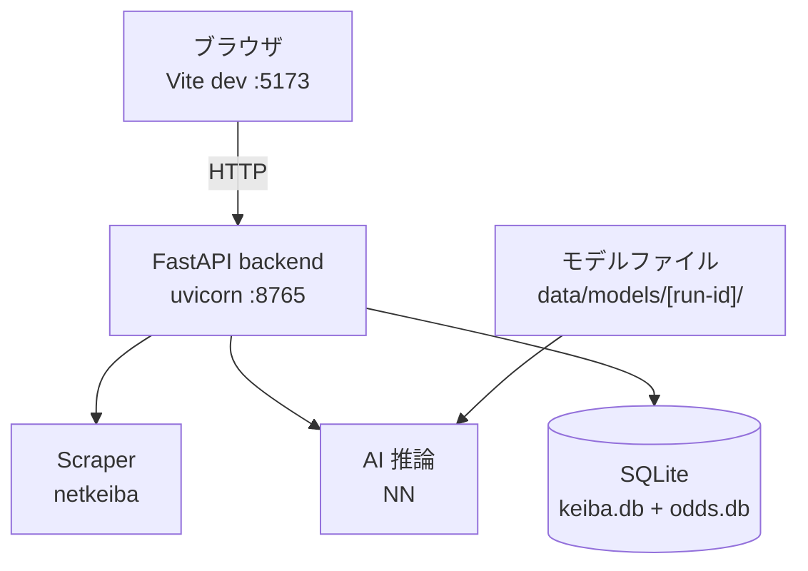
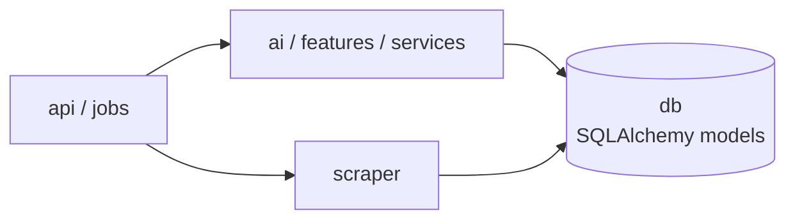
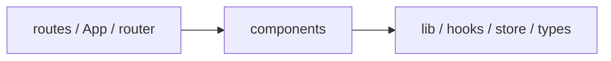
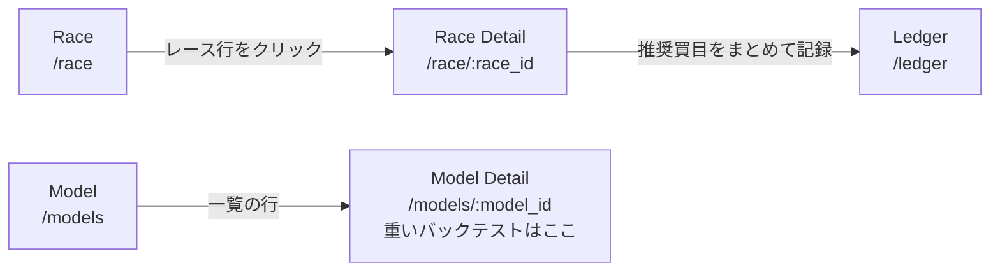

# KEIBA AI — 設計方針書

関連ドキュメント: [spec.md](spec.md) / [data-pipeline.md](data-pipeline.md) / [ai-model.md](ai-model.md) / [operations.md](operations.md)

---

## 設計の出発点

### ユーザー要件

- 今週末の出走予定レースを一覧表示し、馬ごとの単勝・複勝予想確率を確認したい
- モデルの成績（回収率・的中率・確率の質）を、出所と評価窓つきで把握したい
- 手元の PC 上で完結して動作し、外部サービスへデータを送出しない

### 非機能要件

| 項目 | 方針 |
|---|---|
| 動作形態 | ローカル dev サーバ（`scripts/dev.sh` で uvicorn :8765 + Vite :5173 を起動）+ ブラウザアクセス |
| データプライバシー | 全データをローカル保持。クラウド同期なし |
| 停止容易性 | スクレイピングを任意のタイミングで即時停止できるスイッチを設ける |
| レート制御 | netkeiba への最低 3 秒間隔（詳細は [data-pipeline.md](data-pipeline.md)）|
| 拡張性 | モデルの差し替え・特徴量追加が最小変更で可能な設計 |
| 保守性 | バックエンド・フロントエンド・AI モジュールの責務を明確に分離 |

---

## アーキテクチャ図



ブラウザから backend へは `http://127.0.0.1:8765/api/*`。

`scripts/dev.sh` で FastAPI (uvicorn :8765) と React 管理画面 (Vite :5173) を並列起動し、ブラウザでアクセスする。外部へのネットワーク通信はスクレイパーのみ。

---

## AI モジュール設計

各モジュールの責務を明確に分離し、独立してテスト・置き換えができるようにする。

```text
backend/src/
├── main.py       FastAPI app factory (create_app) + lifespan + CORS + uvicorn __main__
├── scraper/      スクレイピング専用。HTML 取得・パース・DB 保存のみ。AI を知らない
├── features/     DB から生データを読み取り、学習・推論用の特徴量 DataFrame を生成
│                 （リーク防止のため「予測時点での情報のみ使用する」制約を徹底管理）
│                 race_info.py がレース単位の情報量（新馬戦などの「履歴が無いレース」）を判定する
├── ai/           特徴量を受け取り NN の学習・評価・推論を実行。features を知らない
│                 依存 DAG の層で機能サブパッケージ化されている:
│                 ├── core/       types / labels / splits / temperature / probabilities（最下層）
│                 ├── model/      registry / _artifacts_nn + NN 実装（net / loss / dataset / preprocess）
│                 ├── training/   train_nn（学習 CLI）
│                 ├── inference/  predict — bundle-aware 推論（predict_race / *_with_combinations）
│                 ├── betting/    odds / strategy（ベット選定・賭け金配分）
│                 ├── simulation/ engine / persistence（バックテストシミュレーション）
│                 └── evaluation/ backtest — NDCG@k・ヒット率・ROI 計算
├── services/     買い目の決済と集計。`bet_settlement` が payouts と買い目を突き合わせて
│                 bet_records を確定し（連系は `core.bet_types.normalize_combo` を通す）、
│                 `bet_analytics` が回収率・的中率を集計する（DB / HTTP 非依存の純関数）
├── core/         設定（Settings）・ロギング・settings_store（JSON 永続化）・bet_types。
│                 買い方の設定の解決は `settings_store.resolve_betting_settings` が単一の入口
├── api/          FastAPI ルーター群（schemas / deps / routers/*）
│                 ビジネスロジックは持たず、上記モジュールを呼ぶだけ
└── jobs/         取り込み・運用 CLI（ingest / ingest_range / ingest_odds / backup_db 等）。上記モジュールを呼ぶ
```

### 依存方向



`scraper` は `api` / `jobs` からのみ呼ばれる。`core` は横断で、どの層からも呼んでよい。

循環依存は禁止。`ai` は `scraper` を直接呼び出さない。`ai` / `features` / `services` は
同じ層（policy の `domain`）なので、この 3 つの間に順序は無い。

フロント側も同じ向きを持つ。



`hooks` から `components` を呼ばない。両方向とも `.claude/policy.yml` の `code.layers` に
書き起こしてあり、`/claude-keeper:check` が実際の import を数えて逸脱を出す。
sonner の `toast` を `components/ui/` に置いていた頃はここが 5 本逆流していた
（中身は関数であってコンポーネントではないので `lib/toast.ts` へ移した）。

### DI 構成

FastAPI の依存注入（`api/deps.py`）で以下を提供する。

| DI 関数 | 提供するオブジェクト | 概要 |
|---|---|---|
| `get_engine` | `Engine` | SQLAlchemy 同期エンジン |
| `get_session` | `Session` | リクエストスコープの DB セッション（yield / finally で close） |
| `get_settings_store` | `SettingsStore` | `core/settings_store.py` の JSON 永続化オブジェクト |
| `get_job_registry` | `JobRegistry` | バックグラウンドジョブのインメモリ管理オブジェクト |

### JobRegistry の性質

- `asyncio.create_task` でバックグラウンドジョブを起動し、`JobInfo` をインメモリで保持する
- **プロセス再起動でジョブ状態は消失する**（永続化なし）

---

## UI 画面構成

**見た目の規定（方向・色・字の尺度・余白・角丸・状態・部品の形）は
[ui-style.md](ui-style.md) が正本。**ここは「どの画面が何を判断させるか」だけを持つ。

### 画面一覧と役割

| # | 画面名 | ルート | 役割 | 対応 API |
|---|---|---|---|---|
| 1 | Race | `/race` | **最初に出る画面**（`/` から送る）。月カレンダーで日を選び、その日のレース一覧と取込操作をまとめる | `GET /api/races/calendar`, `GET /api/races/by_date`, `POST /api/scraper/run_shutuba`, `POST /api/scraper/run_results` |
| 2 | Race Detail | `/race/:race_id` | レース概要 + 出走馬表（予想確率）+ 推奨買目（1 点ずつ / 購入用 / 答え合わせ の 3 タブ）| `GET /api/races/{race_id}`, `GET /api/predictions/{race_id}`, `GET /api/recommendations/{race_id}` |
| 3 | Ledger | `/ledger` | 購入記録と収支（回収率・的中率・券種別内訳・損益推移） | `GET /api/bets*` |
| 4 | Model | `/models` | **モデルの 1 画面**。単勝回収率（実測・窓つき）+ 一覧 + 学習 + 計測 + 役割の割り当て | `GET /api/metrics/summary`, `GET /api/models`, `POST /api/models/train`, `POST /api/models/{id}/evaluate`, `POST /api/models/{id}/activate`, `PUT /api/settings` |
| 5 | Model Detail | `/models/:model_id` | モデル 1 件の詳細と、期間・予算を指定したバックテスト | `GET /api/models/{id}`, `POST /api/simulation/start`, `GET /api/simulation/runs/{run_id}` |
| 6 | Settings | `/settings` | 全レース共通の予想パラメータとスクレイパー設定（予算 / 券種ごとのしきい値 / 取り込み方 の 3 節） | `GET /api/settings`, `PUT /api/settings` |

旧 `/upcoming` `/past` `/ingest` `/races` `/races/:race_id` はすべて `/race*` へ送る。
ブックマーク互換で `router.tsx` に残してあるだけの経路で、`/races` 系だけは `Navigate` ではなく
**loader で `redirect`** している — 素の `<Navigate>` は `?date=` と `race_id` を落とすので、
選んでいた日とレースが消える。

**最初に出るのは Race で、Dashboard という名前の画面は無い。**この道具を開く理由は
「その日のレースを見る」で、モデルの成績を見に来るのは学習し直したときだけ。運用の週次ループ
（取込 → 予想 → 記録 → 収支）が最初の画面を一度も通らない状態になっていたのを直した。
呼び名を 2 つ作らないため、Topbar に `DASHBOARD` を置かず、**`/` も画面にせず `/race` へ送る**
（`/` と `/race` の両方が同じ画面を出すと、どちらが正なのか決まらない）。

### 画面遷移図



Topbar は全画面共通で `RACE / LEDGER / MODEL / SETTINGS` の 4 つ。**並びは週次の流れ順**で、
`/` は RACE（`/race`）へ送る。

ナビは左サイドバーではなく上部の `Topbar`。アイコンも番号も置かず、等幅の英字ラベルだけで、
選択中は面ではなく色（primary）で示す。右端に light / dark のトグルを持つ
（実体は `hooks/useTheme.ts`。既定と保存先は [ui-style.md](ui-style.md)「デザイントークン」）。

### 各画面の主要コンポーネント

#### Race

上から順に:

1. `DataCoverageBand` — どこまで取り込めているか
2. 横 2 列
   - `RaceCalendar`（左・2 列ぶん）— 月表示。日ごとに開催と取込状況を色で示す
   - `DayIngestPanel`（右）— 選んだ日の取込操作。過去 = 結果 / 当日 = 両方 / 未来 = 出馬表
3. 選択日のレース一覧 — 行クリックで Race Detail へ

#### Race Detail

上から順に:

1. **レース概要** — コース・距離・馬場・頭数
   - `LowInformationNotice` — 出走馬全員が初出走のレース（新馬戦など）で「判断材料が少ない」と明示する
2. **出走馬表**（スコア降順）
   - 馬番（`Umaban`・枠色）/ 馬名 / スコア / 1着確率 / 3着内率（**数値だけ。背後のバーは置かない**）
   - 行をクリックすると、その馬の**このレース日より前**の過去走が下に開く（`HorsePastRuns`。複数頭を同時に開ける）
   - **BUY バッジは置かない** — 買うのは常にモデル 1 位の 1 頭で、列を 1 つ使って「1 位かどうか」を二重に示していただけ
   - **「本命」カードも置かない** — 推奨買目の 1 行目がそれ
   - 使う数字は**的中確率**と**確信度**の 2 つ。EV は参考列のみ
3. **`RecommendationParamsBar` + `RecommendationsCard`** — 予算 / 券種 を切り替えて再計算（1 点 = 100 円は固定）

| タブ | 中身 |
|---|---|
| 1「1 点ずつ」 | 買う順序どおりに並べる（単勝 → 複勝 → 連系 → 的中確率の高い順。エンジンと同じ）。確信度の列は確率モデルから見た「その買い目が当たる確率」で、**券種をまたいで同じ意味**（単勝 = 1着 / 複勝 = 3着以内 / 連系 = 組合せ）。EV は「参考」列に降格 — 買う判定に使っていないため |
| 2「購入用」 | 流し / ボックス / フォーメーションに畳む。**畳めるのは推奨と点数が一致するときだけ。**行を開くと 1 点ずつ。券種ごと / 全部まとめて購入記録に入れられる（`POST /api/bets/bulk`） |
| 3「答え合わせ」 | 確定後だけ出す。この買い目を全部買った場合の収支 / 回収率を券種ごとの内訳つきで（`payouts` と `combo` を突き合わせ） |

買い方の説明は折り畳み 1 つに集約する（`BettingRuleDetails`）。

出走馬表は `components/EntryPredictionTable.tsx`、並べ替えの規則は
`lib/entrySort.ts` に分けてある（`routes/RaceDetail.tsx` が 958 行に伸びたため）。
表は props だけで完結していて画面側の状態を見ない。`LowInformationNotice` /
`RunProgress` はこの画面固有のつくりものなので置いたまま。

#### Ledger

上から順に:

1. サマリ — 投資額 / 払戻 / 回収率 / 的中率
2. `ProfitChart` — 0 起点の損益推移
3. 券種別内訳 + 購入記録テーブル — `AddBetDialog` で手動登録 / CSV 書き出し

#### Model

画面は **2 つの塊**に分ける。以前は帯と表が同じ重さで縦に並び、どこからどこまでが
1 つの話か読み取れなかった。

**塊 1「いま予想に使っているモデル」** — `OperatingModels`。**左右対称の 2 列**で、
左が「買う馬を決める」（active）、右が「確からしさを答える」（確率モデル）。
どちらも同じ組み立てで、上から順に:

1. 役割名（罫線つき見出し）
2. 何をする役かの本文
3. モデル（ID・学習期間）
4. `MetricCard` 1 枚 — 指標名 +「?」→ 値（`.text-kpi`）→ 出所 / 評価窓 / レース数
5. 支える数字（ラベル +「?」）

未設定側は「未設定」バッジ + 設定すると何が変わるかを出す。

**塊 2「手持ちのモデル」** — 一覧と、一覧に対する操作を同じ塊に置く。

- 見出し行の右に `[ID を詰める]` `[再学習を実行]`（ページ見出しの横に置くと何に対する操作か読めない）
- `ModelTable`（評価窓つき。Activate / 計測 / 確率に設定 / 名称編集 / 削除）
  - **「計測」= 実運用の賭けルールで測り直す。**学習時の指標しか無い行の「未算出」はこれで埋まる（10 分前後・`JobProgressCard` で進捗）
  - **推移グラフは置かない** — モデルごとに評価窓が違い、時系列に並べても読めない

**この塊は「いくつか」ではなく「基準を越えているか」に答える。**基準は役割ごとに違う:

| 役割 | 出す値 | 基準 | 基準の出しかた |
|---|---|---|---|
| 買う馬を決める | 単勝回収率 | `1.00`（控除率込みのトントン） | 指標名の「?」 |
| 確からしさを答える | log-loss | 同じレース集合の市場 | 指標名の「?」＋ 支える数字に市場の値 |

**基準を文で言い換えない。**「トントン (1.00) に 6.9% 届かない」と書いていたが、
値のすぐ下に文があると**値より先に読まれる**。向きは `MetricCard` の色（左の帯と
数字）が持ち、基準の定義は「?」に畳む。比べられないとき（市場側が欠けているとき）は
色を付けず、比べる相手も出さない。**黙って「良い」に倒さない。**

**比べる相手そのものは畳まない。**log-loss は市場の値が見えないと読みようがないので、
支える数字として並べる。畳むのは*定義*であって*値*ではない。置き場所は**値の右に
かっこ書き**（`0.570 (市場 0.482)`）— 下の行にすると 1 段増えて左右の列で高さが揃わず、
どの値に掛かる注記なのかも弱くなる。

**目盛りも帯も引かない。**回収率を実尺（0〜1.2）で描くと 0.093 の差が幅の 8% にしか
ならず、log-loss には自然な上下限が無い。軸を切れば差を誇張することになる。

**左右対称にする。**以前は active にだけ KPI カードを 7 枚置き、確率モデルは
log-loss と順位精度の 2 枚だけで、従属物のように見えていた。実際は **2 つで 1 台の
機械**（active が馬を選び、確率モデルが確からしさを答える）なので、どちらかを
大きくしない。

**分かれ目は見出しの罫線**（`SectionHeading` の `rule`）で示す。列の幅で止まるので、
そこまでが 1 つの役割だと読める。縦罫は左右の高さが揃わないと途中で切れて見える
（確率モデル側は指標が 1 つ少ないので必ず短くなる）。引く条件は
[ui-style.md](ui-style.md)「字の尺度」。

**役割の説明はホバーに畳まない。**「なぜ 2 つ要るのか」はこの塊のいちばん読まれない
情報で、「?」に入れると知られないまま終わる。役割名の下に本文で書く。

#### Model Detail

上はモデル概要（学習条件・評価指標）。その下が `ModelSimulationPanel` で、**5 つの塊**に分ける。
実行は `POST /simulation/start`（非同期）。

| # | 塊 | 中身と、そう置いた理由 |
|---|---|---|
| 1 | 条件 | 期間 / 1 レースに使う上限 / 買う馬券 を横 1 列。使うモデルはこの画面 + Settings の確率モデル。**RACE 画面と同じ仕組みで回す** — 入力も買い方も揃える（初期資産・賭け金の決め方・戦略・狙い方は廃止） |
| 2 | 結果 | 累計損益 / 必要だった資金 / 回収率。**実行条件はこの中。**最大益・最大損は出さない（最大損は「必要だった資金」と符号違いの同じ数字で、山と谷は 3 のグラフが示す） |
| 3 | 損益推移 | `ProfitChart`（0 起点） |
| 4 | 内訳 | 馬券種別 / レース格別 / コース別を**タブで切り替え**（3 表を積むと縦に伸びるだけで見比べられない） |
| 5 | 過去の実行 | 入力と結果の間に挟まないよう最後に置く |

取込の手動実行・スクレイパーの稼働状況・緊急停止は `DayIngestPanel`（Race 画面）に集約する。

#### Settings

`PageHeader` の下に 3 つの節。どの節も「名前 / 何の値 / 設定」の 3 列で、
券種ごとのしきい値の節だけ実測の 3 列（記録 / 回収率 / 的中率）が右に付く。
**値は例**で、実物は API から引く。

**予算**

| 名前 | 何の値 | 設定 |
|---|---|---|
| 1 レースに使う上限 | 使ってよい額 | `3,000` 円 |

**券種ごとのしきい値**（実測の 3 列は台帳に記録があるときだけ出る）

| 券種 | しきい値 | 設定 | 記録 | 回収率 | 的中率 |
|---|---|---|---|---|---|
| 単勝 | オッズ下限 | `1.10` | 312 | 0.907 | 37% |
| 複勝 | 3 着内率 | `60` % | 298 | 1.027 | 61% |
| 馬連 | 的中率 | `7.5` % | 41 | 0.68 | 12% |
| ワイド / 馬単 / 三連複 / 三連単 | 的中率 | 同じ行で続く | | | |

**取り込み方**

| 名前 | 何の値 | 設定 |
|---|---|---|
| User-Agent | 名乗る文字列 | （幅を外して spacer 列まで広げる） |
| rate_min | 間隔の下限 | `3.0` 秒 |
| rate_max | 間隔の上限 | `10.0` 秒 |
| night_min | 夜間の最小 | `30.0` 秒 |

**節は 3 つ。予算 / 券種ごとのしきい値 / 取り込み方。**それぞれ同じ強さの見出しを持つ。
券種の並びは `単勝 → 複勝 → 連系` で、**推奨がその順に予算を使う順序そのもの**
（`docs/ai-model.md`「推奨ベットルール」）。以前は 複勝 → 単勝 → 予算 → 連系 と
並んでいて、何の順でもなかった。

**予算は券種の表に混ぜず、面にも載せない。**券種ではないので同じ列に置けず、
かといって `.block-surface` に載せると、枠でしかない予算が 7 行あるしきい値より
重く見える。見出しを持った節にすれば、どちらも起きない。しきい値の単位は
券種で違う（オッズ / %）ので、数の後ろに出して列は 1 つに保つ。

**3 つの節は同じ列幅を共有する**（`SettingsForm` の `COL`）。どの節も
「名前 / 何の値 / 設定」の 3 列。表は `table-fixed w-full` で器いっぱいに広げ、
**余りは幅を持たない spacer 列が飲む** — これが無いと `table-fixed` が固定幅の列を
比例配分で広げてしまい、実測の列がある節とない節で入力の位置がずれる。

**単位は数の後ろに置き、値が無い行も枠だけ取る**（単勝）。
そうしないと `%` や `秒` が付く行だけ入力が左へずれる。

**縦に見比べない入力だけ幅を外す。**User-Agent は他の行と読み比べる値ではないので
spacer 列まで広げる（`wide`）。揃えると 20 文字ほどしか見えず、書き換えるのに
端から端まで送ることになる。数値はすべて同じ幅に揃える。

**取り込み方を畳まない。**寿命は買い方と違う（年単位で触らない）が、隠すと
「いま何秒で叩いているか」が読めなくなる。順序を最後に置くことで重さの差は付く。

Settings に **EV 閾値は無い**。どの券種でも期待値は買う/買わないの判定に使わず、
「的中確率の高い順に予算まで」買う。EV 条件を入れると回収率が落ちることが実測で
分かっているため（`docs/ai-model.md`）。券種ごとの 1 点あたり金額（旧 `stake_units`）と
ふだん買う券種（旧 `enabled_bet_types`）は 2026-09-01 に設定から廃止した。枠連は
`core/bet_types.py` の `supported_bet_types()` が落とすので、画面に選択肢として出ない。

**確率モデルの割り当ては Settings ではなくモデル画面 (`/models`) の一覧で行う**（モデルを見比べて
いる場所で選べないと意味がないため）。

タブ（SCRAPER / BETTING）は 2026-09-05 に廃止した。合計 8 項目しかなく隠す量ではなく、
分けていると「取り込み方」と「買い方」を両方直すのに切り替えと 2 回の保存が要る。

---

## 状態管理

### 基本方針

- **TanStack Query（React Query v5）**: サーバーデータのフェッチ・キャッシュ・再取得を管理。API 呼び出しは `src/hooks/` のカスタムフックに集約
- **Zustand**: ページをまたいで保持する UI 状態のみ管理。サーバーデータは一切持たない
- **sonner**: Toast 通知ライブラリ。`toast` は関数なので `src/lib/toast.ts`、画面に出す `<Toaster />` は `src/components/ui/toaster.tsx` に置き、`main.tsx` でマウントする
- **react-hook-form + zod**: SettingsForm / TrainModelDialog の共通フォームバリデーションパターン。`zodResolver` + `mode: 'onChange'` で inline error を表示し、submit ボタンを自動 disable する。ダイアログは `open` のたびに `reset` で初期値を復元する。ライブラリを直接使う（shadcn の `ui/form.tsx` ラッパは使っていないので 2026-09-02 に削除した）
- **購入記録を変える mutation は `useBetMutation` に集約**（`hooks/useBetMutation.ts`）。記録・まとめ記録・削除の 3 つは成功トーストの文言以外が同じで、失敗時の扱いと無効化するキー `['bets']` は 3 つとも同時に変わる
- API クライアントは `src/lib/api.ts` の `ky` インスタンスに集約し、各フックから呼び出す

### React Query（TanStack Query）

| クエリキー | 対応フック | 対象 API | 更新間隔 |
|---|---|---|---|
| `['races', 'calendar', year, month]` | `useRacesCalendar` | `GET /api/races/calendar` | 5 分（staleTime） |
| `['races', 'by_date', date]` | `useRacesByDate` | `GET /api/races/by_date` | 5 分（staleTime） |
| `['races', raceId]` | `useRaceDetail` | `GET /api/races/{race_id}` | ユーザー操作時のみ（refetch） |
| `['predictions', raceId]` | `usePredictions` | `GET /api/predictions/{race_id}` | ユーザー操作時のみ（refetch） |
| `['metrics', 'summary']` | `useMetricsSummary` | `GET /api/metrics/summary` | 10 分 |
| `['scraper', 'status']` | `useScraperStatus` | `GET /api/scraper/status` | アイドル: 30 秒 / 実行中: 5 秒（refetchInterval を Zustand `isRunning` で切り替え） |
| `['models']` | `useModels` | `GET /api/models` | ユーザー操作時のみ |
| `['settings']` | `useSettings` | `GET /api/settings` | ユーザー操作時のみ |
| `['recommendations', raceId, params]` | `useRecommendations` | `GET /api/recommendations/{race_id}` | ユーザー操作時のみ |
| `['bets', ...]` | `useBetList` / `useBetSummary` / `useBetBreakdown` / `useBetTimeseries` | `GET /api/bets*` | 記録の追加・削除時に invalidate |
| `['jobs', jobId]` | `useJobStatus` | `GET /api/jobs/{job_id}` | 2 秒 polling（terminal status で停止）|

### Zustand（`src/store/app.ts`）

| ストア | 保持する状態 |
|---|---|
| `useAppStore` | `sidebarOpen`（旧サイドナビの名残。ナビは Topbar に移行済み） |
| `useScraperStore` | `isRunning`（スクレイパー手動実行中フラグ — ポーリング間隔の切り替えに使用）/ `trackedJobId`（JobProgressCard が追う取込ジョブ） |
| `useTrainingStore` | `trackedJobId`（JobProgressCard が追う学習ジョブ） |

### フロント側 API クライアント（`src/lib/api.ts` + `src/lib/api-base.ts`）

- **HTTP ライブラリ**: `ky` 1.x
- **ベース URL 解決**: `src/lib/api-base.ts` の `getApiBaseUrl()` が `VITE_KEIBA_API_BASE_URL` 環境変数 または デフォルト `http://127.0.0.1:8765` を返す
- **lazy 初期化**: `api.ts` の ky インスタンスは最初の API 呼び出し時に初期化される

### テスト戦略

- `vi.mock('../lib/api')` で API モジュール全体を差し替える方式を採用
- MSW + jsdom + ky の組み合わせが不安定だったため MSW は使用しない
- `@testing-library/user-event` を使用（フォームインタラクションテスト用）

---

## 拡張ポイント

| 拡張内容 | 設計上の配慮 |
|---|---|
| DL アンサンブル（TabNet / CatBoost 等との ensemble） | `ai/model/registry.py` の `ModelBundle` と `ai/inference/predict.py` の bundle-aware 推論が、呼び出し側からモデル実装の詳細を隠蔽する |
| Plackett-Luce モンテカルロによる複勝確率変換 | `ai/core/probabilities.py` の確率変換ロジックを差し替え可能な関数として分離 |
| 券種の追加 | 対応券種は `core/bet_types.py` に集約し、`ai/betting/strategy.py` と `combo_min_hit_prob`（買う下限）が同じ定義を参照する（現状 枠連は未対応で、UI の選択肢にも出さない）|
| 週次自動取り込み・月次自動再学習 | `jobs/` の CLI（`ingest_range` 等）が冪等・レジューム可能なため、外部スケジューラ（cron / タスクスケジューラ）から定期実行するだけで自動化できる |
| データ可視化の高度化（オッズ動向チャート等） | Recharts コンポーネントを page 配下に追加するのみで対応可能 |

---
